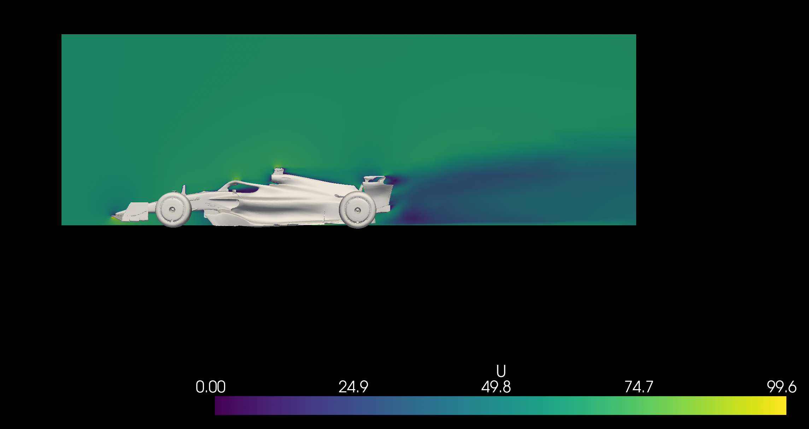

[](https://github.com/inductiva/inductiva/actions/workflows/python-package.yml)


# Large scale simulations made simple

**Inductiva API** provides open-source physical simulation from your laptop. With no configuration headaches, users can easily scale simulations to the next level with one line of code.

Whether you want to simulate pre-build scenarios to solve scientific/engineering problems or you are a power user of a specific open-source simulator, **Inductiva API** is here for you.

## Scenarios

**Inductiva API** contains pre-built scenarios that define physical systems of interest ready to simulate. Users can choose some parameters and configure the system according to their needs, run the simulation using the most adequate resources and visualize the results.

Let's go through the currently available scenarios in **Inductiva API**.

### Protein solvation

The protein solvation scenario models the dynamics of a protein whose structure is described by a PDB file. The protein is placed in a cubic box filled with water. If the protein has a non-zero electric charge, charged ions are added to the solution to neutralize the system. First, the system undergoes an [energy minimization](https://manual.gromacs.org/current/reference-manual/algorithms/energy-minimization.html) process to eliminate any steric clashes or structural issues within the protein-water system. After this, the position of the atoms in this system is updated according to Newton's equation in discrete time steps. The force that acts upon the particles is computed using standard molecular force fields.

#### Example

Initialize the scenario:

```python
from inductiva import molecules

scenario = molecules.scenarios.ProteinSolvation("protein.pdb", temperature=300)
```

The user must provide the path for the PDB file corresponding to the protein to be simulated. Additionally, the temperature (in Kelvin) can be specified, which defaults to 300 K.

Run the simulation:

```python
task = scenario.simulate(simulation_time_ns=10, n_steps_min=5000)

output = task.get_output()
```

Users can set the simulation duration (in ns) and the number of steps for the energy minimization.

Visualize the results:
```python
view = ouptut.render_interactive(representation="ball+stick", add_backbone=True)
```

This yields an interactive visualization of the protein's trajectory that can be visualized and manipulated in a standard jupyter notebook. The user can specify the representation used for the protein and choose to add the backbone to the visualization.


### Wind tunnel

This scenario models the aerodynamics of an object inside a virtual
[wind tunnel](https://en.wikipedia.org/wiki/Wind_tunnel) for a given air flow velocity. Air is injected on a side wall of the wind tunnel, the flow changes according to the structure of the object and leaves through an outlet on the other side. The system is modelled with the steady-state equations for incompressible flow and the $k-\epsilon$ turbulence models.

#### Example

Initialize the scenario:

```python
from inductiva import fluids

scenario = fluids.scenarios.WindTunnel(
    flow_velocity=[30, 0, 0],
    domain_geometry={"x": [-6, 12], "y": [-5, 5], "z": [0, 10]})
```

The user can specify the flow velocity vector (in m/s) and the domain geometry (in m).

Run the simulation:

```python
task = scenario.simulate(object_path="vehicle.obj",
                         simulation_time=100,
                         output_time_step=50,
                         resolution="medium")

output = task.get_output()
```

The user must provide the path for the object to be inserted in the wind tunnel. Additionally, users can choose the total simulation time, the time step interval to output data and the resolution of the simulation.

After the simulation has finished, the user can obtain several metrics and visuals. An example here is given for a slice of the flow:

```python

flow_slice = output.get_flow_slice(simulation_time=100,
                                   plane="xz")
flow_slice.render("velocity")
```



## Simulators

**Inductiva API** has available several open-source simulators ready to use. Users familiar with the simulators can easily start running simulations with their previously prepared simulation configuration files. In this way, they can take advantage of performant hardware to speed up their simulation and exploration.

The simulators we provide are all open-source and have their own dedicated documentation.

Currently, we have available the following simulators:
- [SPlisHSPlasH](https://github.com/InteractiveComputerGraphics/SPlisHSPlasH)
- [DualSPHysics](https://github.com/DualSPHysics/DualSPHysics)
- [OpenFOAM](https://www.openfoam.com/)
- [SWASH](https://swash.sourceforge.io/)
- [XBeach](https://oss.deltares.nl/web/xbeach/)
- [GROMACS](https://www.gromacs.org/)

If you would like other simulators to be added, contact us at [simulations@inductiva.ai](mailto:simulations@inductiva.ai).

### Example

Example of how to use the simulators:

```python

simulator = inductiva.simulators.DualSPHysics()

output_dir = simulator.run(input_dir="FlowCylinder",
                           sim_config_filename="CaseFlowCylinder_Re200_Def.xml",
                           output_dir="Flow",
                           device="gpu")
```

The user must specify the input directory, the simulation configuration file, the output directory and the device to run the simulation on.

Find more examples of simulations in the [tutorials section](https://github.com/inductiva/inductiva/tree/main/demos).


## Async API

Up until now, all examples have run synchronously, which allows users to get feedback while the simulation is running. However, this is not always the best option. For example, if the user wants to run a large number of simulations, it is better to run them asynchronously. This way, the user can launch all the simulations and then check the results when they are ready.

Let's look at an example using the wind tunnel scenario:

```python
from inductiva import fluids

# Initialize scenario with defaults
scenario = fluids.scenarios.WindTunnel()

# Path to a set of objects
object_path = "path/to/vehicle.obj"

# Run simulation
task = scenario.simulate(object_path=object_path,
                         run_async=True)

# Blocking call to obtain the results
output = task.get_output()
```

In this way, the simulation is launched asynchronously and the user can continue with other tasks. When the user wants to retrieve the results, they can do so by calling the `get_output()` method. This method will block until the results are ready.

Running simulations asynchronously allows users to launch multiple simulations in parallel. Let's look at an example:

```python
from inductiva import fluids

# Initialize scenario with defaults
scenario = fluids.scenarios.WindTunnel()

# Path to a set of vehicles
vehicle_path_list = ["vehicle_1.obj", "vehicle_2.obj", ..., "vehicle_1000.obj"]

tasks_list = []

for vehicle in vehicle_path_list:
    task = scenario.simulate(object_path=vehicle,
                             run_async=True)
    tasks_list.append(task)
```

All of the simulations will be launched in one go. The user can check the status of the simulations and retrieve the results when they are ready. Check the FAQ section for more information on how to do this.

## Task management


### Using the `Task` class

As shown above, both the sync and async runs of the scenarios shown above return a `Task` object.
This object provides methods for managing a specific task submitted to the **Inductiva API**.
For instance, you can:
 * Get its status;
 * Get the machine type where it ran/is running;
 * Kill it if you've changed your mind;
 * Download output files (all of them or only the important ones);
 * Get its execution time.

Check out some example usage of `Task`:

```python
# `scenario` constructed as in the examples above.
# ... stands for arguments related to each specific scenario.
task = scenario.simulate(..., run_async=True)

# Get status of the task.
status = task.get_status()
print(status) # would be, e.g., "submitted", "started", "success", "failed", "killed"

# Kill a task that hasn't completed yet.
if status == "submitted" or status == "started":
    task.kill()
```

```python

task = scenario.simulate(..., run_async=True)

# Get the output of the task. If the task is still running, this will block
# until the outputs are ready.
# `output` objects vary depending on the scenario, exposing methods to
# manipulate the results that are relevant for that scenario!
output = task.get_output()

# Alternatively, download the raw output files!

# If you don't know the files generated by your task, you can get an object
# representing information on the output files.
outputs_info = task.get_output_files_info()

full_download_size = outputs_info.size # Size of the full output archive.
files = outputs_info.contents # List of individual files available.

# Pretty print information on the output archive.
print(outputs_info)
# Console logs:
#
# Archive size: 1.64 GiB
# Contents:
#  Size         Compressed   Name
#  191 B        96 B         stderr.txt
#  138.24 KiB   16.73 KiB    stdout.txt
# ...
#  3.80 MiB     3.61 MiB     important_file1.txt
#  1.27 MiB     1.21 MiB     important_file2.txt


# Download only those you are interested in:
output_dir = task.download_outputs(
    filenames=["important_file1.txt", "important_file2.txt"])
# Console logs:
#
# 100%|██████████| 4.82M/4.82M [00:00<00:00, 273MiB/s]

# Or all the generated files for archival, without extracting the
# downloaded zip.
output_dir = task.download_outputs(uncompress=False)
# Console logs:
#
# 100%|██████████| 1.64G/1.64G [00:32<00:00, 55.1MiB/s]
```

### Retrieving tasks from previous sessions

A fundamental aspect of the API is its ability to run long tasks asynchronously.
You can retrieve previously created tasks and reconstruct the `Task` objects  -- the same objects that you get from the call to `scenario.simulate()` -- using the `inductiva.tasks.get()` function.
It requires an argument named `last_n`, which specifies the number of most recent tasks submitted to the API to retrieve. It returns a list of `Task` objects so that you can resume manipulating the task and its results.
Additionally, you can filter tasks by their current status, which allows you to get, for instance, only tasks that failed or only
tasks that are submitted and not yet started.
#### Examples:

```python
import inductiva

# Get my last 10 submitted tasks.
tasks = inductiva.tasks.get(last_n=10)

# Get my last 10 tasks that ran successfuly.
tasks = inductiva.tasks.get(last_n=10, status="success")

# You can use the task objects to manipulate the tasks.
not_started_tasks = inductiva.tasks.get(last_n=5, status="submitted")
for task in not_started_tasks:
    task.kill()

successful_tasks = inductiva.tasks.get(last_n=20, status="success")
for task in successful_tasks:
    task.download_outputs()
```

Another function named `list`, which shares the same arguments as `get`, can be used to print information about the
tasks in tabular format to the console:

```python
import inductiva

# list the last 5 tasks that were successful
inductiva.tasks.list(5, status="success")
# Console logs:
#
#                     ID       Simulator               Status            Submitted              Started        Duration            VM Type
#  1691150776862178362        openfoam              success     04 Aug, 12:06:17     04 Aug, 12:06:18       0h 1m 53s      c2-standard-8
#  1691149904961476240        openfoam              success     04 Aug, 11:51:46     04 Aug, 11:51:46       0h 1m 28s      c2-standard-8
#  1691081881158823776        openfoam              success     03 Aug, 16:58:02     03 Aug, 16:58:02       0h 1m 20s     n2-standard-32
#  1691081409916619414        openfoam              success     03 Aug, 16:50:11     03 Aug, 16:50:11       0h 1m 20s     n2-standard-32
#  1691080520213617518        openfoam              success     03 Aug, 16:35:21     03 Aug, 16:35:21       0h 1m 23s     n2-standard-32
```


## Manage Resources

**Inductiva API** provides a simple way to manage the hardware resources used to run the simulations. Users can launch virtual machines, list the available machines and terminate them. This is a feature available only to admins.
In this way, users do not need to wait for their simulations in a queue and can have full control of the hardware used.

Start your machines and run your simulations:

```python

import inductiva

machines = inductiva.admin.launch_machines(name="test_machine",
                                           machine_type="c2-standard-16")

# Example with ProteinSolvation scenario
scenario = molecules.scenarios.ProteinSolvation(pdb_file, temperature=300)

output = scenario.simulate(simulation_time=10,
                           nsteps_minim = 5000,
                           resources=machine)
```

To launch resources users must select a name for the resources group, the type of machine to be launched and the number of machines, with the available options being the machines available in the [Google Cloud Platform](https://cloud.google.com/compute/docs/machine-types).

But do not forget to kill your machines:
```python

machine.kill()
```

## Installation

It is super simple to start using the API if you are already familiar with Python package management.

One just needs to do
```
pip install inductiva
```

and you are good to go! You are ready to start [exploring our tutorial notebooks](https://github.com/inductiva/inductiva/tree/main/demos).

## API access tokens

To use **Inductiva API** you will need an API token. Please request your demo API token via the following Google Form (we will reply to you by email):

[Request API token](https://docs.google.com/forms/d/e/1FAIpQLSflytIIwzaBE_ZzoRloVm3uTo1OQCH6Cqhw3bhFVnC61s7Wmw/viewform)

Before running simulations you just need to add the following line and you are good to go:

```python
import inductiva

inductiva.api_key = "YOUR_API_KEY"
```

## FAQ:

- [Getting Started]()
- [Task Management]()
- [Machine Group]()
