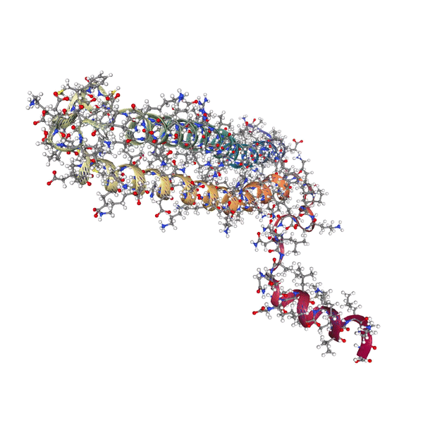

[](https://github.com/inductiva/inductiva/actions/workflows/python-package.yml)


# Inductiva API Python client

Inductiva is a Python package designed for executing large-scale simulations of physical systems directly in the cloud.

This offers several distinct advantages:

- 🔄 It consolidates various simulation domains, including fluid dynamics, molecular dynamics, plasmas, and structural mechanics, under a single unified entry point.
- 📦 Eliminates the need to install and manage complex simulation software and corresponding dependencies.
- 🚀 Allows running hundreds or even thousands of simulations concurrently, with no additional effort.
- 💽 Automatically optimizes hardware configurations for each type of simulation (e.g., CPU vs. GPU, appropriate number of CPU cores, RAM, etc.).
- 🐍 You're not limited to a graphical interface or intricate configuration scripts. Instead, you write small Python programs that seamlessly integrate with your existing codebase.


## Installation

On your terminal:

```
pip install inductiva
```

## API access tokens

Please [request API token](https://docs.google.com/forms/d/e/1FAIpQLSflytIIwzaBE_ZzoRloVm3uTo1OQCH6Cqhw3bhFVnC61s7Wmw/viewform)  and add the following line to your code:

```python
import inductiva

inductiva.api_key = "YOUR_API_KEY"
```

And you are good to go! You can start [exploring our tutorial notebooks](https://github.com/inductiva/inductiva/tree/main/demos).

## Scenarios

**Inductiva API** contains pre-built scenarios that define physical systems of interest ready to simulate. Users can choose some parameters and configure the system according to their needs, run the simulation using the most adequate resources and visualize the results.


### Example

Example of how to use a scenario:

```python
 import inductiva

 # Initialize the scenario
 scenario = inductiva.molecules.scenarios.ProteinSolvation(
     protein_pdb = "protein_pdb_file.pdb"
     temperature = 300)

 # Run a simulation
 task = scenario.simulate(simulation_time_ns = 20)

 # Get the simulation output on your local machine.
 output = task.get_output()

 # Visualize the protein trajectory
 output.render_interactive()
 ```

This allows us to visualize the protein trajectory.

<p align="center">
  
</p>

### Available scenarios

These are currently available scenarios:

- [Coastal Area](inductiva/coastal/README.md#coastal-area-scenario)
- [Wind Tunnel](inductiva/fluids/scenarios/wind_tunnel/README.md)
- [Fluid Tank](inductiva/fluids/scenarios/fluid_tank/README.md)
- [Protein Solvation](inductiva/molecules/scenarios/protein_solvation/README.md)


## Simulators

**Inductiva API** has available several open-source simulators ready to use. Users familiar with the simulators can easily start running simulations with their previously prepared simulation configuration files. In this way, they can take advantage of performant hardware to speed up their simulation and exploration.

The simulators we provide are all open-source and have their own dedicated documentation.

Currently, we have available the following simulators:
- [SPlisHSPlasH](https://github.com/InteractiveComputerGraphics/SPlisHSPlasH)
- [DualSPHysics](https://github.com/DualSPHysics/DualSPHysics)
- [OpenFOAM](https://www.openfoam.com/)
- [SWASH](https://swash.sourceforge.io/)
- [XBeach](https://oss.deltares.nl/web/xbeach/)
- [GROMACS](https://www.gromacs.org/)

If you would like other simulators to be added, contact us at [simulations@inductiva.ai](mailto:simulations@inductiva.ai).

### Example

Example of how to use the simulators:

```python

simulator = inductiva.simulators.DualSPHysics()

output_dir = simulator.run(input_dir="FlowCylinder",
                           sim_config_filename="CaseFlowCylinder_Re200_Def.xml",
                           output_dir="Flow",
                           device="gpu")
```

The user must specify the input directory, the simulation configuration file, the output directory and the device to run the simulation on.

Find more examples of simulations in the [tutorials section](https://github.com/inductiva/inductiva/tree/main/demos).


## Async API

Up until now, all examples have run synchronously, which allows users to get feedback while the simulation is running. However, this is not always the best option. For example, if the user wants to run a large number of simulations, it is better to run them asynchronously. This way, the user can launch all the simulations and then check the results when they are ready.

Let's look at an example using the wind tunnel scenario:

```python
from inductiva import fluids

# Initialize scenario with defaults
scenario = fluids.scenarios.WindTunnel()

# Path to a set of objects
object_path = "path/to/vehicle.obj"

# Run simulation
task = scenario.simulate(object_path=object_path,
                         run_async=True)

# Blocking call to obtain the results
output = task.get_output()
```

In this way, the simulation is launched asynchronously and the user can continue with other tasks. When the user wants to retrieve the results, they can do so by calling the `get_output()` method. This method will block until the results are ready.

Running simulations asynchronously allows users to launch multiple simulations in parallel. Let's look at an example:

```python
from inductiva import fluids

# Initialize scenario with defaults
scenario = fluids.scenarios.WindTunnel()

# Path to a set of vehicles
vehicle_path_list = ["vehicle_1.obj", "vehicle_2.obj", ..., "vehicle_1000.obj"]

tasks_list = []

for vehicle in vehicle_path_list:
    task = scenario.simulate(object_path=vehicle,
                             run_async=True)
    tasks_list.append(task)
```

All of the simulations will be launched in one go. The user can check the status of the simulations and retrieve the results when they are ready. Check the FAQ section for more information on how to do this.


## FAQ:

- [Getting Started](#installation)
- [Task Management](inductiva/tasks/README.md)
- [Machine Group](inductiva/resources/README.md)
