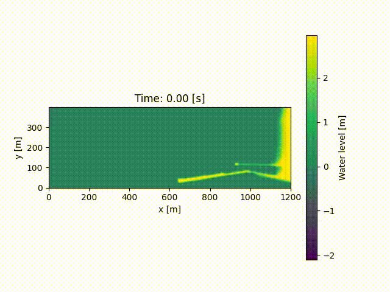

[](https://github.com/inductiva/inductiva/actions/workflows/python-package.yml)


## Large scale simulations made simple

Inductiva API provides dozens of open-source physical simulation packages from your laptop. Users can start simulating right away, with no hardware setup issues and no software configuration headaches. Additionally, we provide a transparent way to scale your simulations to the next-level with one-line of code.

One can **run** simulations in two ways:
- **High-level Simulation:** We provide pre-built scenarios that define a physical model (e.g., the dam break scenario in fluid dynamics). Users are allowed to define some parameters of the scenarios, choose the method of simulation with a few parameters and accelerate their simulations with the best hardware available for them. 

Example of how to run the dam break scenario:
```python
from inductiva import fluids

scenario = fluids.scenarios.DamBreak(dimensions=(1., 0.3, 0.3))

output = scenario.simulate()
video = output.render()
```

- **Low-level Simulation:** Users familiar with the simulators can submit their previously prepared simulation configuration files. In this way, users can immediatelly take advantage of performant hardware to speed up their simulations, without having to change any of their existing simulation scripts. Moreover, users may want to execute more than just one simulation and via API they can do it in a couple of lines of code. 

Example of how to run a low-level simulation:
```python
from inductiva import fluids

simulator = fluids.simulators.DualSPHysics()

output_dir = simulator.run(input_dir="FlowCylinder",
                           sim_config_filename="CaseFlowCylinder_Re200_Def.xml",
                           output_dir="Flow",
                           device="gpu")
```

Find more examples of simulations at the [tutorials section](https://github.com/inductiva/inductiva/tree/main/demos).

Our goal is to provide researchers and engineers with an easy and fast way to scale their simulations and explore various designs. 


## Simulators

The simulators we provide are all open-source and have their own dedicated documentation.

Currently, we have available the following simulators:
- [SPlisHSPlasH](https://github.com/InteractiveComputerGraphics/SPlisHSPlasH)
- [DualSPHysics](https://github.com/DualSPHysics/DualSPHysics)
- [OpenFOAM](https://www.openfoam.com/)
- [SWASH](https://swash.sourceforge.io/)
- [xBeach](https://oss.deltares.nl/web/xbeach/)
- [GROMACS](https://www.gromacs.org/)

If you would like other simulators to be added, contact us at [simulations@inductiva.ai](mailto:simulations@inductiva.ai).

## Scenarios

### Coastal area

This scenario simulates the propagation of waves in a coastal area, by solving
the [shallow water equations](https://en.wikipedia.org/wiki/Shallow_water_equations)
in a given bathymetric profile (i.e., the depth of the sea bottom). For now,
this profile is fixed to be that of Praia do Carneiro beach, in Porto, Portugal.
Waves are injected at the boundary opposite to the beach, and propagate towards
the shore, interacting with the different elements of the bathymetry.

#### Example

Initialize the scenario:

```python
from inductiva.fluids.scenarios import CoastalArea

scenario = CoastalArea(wave_amplitude=2.5, wave_period=5.5, water_level=1.0)
```

The user can specify the wave amplitude (in meters) and period (in seconds), as
well as the base water level (in meters).

Run the simulation:

```python
output = scenario.simulate(simulation_time=120, time_step=0.1, output_time_step=1)
```

The user can specify the total simulation time, the adopted time step and the
time step between outputs (all in seconds).

Visualize the results:

```python
output.render(quantity="water_level")
```

This produces a movie of the temporal evolution of the water level in the
coastal area.




### MDWaterBox

This scenario simulates a system that consists of a cubic box of water molecules, evolving according to the rules of Molecular Dynamics - the position of the water molecules is updated using Newton's equation in discrete time steps. The force that acts upon the particles is computed using standard molecular force fields. This approach is inspired by [this article](https://arxiv.org/abs/2112.03383).

#### Example

First we initialize the scenario:
```
from inductiva.molecules.scenarios.md_water_box import MDWaterBox

scenario = MDWaterBox(temperature = 300, box_size = 2.3)
```

The user can specify the temperature (in Kelvin) and box size (length of one of the cube's edges, in nanometers). The numbers above correspond to the default values.

After the initialization, we are ready to simulate the system:

```
output = scenario.simulate(output_dir = "output_dir",
            simulation_time = 10,
            integrator = "md",
            nsteps_minim = 5000)
```

The simulate method initializes a simulation in the cloud. In this call, we set the parameters:
 - output_dir = "output_dir": sets the path of the directory where the simulation output will be downloaded to;
 - simulation_time = 10: sets the trajectories time to span 10 **nanosecons**;
 - integrator = "md": the simulation can conform either to: the [molecular dynamics paradigm](https://manual.gromacs.org/nightly/reference-manual/algorithms/molecular-dynamics.html) ("md"), to the [brownian motion](https://manual.gromacs.org/2021.2/reference-manual/algorithms/brownian-dynamics.html) one ("bd") or perform [stochastic dynamics](https://manual.gromacs.org/current/reference-manual/algorithms/stochastic-dynamics.html) on the system;
 -nsteps_minin = 5000: sets the number of minimization steps in the energy minimization step. 

When the simulation ends, the simulation output files can be found in the output_dir. Also, the object simulation can be used to visualize some aspects of the outputs. In particular, ```output.render_interactive()``` yields an interactive visualization that can be visualized in a standard jupyter notebook.

## Installation

It is super simple to start using the API if you are already familiar with Python package management.
One just needs to do
```
pip install inductiva
```

and your are good to go! You are ready to start [exploring our tutorial notebooks](https://github.com/inductiva/inductiva/tree/main/demos).

Notice that, in a local computer you just need to do this once. When opening the tutorials in Google Colab, you may need to re-install this
between notebooks.

## API access tokens

Please request your demo API token via the following Google Form (we will reply to you by email):

[Request API token](https://docs.google.com/forms/d/e/1FAIpQLSflytIIwzaBE_ZzoRloVm3uTo1OQCH6Cqhw3bhFVnC61s7Wmw/viewform)

