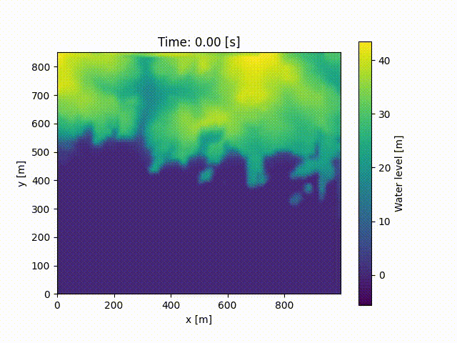

[](https://github.com/inductiva/inductiva/actions/workflows/python-package.yml)


# Large scale simulations made simple

**Inductiva API** provides open-source physical simulation from your laptop. Users can start simulating right away, with no hardware setup issues and no software configuration headaches. We provide a transparent way to scale your simulations to the next level with one line of code.

Whether you want to use simulation to solve scientific/engineering problems or you are a power user of a specific open-source simulator, **Inductiva API** is here for you. 

Our goal is to provide researchers and engineers with an easy and fast way to scale their simulations and explore various designs. 


## Scenarios

**Inductiva API** contains pre-built scenarios that define physical systems of interest ready to simulate. Users can choose some parameters and configure the system according to their needs, run the simulation using the most adequate resources and visualize the results.

Let's go through the currently available scenarios in **Inductiva API**.

### ProteinSolvation

The ProteinSolvation scenario models the dynamics of a protein whose structure is described by a PDB file. The protein is placed in a cubic box filled with water. If the protein has a non-zero electric charge, charged ions are added to the solution to neutralize the system. First, the system undergoes an [energy minimization](https://manual.gromacs.org/current/reference-manual/algorithms/energy-minimization.html) process to eliminate any steric clashes or structural issues within the protein-water system. After this, the position of the atoms in this system is updated according to Newton's equation in discrete time steps. The force that acts upon the particles is computed using standard molecular force fields.

#### Example

Initialize the scenario:

```python
from inductiva import molecules

scenario = molecules.scenarios.ProteinSolvation("protein.pdb", temperature=300)
```

The user must provide the path for the PDB file (pdb_file) corresponding to the protein to be simulated. Additionally, the temperature (in Kelvin) can be specified, which defaults to 300 K. 

Run the simulation:

```python
output = scenario.simulate(simulation_time=10, nsteps_minim=5000)
```

Users can set the simulation duration (in ns) and the number of steps for the energy minimization. 

Visualize the results: 
```python
view = ouptut.render_interctive(representation="ball+stick", add_backbone=True)
```

This yields an interactive visualization of the protein's trajectory that can be visualized and manipulated in a standard jupyter notebook. The user can specify the representation used for the protein and choose to add the backbone to the visualization.  

<p align="center">
  
</p>


### Wind Tunnel

This scenario models the aerodynamics of an object inside a virtual
[Wind Tunnel](https://en.wikipedia.org/wiki/Wind_tunnel) for a given air flow velocity. Air is injected on a side wall of the wind tunnel, the flow changes according to the structure of the object and leaves through an outlet on the other side. The system is modelled with the steady-state equations for incompressible flow and the $k-\epsilon$ turbulence models.

#### Example

Initialize the scenario:

```python
from inductiva import fluids

scenario = fluids.scenarios.WindTunnel(
    flow_velocity=[30, 0, 0],
    domain_geometry={"x": [-6, 12], "y": [-5, 5], "z": [0, 10]})
```

The user can specify the flow velocity vector (in m/s) and the domain geometry (in m).

Run the simulation:

```python
output = scenario.simulate(object_path="vehicle.obj",
                           simulation_time=100,
                           output_time_step=50,
                           resolution="medium")
```

The user must provide the path for the object to be inserted in the wind tunnel. Additionally, users can choose the total simulation time, the time step interval to output data and the resolution of the simulation.

After the simulation has finished, the user can obtain several metrics and visuals. An example here is given for a slice of the flow:

```python

flow_slice = output.get_flow_slice(simulation_time=100,
                                   plane="xz")
flow_slice.render("velocity")
```


### Fluid tank

This scenario simulates the motion of a fluid in a cubic or cylindrical tank.
Fluid is injected into the tank via an inlet located at the top of the tank and
flows out of the tank via an outlet located at the bottom of the tank. The
motion of the fluid is controlled by gravity. The simulation is performed using
the [Smoothed Particle Hydrodynamics](https://en.wikipedia.org/wiki/Smoothed-particle_hydrodynamics)
method.

#### Example

Initialize the scenario:

```python
from inductiva import fluids
scenario = fluids.scenarios.FluidTank(shape=fluids.shapes.Cube(),
                                      fluid=fluids.WATER,
                                      fluid_level=0.5)
```

The user can specify the fluid (e.g. water, honey or oil), the fluid level (in
meters), as well as the tank shape and its inlet and outlet properties.

Run the simulation:

```python
output = scenario.simulate(simulation_time=5,
                           output_time_step=0.1,
                           resolution="medium")
```

The user can specify the total simulation time and the time step between outputs
(all in seconds). The user can also specify the resolution of the simulation
(low, medium or high).

Visualize the results:

```python
output.render()
```


### Coastal area

This scenario simulates the propagation of waves in a coastal area, by solving
the [shallow water equations](https://en.wikipedia.org/wiki/Shallow_water_equations)
in a given bathymetric profile (i.e., the depth of the sea bottom). 
Waves are injected at the boundary opposite to the beach, and propagate towards
the shore, interacting with the different elements of the bathymetry.

#### Example

Initialize the scenario:

```python
from inductiva import fluids

scenario = fluids.scenarios.CoastalArea(wave_amplitude=2.5,
                                        wave_period=5.5,
                                        water_level=1.0)
```

The user can specify the wave amplitude (in meters) and period (in seconds), as
well as the base water level (in meters).

Run the simulation:

```python
output = scenario.simulate(simulation_time=120,
                           time_step=0.1,
                           output_time_step=1)
```

The user can specify the total simulation time, the adopted time step and the
time step between outputs (all in seconds).

Visualize the results:

```python
output.render(quantity="water_level")
```

This produces a movie of the temporal evolution of the water level in the
coastal area.



## Simulators

**Inductiva API** has available several open-source simulators ready to use via a Python interface. Users familiar with the simulators can easily start running simulations with their previously prepared simulation configuration files. In this way, they can take advantage of performant hardware to speed up their simulation and exploration. 

### Simulators Available

The simulators we provide are all open-source and have their own dedicated documentation.

Currently, we have available the following simulators:
- [SPlisHSPlasH](https://github.com/InteractiveComputerGraphics/SPlisHSPlasH)
- [DualSPHysics](https://github.com/DualSPHysics/DualSPHysics)
- [OpenFOAM](https://www.openfoam.com/)
- [SWASH](https://swash.sourceforge.io/)
- [xBeach](https://oss.deltares.nl/web/xbeach/)
- [GROMACS](https://www.gromacs.org/)

If you would like other simulators to be added, contact us at [simulations@inductiva.ai](mailto:simulations@inductiva.ai).

### Example

Example of how to use the simulators:

```python
from inductiva import fluids

simulator = fluids.simulators.DualSPHysics()

output_dir = simulator.run(input_dir="FlowCylinder",
                           sim_config_filename="CaseFlowCylinder_Re200_Def.xml",
                           output_dir="Flow",
                           device="gpu")
```

The user must specify the input directory, the simulation configuration file, the output directory and the device to run the simulation on.

Find more examples of simulations at the [tutorials section](https://github.com/inductiva/inductiva/tree/main/demos).


## Manage Resources

**Inductiva API** provides a simple way to manage the hardware resources used to run the simulations. Users can launch virtual machines, list the available machines and terminate them.
In this way, users do not need to wait for their simulations in a queue and can have full control of the hardware used.

Start your machines and run your simulations:

```python

import inductiva

machine = inductiva.resources.launch_machines(name="test_machine",
                                              machine_type="c2-standard-16")

# Example with ProteinSolvation scenario
scenario = molecules.scenarios.ProteinSolvation(pdb_file, temperature=300)

output = scenario.simulate(simulation_time=10,
                           nsteps_minim = 5000,
                           resources=machine)
```

To launch resources users must select a name for the resources group, the type of machine to be launched and the number of machines, with the available options being the machines available in the [Google Cloud Platform](https://cloud.google.com/compute/docs/machine-types).

But do not forget to kill your machines:
```python

machine.kill()
```

## Async API

Up until now, all examples have run synchronously, which allows users to get feedback while the simulation is running. However, this is not always the best option. For example, if the user wants to run a large number of simulations, it is better to run them asynchronously. This way, the user can launch all the simulations and then check the results when they are ready.

Let's look at an example using the wind tunnel scenario:

```python
from inductiva import fluids

scenario = fluids.scenarios.WindTunnel(
    flow_velocity=[30, 0, 0],
    domain_geometry={"x": [-6, 12], "y": [-5, 5], "z": [0, 10]})

# Path to a folder containing a set of objects
objects_path_list = ["object_1.obj", "object_2.obj", ..., "object_1000.obj"]

for object_path in objects_path_list:
    task = scenario.simulate(object_path=object_path,
                      simulation_time=100,
                      output_time_step=50,
                      resolution="medium",
                      run_async=True)
```

All of the simulations will be launched in one go. The user can check the status of the simulations and retrieve the results when they are ready. Check the FAQ section for more information on how to do this.

## Installation

It is super simple to start using the API if you are already familiar with Python package management.

One just needs to do
```
pip install inductiva
```

and your are good to go! You are ready to start [exploring our tutorial notebooks](https://github.com/inductiva/inductiva/tree/main/demos).

## API access tokens

To use **Inductiva API** you will need an API token. Please request your demo API token via the following Google Form (we will reply to you by email):

[Request API token](https://docs.google.com/forms/d/e/1FAIpQLSflytIIwzaBE_ZzoRloVm3uTo1OQCH6Cqhw3bhFVnC61s7Wmw/viewform)

Before running simulations you just need to add the following line and you are good to go:

```python
import inductiva

inductiva.api_key = "YOUR_API_KEY"
```

## FAQ:

[Task Management]()
[Machine Group]()
[Getting Started]()


