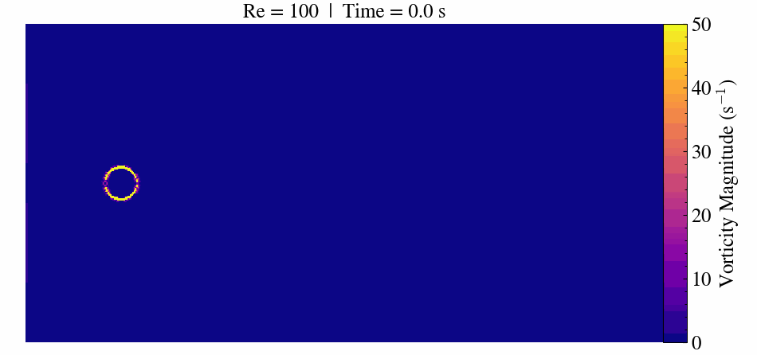

# Flow Around a Circular Cylinder 🌀
This tutorial will simulate a flow over a cylinder case using AMR-Wind. This classic fluid dynamics problem reveals the changes in flow behavior depending on the Reynolds number (Re).

We will cover the `ib_cylinder_Re_300` use case from the test files folder of the [AMR-Wind GitHub repository](https://github.com/Exawind/amr-wind/tree/v3.4.0).

  

## Case Description
The flow around a circular cylinder has been extensively studied because it captures fundamental fluid dynamics phenomena. At very low Reynolds numbers (Re < 5), the flow remains steady and symmetric. As Re increases, the flow begins to separate and forms steady recirculation zones. 

When the Reynolds number surpasses approximately 47, the flow transitions to an unsteady regime. Here, periodic vortex shedding develops, creating the characteristic von Kármán vortex street [1].

At Re = 300, the flow becomes fully three-dimensional and unsteady. This makes it a popular benchmark for validating CFD solvers, immersed boundary methods, and mesh refinement strategies [2].


[1] *[Kármán vortex street – Wikipedia]*(https://en.wikipedia.org/wiki/K%C3%A1rm%C3%A1n_vortex_street)
[2] *[Williamson, C.H.K. (1996). Vortex dynamics in the cylinder wake. Annual Review of Fluid Mechanics.]*(https://doi.org/10.1146/annurev.fl.28.010196.002401)

## Run the Circular Cylinder Case

### Prerequisites
Download the required files [here](https://github.com/Exawind/amr-wind/tree/main/test/test_files/ib_cylinder_Re_300) and place them in a folder called `SimulationFiles`. 

### Case Modifications
To improve the visibility of vortex shedding and optimize computational efficiency, the original case setup was modified with the following changes:

*    Increased domain length in the x-direction to 2.0 units for better capture of the wake development
*    Simplified mesh refinement, including removal of the second refinement level and corresponding updates in `static_box.refine`
*    Adjusted simulation time and output frequency, increasing total simulation time while reducing save frequency
*    Updated flow parameters by modifying viscosity to achieve a Reynolds number of 1000
*    Added `mag_vorticity` to `io.derived_outputs` to visualize vortex structures

```diff
## ib_cylinder_Re_300.inp ##

#¨¨¨¨¨¨¨¨¨¨¨¨¨¨¨¨¨¨¨¨¨¨¨¨¨¨¨¨¨¨¨¨¨¨¨¨¨¨¨#
#            SIMULATION STOP            #
#.......................................#
- time.stop_time               =   -10.0     # Max (simulated) time to evolve
+ time.stop_time               =   10.0      # Switched stop condition to physical time
- time.max_step                =   20        # Max number of time steps
+ time.max_step                =   -20       # Making the term negative to deactivate it

#¨¨¨¨¨¨¨¨¨¨¨¨¨¨¨¨¨¨¨¨¨¨¨¨¨¨¨¨¨¨¨¨¨¨¨¨¨¨¨#
#         TIME STEP COMPUTATION         #
#.......................................#
time.fixed_dt         =   -0.05        # Use this constant dt if > 0
- time.cfl              =   0.45         # CFL factor
+ time.cfl              =   1.0

#¨¨¨¨¨¨¨¨¨¨¨¨¨¨¨¨¨¨¨¨¨¨¨¨¨¨¨¨¨¨¨¨¨¨¨¨¨¨¨#
#            INPUT AND OUTPUT           #
#.......................................#
- time.plot_interval            =  10       # Steps between plot files
+ time.plot_interval            =  100      # Reduced output frequency to limit file size

time.checkpoint_interval      =  -1       # Steps between checkpoint files

#¨¨¨¨¨¨¨¨¨¨¨¨¨¨¨¨¨¨¨¨¨¨¨¨¨¨¨¨¨¨¨¨¨¨¨¨¨¨¨#
#               PHYSICS                 #
#.......................................#
ConstValue.density.value = 1.0
ConstValue.velocity.value = 1.0 0.0 0.0

io.output_default_variables = 0
io.outputs = density p
- io.derived_outputs = "components(velocity,0,1)" "components(gp,0,1)"
+ io.derived_outputs = "components(velocity,0,1)" "components(gp,0,1)" "mag_vorticity"
incflo.use_godunov = 1
incflo.diffusion_type = 2
incflo.godunov_type = "weno_z"
incflo.do_initial_proj = 1
incflo.initial_iterations = 3
- transport.viscosity = 1.0e-3   # Set for Re = D*v/mu = 100;
+ transport.viscosity = 1.0e-4   #Adjusted for Re = 1000
transport.laminar_prandtl = 0.7
transport.turbulent_prandtl = 0.3333
turbulence.model = Laminar

incflo.physics = FreeStream IB
IB.labels = IB1  
IB.IB1.type = Cylinder 
IB.IB1.center = 0.0 0.0 0.0
IB.IB1.radius = 0.05 
IB.IB1.height = 0.25

- amr.n_cell     = 64 64 16   # Grid cells at coarsest AMRlevel
+ amr.n_cell     = 128 64 8 # Doubled x-divisions to match domain size
tagging.labels = sr                                                                                                                
tagging.sr.type = CartBoxRefinement                                                                                                                
tagging.sr.static_refinement_def = static_box.refine                                                                                             
- amr.max_level = 2
+ amr.max_level = 1

- geometry.prob_lo        =   -0.5 -0.5 -0.125
+ geometry.prob_lo        =   -0.3 -0.5 -0.0625 # Cylinder offset to extend wake region
- geometry.prob_hi        =    0.5  0.5  0.125
+ geometry.prob_hi        =    1.7  0.5  0.0625  
geometry.is_periodic    =   0   0   1   # Periodicity x y z (0/1)

# Boundary conditions
xlo.type = "mass_inflow"
xlo.density = 1.0
xlo.velocity = 1.0 0.0 0.0
xhi.type = "pressure_outflow"
ylo.type =   "slip_wall"
yhi.type =   "slip_wall"

incflo.verbose          =   0          # incflo_level
nodal_proj.verbose = 0

nodal_proj.mg_rtol = 1.0e-12
nodal_proj.mg_atol = 1.0e-12
mac_proj.mg_rtol = 1.0e-12
mac_proj.mg_atol = 1.0e-12

```

```diff
## static_box.refine ##

- 2 # Number of levels of refinement
+ 1
  1 # Number of refinement boxes in the first level
 -0.125 -0.125 -0.125 0.5 0.125 0.125 #Defining the boundaries of refinement box <xlo ylo zlo xhi yhi zhi>
- 1 # Number of refinement boxes in the second level
- -0.0625 -0.0625 -0.125 0.0625 0.0625 0.125 #Defining the boundaries of refinement box <xlo ylo zlo xhi yhi zhi>
```

## Running the Simulation
Here is the code required to run the simulation using the Inductiva API:

```python
"""AMR-Wind example."""
import inductiva

# Allocate cloud machine on Google Cloud Platform
cloud_machine = inductiva.resources.MachineGroup( \
    provider="GCP",
    machine_type="c2d-highcpu-56",
    spot=True)

# Initialize the Simulator
amr_wind = inductiva.simulators.AmrWind(\
    version="2.4.0")

# Run simulation
task = amr_wind.run(input_dir="/Path/to/SimulationFiles",
    sim_config_filename="ib_cylinder_Re_300.inp",
    on=cloud_machine)

# Wait for the simulation to finish and download the results
task.wait()
cloud_machine.terminate()

task.download_outputs()

task.print_summary()

```

> **Note**: `spot` machines are a lot cheaper but may be terminated by the provider if necessary.

In this example, we're using a cloud machine (`c2d-highcpu-56`) equipped with 56 virtual CPUs.

When the simulation is complete, we terminate the machine, download the results and print a summary of the simulation as shown below.

<include task print summary>

As you can see in the "In Progress" line, the part of the timeline that
represents the actual execution of the simulation, 
the core computation time of this simulation was approximately 386.5 s.

To analyze the simulation data programmatically, Python-based tools like **yt** can be used, enabling custom visualizations and data extraction. For step-by-step guidance on creating slice plots and animations, be sure to check out our[post-processing yt tutorial](https://inductiva.ai/guides/amr-wind/using-yt).

## Scalling Up the Simulation
One of the key advantages of using Inductiva is the ease with which you can scale your simulations to larger, more powerful machines with minimal changes to your code. Scaling up simply involves updating the `machine_type` parameter when creating your MachineGroup.

Rather than increasing the number of vCPUs on the existing c2d cloud machine, we chose to rerun the simulation on a cloud GPU machine to leverage accelerated hardware. In the following code example, we use the `g2-standard-4` instance type.

```python
import inductiva

# Allocate cloud machine on Google Cloud Platform
cloud_machine = inductiva.resources.MachineGroup( \
    provider="GCP",
    machine_type="g2-standard-4",
    data_disk_gb=50,
    spot=True)

# Download the input files into a folder
input_dir = "/Path/to/SimulationFiles"

# Initialize the Simulator
amr_wind = inductiva.simulators.AmrWind( \
    version="3.4.1")

# Run simulation
task = amr_wind.run(input_dir=input_dir,
    sim_config_filename="ib_cylinder_Re_300.inp",
    n_vcpus=1,
    on=cloud_machine)
```

<table both results and compare them in a sentence>

May your residuals drop fast and your vortices stay coherent. Happy simulating!