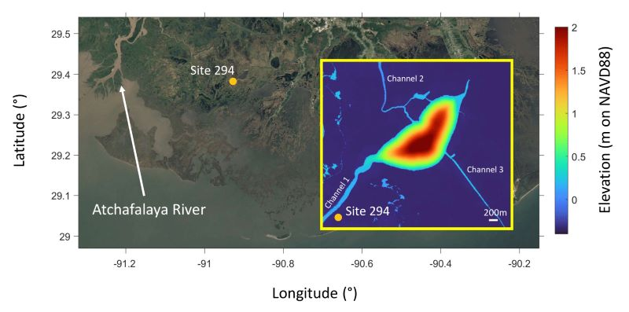

# Run the Delta-X Sediment Model
In this tutorial, we demonstrate how to use the Inductiva API to run a series of Delft3D simulations reproducing the results of [Donatelli, C., & Fagherazzi, S. (2023). Delta-X: Delft3D Sediment Model, Site 294, Terrebonne Basin, MRD, Louisiana, USA (Version 1). ORNL Distributed Active Archive Center](https://doi.org/10.3334/ORNLDAAC/2303).

The study includes the Delft3D model for **Site 294** in the **Terrebonne Basin along the Mississippi River Delta (MRD)** in coastal Louisiana. This model is part of the **NASA Delta-X mission**, a five-year Earth Venture Suborbital-3 project investigating the Mississippi River Delta, which is simultaneously expanding and subsiding in different areas. The study covers the **Delta-X Spring and Fall 2021 deployments**, simulating water levels, flow velocities, and suspended sediment concentrations.

<p align="center"></p>

This case is large-scale, realistic, and scientifically validated. Unlike many research examples, the full case is publicly available via **NASA’s ORNL DAAC**, including forcing data, boundary conditions, bathymetry, sediment parameters, and ready-to-run Delft3D input files. The model couples hydrodynamics, sediment transport, and morphodynamics, making it an ideal example for demonstrating how **Inductiva** can **accelerate scientific workflows**, from launching simulations to efficiently generating results.

This tutorial focuses on executing the 2021 Spring deployment across multiple computational resources and is organized into three parts:
- [Set up the example files](sections/section1)
- [Run the Case on Inductiva](sections/section2)
- [Evaluate the Impact of Hyper-threading](sections/section3)

Let's get started!

```{banner_small}
:origin: swan
```

```{toctree}
:hidden:
sections/section1.md
sections/section2.md
sections/section3.md
```
