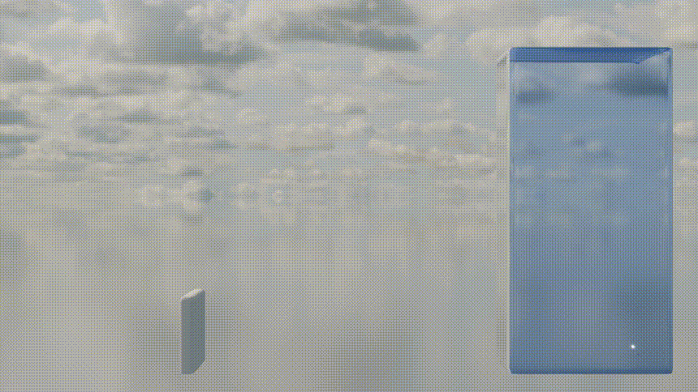

# DualSPHysics Visualizations with Blender
Blender is a powerful, open-source 3D creation suite widely used for producing stunning visualizations, animations, and models. Its advanced rendering engine, complex shader support, and rich plugin ecosystem make it ideal for high-quality graphics, ranging from films and games to scientific visualizations.

However, visualizing DualSPHysics simulation results in Blender is not straightforward. DualSPHysics outputs particle data in .vtk files, which aren’t directly compatible with Blender. To visualize this data, you need to convert it into mesh or volumetric formats that Blender can read. This typically requires using scripts or external tools to convert the raw simulation data into formats compatible with Blender’s rendering system.

<p align="center"></p>

To simplify the workflow, this guide is split into two parts:

* [Part 1: Converting `.vtk` to `.obj` — Preparing simulation data for Blender](https://inductiva.ai/guides/dualsphysics/convert-to-obj)
* [Part 2: Rendering in Blender — Importing and visualizing the converted data](https://inductiva.ai/guides/dualsphysics/render-in-blender)

This approach bridges the gap between raw DualSPHysics output and professional-quality visualizations using Blender.

```{toctree}
:hidden:
Convert .vtk to .obj <convert-to-obj.md>
Rendering in Blender <render-in-blender.md>
```