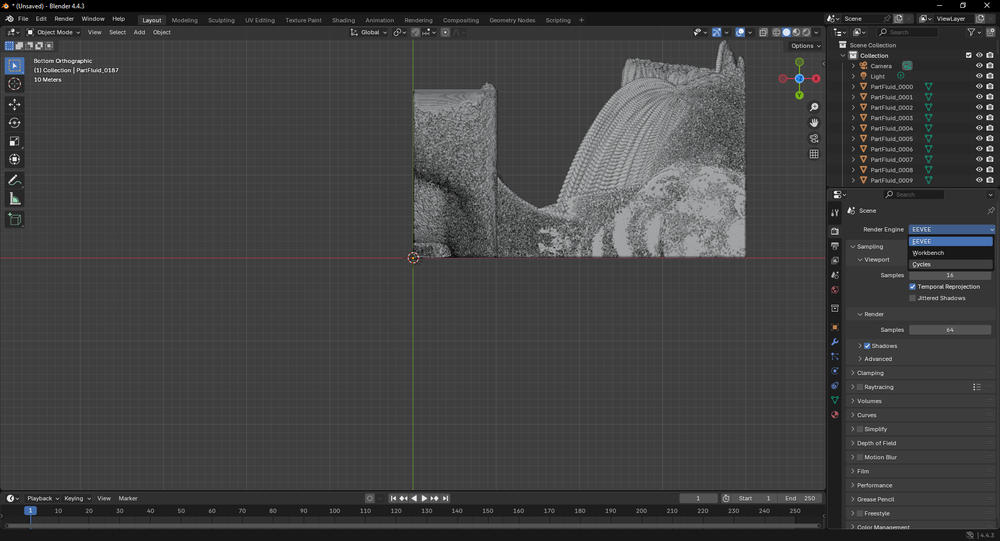
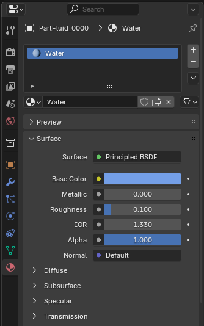
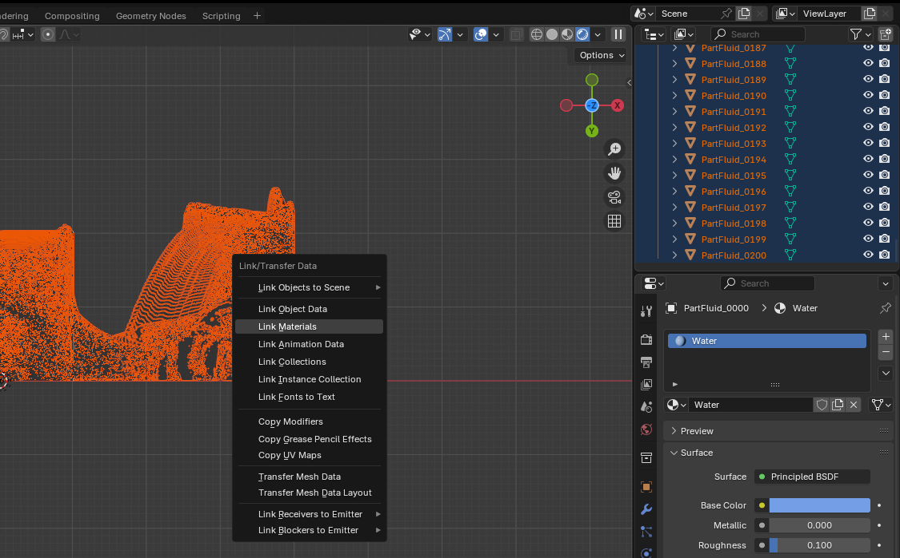
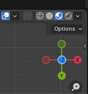
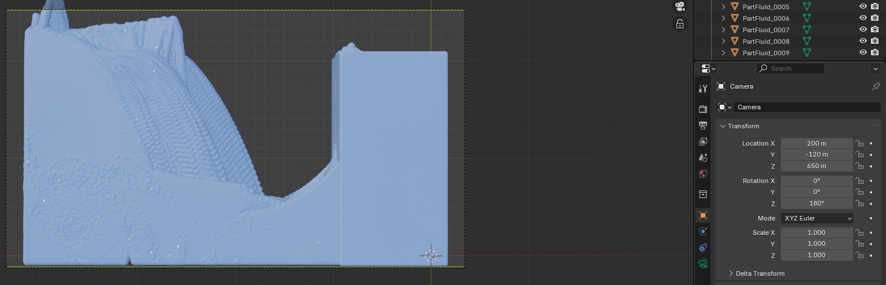
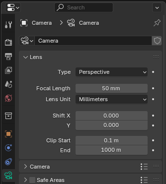
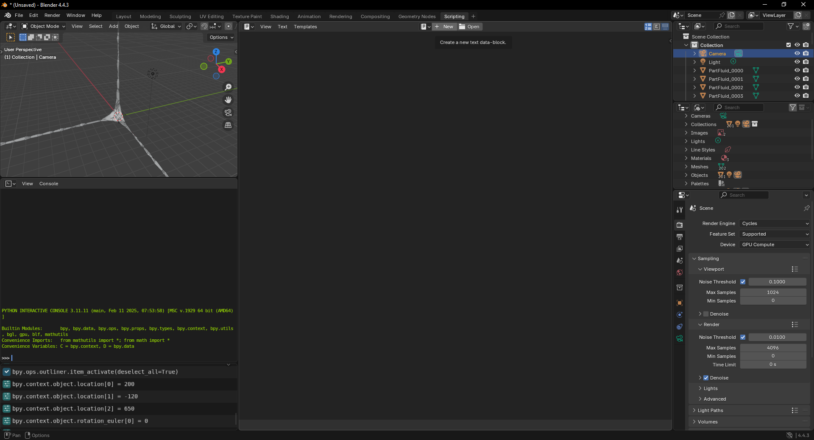
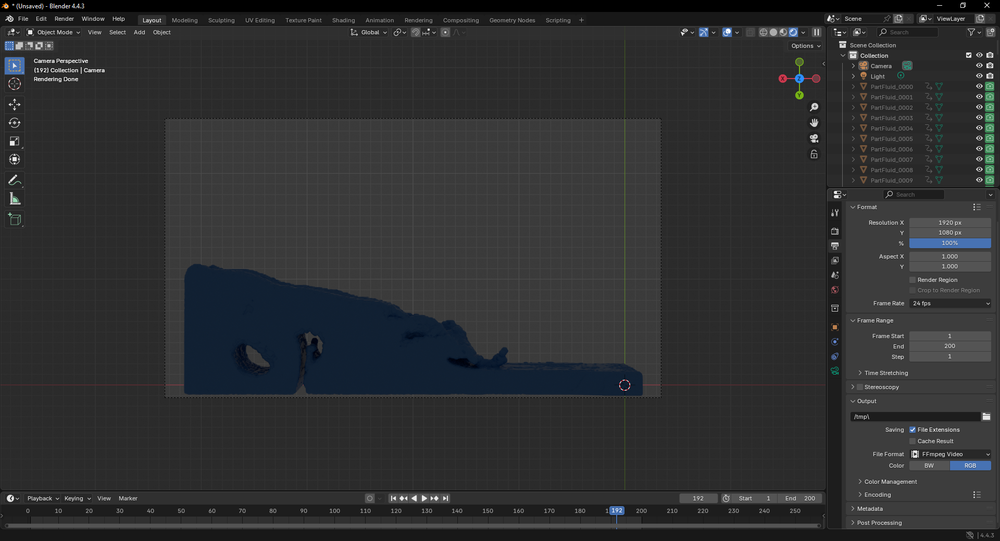

# Rendering the Mesh in Blender

After generating your `.obj` files, you can import them into Blender by simply
dragging them into the scene. This will create one object for each frame of your
animation, resulting in many `.obj` files in your scene. While this isn't the
standard Blender workflow for animations, it's workable — we just need to
prepare the scene properly.

> **Note**: When you open Blender, feel free to delete the default cube from the
Scene Collection.

## 1. Set the Render Engine and Material

Since we'll be using ray tracing, first switch the render engine to **Cycles**:

* Go to the **Render** tab in the Properties panel.
* Set the **Render Engine** to `Cycles`.
* Set the **Device** to `GPU Compute` (if available).

<div align="center">
   
   <p><em>Figure 1: Select Cycles for renderer</em></p>
</div>

Next, assign a material to your objects:

1. Select the first object in the scene — for example, `PartFluid_0000`.
2. Go to the **Material** tab in the Properties panel.
3. Click **New** to create a new material. Rename it to something like `Water`.
4. Set the material properties:

   * **Base Color**: Light blue
   * **Roughness**: `0.1`
   * **IOR** (Index of Refraction): `1.33`
   * **Transmission**: `1.0` (for full transparency)

<div align="center">
   
   <p><em>Figure 2: Creating the material</em></p>
</div>

To apply this material to all the `.obj` objects:

1. Select `PartFluid_0000`, then Shift-click to select the last object (e.g., `PartFluid_0200`) to select all.
2. Press `Ctrl + L` and choose **Link Materials**.

<div align="center">
   
   <p><em>Figure 3: Link the material to all objects</em></p>
</div>

Now all your fluid objects share the same water material. To preview the look,
change the viewport shading (top-right corner) to **Material Preview**.

<div align="center">
   
   <p><em>Figure 4: Change the viewport</em></p>
</div>

## 2. Position the Camera

To set up the camera:

1. Select the camera in the **Scene Collection**.
2. In the **Object** tab of the Properties panel, set:

   * **Location**: `X: 200`, `Y: -120`, `Z: 650`
   * **Rotation**: `X: 0.0`, `Y: 0.0`, `Z: 180.0`

<div align="center">
   
   <p><em>Figure 5: Position the camera</em></p>
</div>

Additionally, in the **Camera Data** tab, set the **End** value of the lens to `1000`.

<div align="center">
   
   <p><em>Figure 6: Set camera End</em></p>
</div>

## 3. Set Up the Animation

You might notice something odd: all frames are visible at once. That's because
we've imported each animation frame as a separate object. What we want is to
show only the relevant object for each frame.

To fix this, we'll write a small Blender script:

1. Go to the **Scripting** workspace (top bar).
2. Create a new script and paste the following:

<div align="center">
   
   <p><em>Figure 7: Create a blender script</em></p>
</div>

```python
import bpy

# Select all fluid mesh objects
imported_objs = [obj for obj in bpy.data.objects if obj.type == 'MESH' and obj.name.startswith("PartFluid")]
imported_objs.sort(key=lambda o: o.name)  # Sort by name to ensure frame order

# Hide all objects initially
for obj in imported_objs:
    obj.hide_viewport = True
    obj.hide_render = True
    obj.keyframe_insert(data_path="hide_viewport", frame=1)
    obj.keyframe_insert(data_path="hide_render", frame=1)

# Animate: show one object per frame
for i, obj in enumerate(imported_objs):
    frame = i + 1

    obj.hide_viewport = False
    obj.hide_render = False
    obj.keyframe_insert(data_path="hide_viewport", frame=frame)
    obj.keyframe_insert(data_path="hide_render", frame=frame)

    obj.hide_viewport = True
    obj.hide_render = True
    obj.keyframe_insert(data_path="hide_viewport", frame=frame + 1)
    obj.keyframe_insert(data_path="hide_render", frame=frame + 1)
```

This script will:

* Hide all objects by default.
* Animate them so that each one is visible only on its corresponding frame.

## 4. Render the Animation

To export the animation:

1. Go to the **Output** tab in the Properties panel.
2. Set:

   * **Output directory**
   * **File format**
   * **End Frame** to `200`

<div align="center">
   
   <p><em>Figure 8: Set the blender output</em></p>
</div>

Then, in the top menu, go to **Render > Render Animation**. Blender will render
each frame using ray tracing — this might take some time depending on your hardware.

## Wrapping Up

There's more you can explore, like adding an HDRI environment to enhance
lighting and realism, but we'll save that for another tutorial. For now, feel
free to tweak the material and camera settings to achieve your desired visual
effect.

**Happy rendering!**
