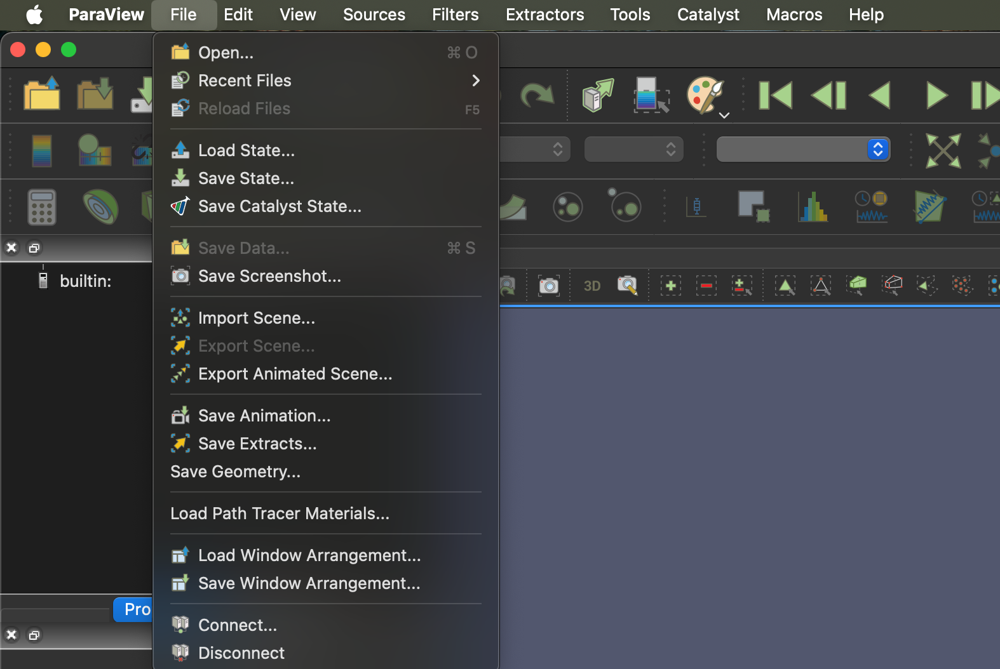
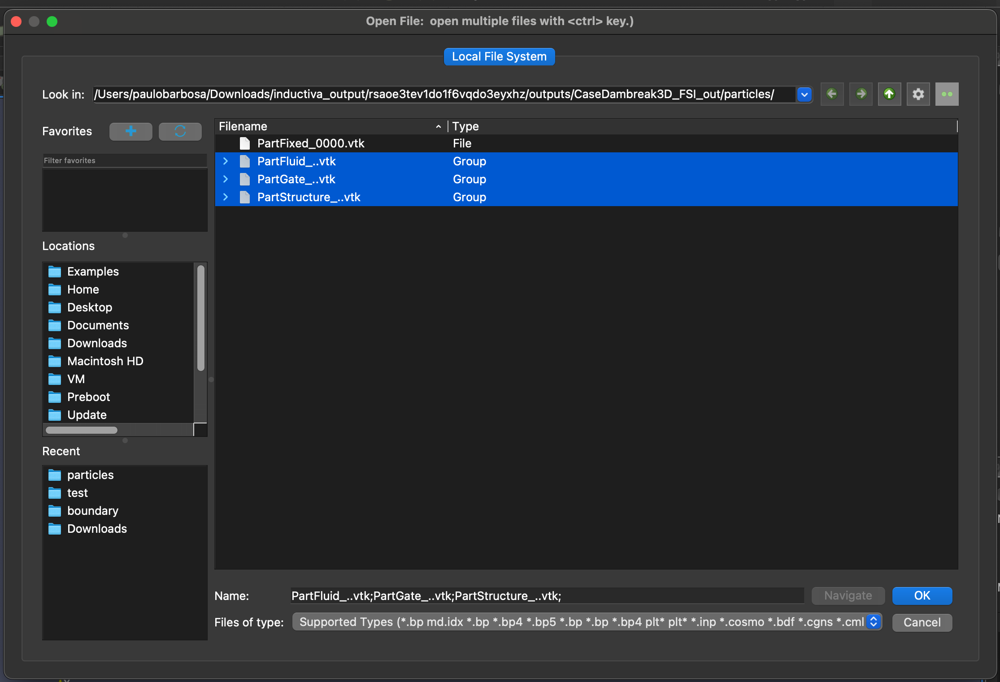
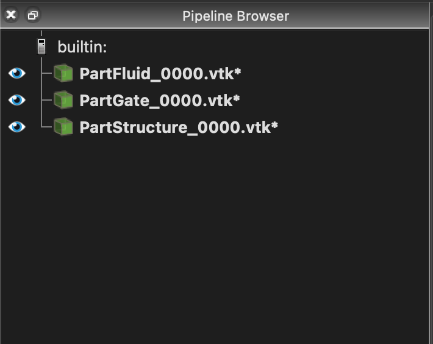
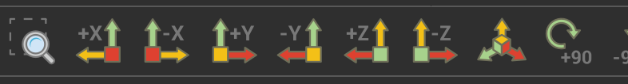
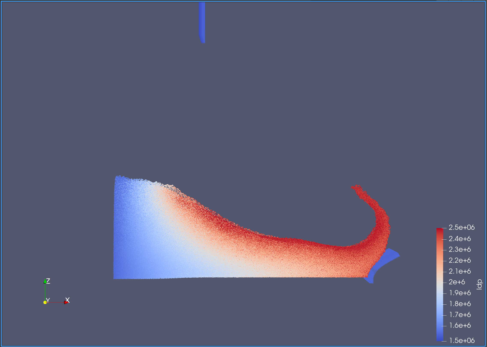
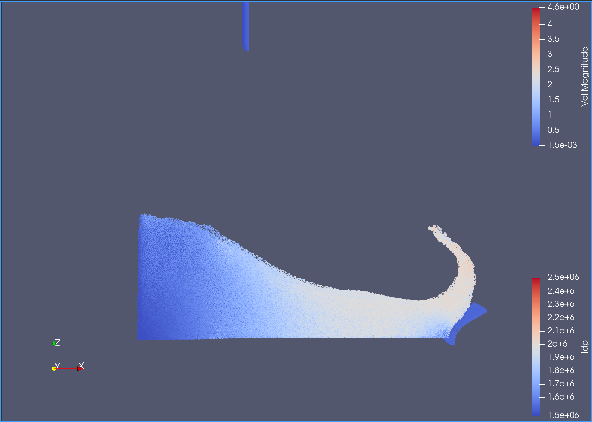

# Visualizing DualSPHysics Simulations with ParaView

Let's pick up where we left off in the section
[Testing different GPUS on the Cloud](../../multiple_gpus.md).

Your simulation is now finished and your simulation results should be downloaded
to your local machine. You can find the results in the `inductiva_output` folder.

## Visualizing the Results with ParaView

Visualizing your simulation with ParaView should be simple and straightforward.

First, open ParaView and click in the menu `File` > `Open...` and navigate to your
simulation results folder. In the results folder, navigate to `CaseDambreak3D_FSI_out/particles`
and select the three Groups called `PartFluid_..vtk`, `PartGate_..vtk` and `PartStructure_..vtk`

Once all files are loaded you need to make them visible by clicking the `eye` icon
in the `Pipeline Browser` on the left side of the screen.

Followinf that, you need to place your camera in the right position. You can do this
by clicking the `set view direction +Y` button in the toolbar.

You are now able to hit the `play` button in the toolbar and see your simulation
running in real time.

## Choosing what data to visualize

In the previous section we visualized the particles of the simulation. Using the 
default values picked by ParaView. One key aspect of visualizing your simulation
is to choose what data you want to visualize. In the case of DualSPHysics, you can
visualize the particles speed, as an example (this will vary depending on the
data you decide to save during the simulation).

To do that, click the `PartFluid_0000.vtk*` in the Pipeline Browser and change
from `idp` to `Vel` in the dropdown menu above.

You can now sabe your animation by clicking `File` > `Save Animation...` and choosing
the format you want to save it in.

Stay tunned for the next section, where we will show you how to visualize your simulation
using Blender.