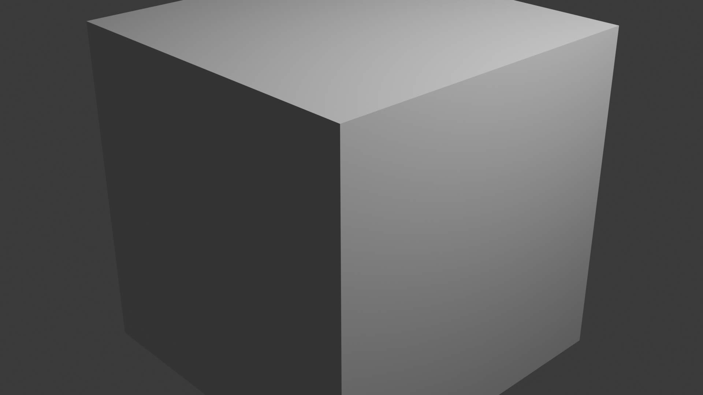

# Run Simple Blender Simulation
Blender is a powerful open-source 3D creation suite supporting the entirety of the 3D pipeline including modeling, rigging, animation, simulation, rendering, compositing and motion tracking, video editing and game creation.

In this guide, we will demonstrate how to render a simple 3D scene (a cube) using the Inductiva API and Blender software.

We’ll walk through:
1. Building a Docker container image with Blender
2. Uploading it to Inductiva
3. Executing the rendering on cloud machines


## Using the Blender Docker Image
Instead of building our own Docker image, we'll use the popular Blender Docker image from LinuxServer.io.

Pull the LinuxServer.io Blender Docker image:

```bash
docker pull lscr.io/linuxserver/blender:latest
```

You can verify the image was pulled by running `docker image ls`. The `lscr.io/linuxserver/blender:latest` image will be listed.

## Uploading the Docker Image to Inductiva
Upload the Docker image to Inductiva storage by running the following command:

```bash
inductiva containers upload lscr.io/linuxserver/blender:latest
```

This command will convert the image to Singularity Image Format (SIF) and upload it to your Inductiva storage, making it available for use in simulations.

Note that we're using the full image name `lscr.io/linuxserver/blender:latest` from Docker Hub.

Run `inductiva containers list` to verify that the image has been uploaded successfully:

```bash
> inductiva containers list

 NAME                 SIZE        CREATION TIME     PROVIDER     REGION
 blender_latest.sif   1.32 GB     17/10, 10:46:31   GCP          europe-west1
```

## Running the Rendering Task
We'll now render Blender's default startup scene, which includes a cube, camera, and lighting setup. This is perfect for demonstrating Blender's capabilities without needing to download any external files.

Create a Python script `render_default.py` with the following content:

```python
import bpy
import os

print("=== BLENDER SCRIPT STARTED ===")
print(f"Current working directory: {os.getcwd()}")
print(f"Blender version: {bpy.app.version_string}")

# Blender starts with a default scene containing:
# - A cube (the default mesh)
# - A camera (positioned to view the cube)
# - A light (illuminating the scene)

print("Scene objects:", [obj.name for obj in bpy.context.scene.objects])

cube = bpy.context.object  # The default cube
if cube:
    cube.scale = (2, 2, 2)  # Make it a bit bigger
    print(f"Cube scale set to: {cube.scale}")
else:
    print("Warning: No cube found in scene")

# Set render settings
scene = bpy.context.scene
scene.render.image_settings.file_format = 'PNG'
scene.render.filepath = 'default_scene.png'

# Set render resolution for better quality
scene.render.resolution_x = 1920
scene.render.resolution_y = 1080

print(f"Render settings: {scene.render.resolution_x}x{scene.render.resolution_y}")
print(f"Output path: {scene.render.filepath}")

# Render the image
print("Starting render...")
try:
    bpy.ops.render.render(write_still=True)
    print("Render completed!")
    
    # Check if file was created
    if os.path.exists('default_scene.png'):
        print("SUCCESS: default_scene.png was created!")
        print(f"File size: {os.path.getsize('default_scene.png')} bytes")
    else:
        print("ERROR: default_scene.png was not created")
        print("Files in current directory:", os.listdir('.'))
        
except Exception as e:
    print(f"ERROR during rendering: {e}")

print("=== BLENDER SCRIPT COMPLETED ===")
```

Place this script in a directory named `input`.

Now, use the Inductiva API to run the rendering:

```python
import inductiva

cloud_machine = inductiva.resources.MachineGroup("c2d-standard-4")

blender = inductiva.simulators.CustomImage(
    "inductiva://my-containers/blender_latest.sif")

task = blender.run(
    on=cloud_machine,
    input_dir="input",  # Directory containing render_default.py
    commands=[
        "blender -b -P render_default.py"
    ],
    project="blender-render",
)
task.wait()
task.print_summary()
```

For this initial test, we use a `c2d-standard-4` machine, which has 4 vCPUs and 16 GB of RAM.

We are using the `CustomImage` simulator, which lets us select any Docker image, either one publicly available on Docker Hub or one we’ve uploaded to our Inductiva storage, as demonstrated earlier.

In this case, we are using a local directory called `input` containing the Python script as the input directory.

The `commands` parameter specifies the command to run inside the container: `blender -b -P render_default.py` where `-b` runs in background mode and `-P` executes the Python script.

To keep things organized, we've assigned the project name `blender-render` to this task, making it easier to manage and retrieve related runs later on.

Calling `task.wait()` will block execution until the task completes, showing the command's output in real time. Once done, `task.print_summary()` will display a summary of the task, similar to:

```
Task status: Success

Timeline:
	Waiting for Input         at 17/10, 11:48:49      0.613 s
	In Queue                  at 17/10, 11:48:49      40.191 s
	Preparing to Compute      at 17/10, 11:49:30      6.395 s
	In Progress               at 17/10, 11:49:36      80.344 s
		└> 80.16 s         blender -b -P render_default.py
	Finalizing                at 17/10, 11:50:56      0.563 s
	Success                   at 17/10, 11:50:57      

Data:
	Size of zipped output:    1.15 MB
	Size of unzipped output:  1.19 MB
	Number of output files:   5

Estimated computation cost (US$): 0.00065 US$
```

The rendered image `default_scene.png` can be found in the output directory, accessible through the Inductiva Console or by downloading the task outputs using the CLI (`inductiva tasks download <task_id>`).

Here's what the rendered output looks like:



This image shows the default Blender scene with a cube, camera, and lighting setup rendered at 1920x1080 resolution.


## Wrapping Up
In this guide, you learned how to use the Inductiva API to run arbitrary computational tasks in the cloud, specifically Blender rendering. This demonstrates how custom workloads like 3D rendering can be executed with Inductiva, unlocking access to powerful computational resources with minimal setup.

```{banner_small}
:origin: run_blender_simulation
```

