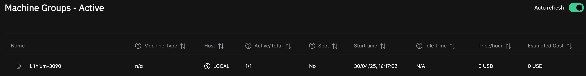

# Step 1: Launch the Local Task-Runner
Start the Local task-runner with:

```bash
$ inductiva task-runner launch <machine-group-name>
```

This launches a Docker container running the task-runner and registers your computer as part of the specified machine group.

## List and Inspect Resources
After launching the task-runner, use the following commands to view and inspect your machine group.

### List Resources
Use the Inductiva CLI:

```bash
$ inductiva resources list

 NAME                  MACHINE TYPE     ELASTIC     TYPE       # MACHINES     DATA SIZE IN GB     SPOT     CREATED AT (UTC)     IDLE TIME     MAX COST ($/HOUR)
 local-machine-group   local            False       standard   1/1            32                  False    15/01, 11:54:02      0:00:19       0

```

Or the Web Console:



### Get Resource Details
Use the Inductiva CLI:

```bash
$ inductiva resources info <machine-group-name>

Showing machines of machine group: local-machine-group

 HOST NAME                     STARTED           STATUS     LAST SEEN         RUNNING TASK
 rodrigo-ThinkPad-T14s-Gen-4   15/01, 11:54:03   Active     15/01, 11:54:33   n/a
    
```

Or the Web Console:


## Customize the Hostname
You can customize the hostname with the `--hostname` argument:

```bash
$ inductiva task-runner launch <machine-group-name> --hostname <custom-hostname>
```

If not specified, it defaults to your computer’s hostname.

> The task-runner is limited to one instance per computer, but multiple task-runner can be part of the same machine group.

## Run in Background
Use `--detach` to run the task-runner in background:

```bash
$ inductiva task-runner launch <machine-group-name> --detach
```

This command will start the task-runner in background, allowing you to close your SSH connection without interrupting the process.

To terminate a task-runner running in background, use the `remove` command:

```bash
$ inductiva task-runner remove
```