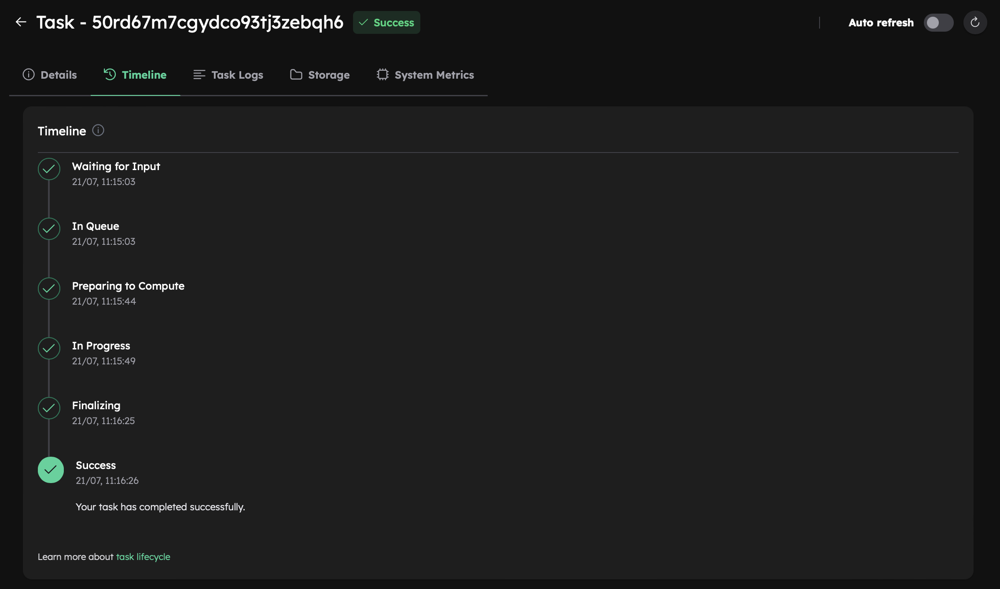

# Run Your First Simulation
This tutorial will show you how to run FDS simulations using the Inductiva API. 

We will cover the `box_burn_away6` from the FDS GitHub repository to help you get started with simulations.

## Prerequisites
Before running the simulation, you’ll need to download the required input files. You can either:

- **Manually download** them from the [FDS GitHub repository](https://github.com/firemodels/fds/tree/FDS-6.9.1/Verification/Fires) and place them in a folder named `Fires`,
**or**
- **Download automatically** using the link provided [here](https://storage.googleapis.com/inductiva-api-demo-files/fds-tutorials/Fires.zip).

Once the files are in place, you’ll be ready to submit your simulation to the Cloud.

## Running a FDS Simulation
Here is the code required to run a FDS simulation using the Inductiva API:

```python
"""FDS example."""
import inductiva

# Allocate a machine on Google Cloud Platform
cloud_machine = inductiva.resources.MachineGroup( \
    provider="GCP",
    machine_type="c2d-highcpu-2",
    spot=True)

# Initialize the Simulator
fds = inductiva.simulators.FDS( \
    version="6.9.1")

# Run simulation
task = fds.run( \
    input_dir="/Path/to/Fires",
    sim_config_filename="box_burn_away6.fds",
    n_vcpus=1,
    on=cloud_machine)

# Wait for the simulation to finish and download the results
task.wait()
cloud_machine.terminate()

task.download_outputs()

task.print_summary()
```

> **Note**: Setting `spot=True` enables the use of spot machines, which are available at substantial discounts. 
> However, your simulation may be interrupted if the cloud provider reclaims the machine.

Since FDS requires separate mesh setups for each processor, you will need to specify the number of cores (`n_vcpus`) for your simulation. FDS does not automatically assign cores, so it's crucial to configure this manually.

To adapt this script for other FDS simulations, replace `input_dir` with the
path to your FDS input files and set the `sim_config_filename` accordingly.

When the simulation is complete, we terminate the machine, download the results and print a summary of the simulation as shown below.

```
Task status: Success

Timeline:
	Waiting for Input         at 21/07, 12:31:57      0.986 s
	In Queue                  at 21/07, 12:31:58      37.173 s
	Preparing to Compute      at 21/07, 12:32:35      5.523 s
	In Progress               at 21/07, 12:32:41      47.271 s
		└> 47.116 s        /opt/fds/Build/ompi_gnu_linux/fds_ompi_gnu_linux box_burn_away6.fds
	Finalizing                at 21/07, 12:33:28      0.518 s
	Success                   at 21/07, 12:33:28      

Data:
	Size of zipped output:    5.35 MB
	Size of unzipped output:  39.30 MB
	Number of output files:   25

Estimated computation cost (US$): 0.00021 US$

Go to https://console.inductiva.ai/tasks/nq0y00hffaao4e7dx7v88w3nx for more details.
```

As you can see in the "In Progress" line, the part of the timeline that represents the actual execution of the simulation, 
the core computation time of this simulation was approximately 47.2 seconds.

You can view more details about your simulation task in the Inductiva Console [Inductiva Console](https://console.inductiva.ai/tasks), including the task timeline, logs, output storage, and other features to support your workflow.

<p align="center"></p>

```{banner_small}
:origin: fds
```
