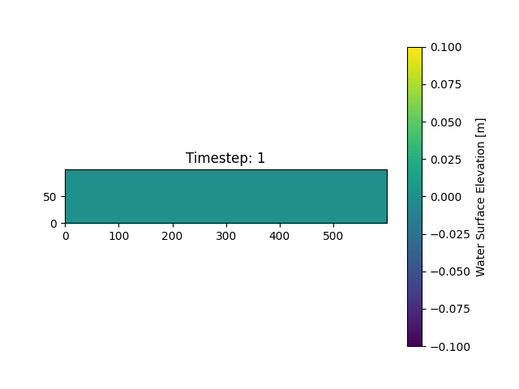

# Run Your First Simulation
This tutorial will show you how to run FUNWAVE simulations using the Inductiva API. 

We will cover the `meteo_tsunami` use case from the [FUNWAVE GitHub repository](https://github.com/fengyanshi/FUNWAVE-TVD/tree/Version_3.6) to help you get started with simulations.

<div align="center">
  
</div>

## Prerequisites
Download the required files [here](https://github.com/fengyanshi/FUNWAVE-TVD/releases/tag/Version_3.6). The simulation files will be placed inside the `FUNWAVE-TVD-Version_3.6/simple_cases/meteo_tsunami` folder.

## Running a FUNWAVE Simulation
Here is the code required to run a FUNWAVE simulation using the Inductiva API:

```python
"""FUNWAVE example."""
import inductiva

# Allocate a machine on Google Cloud Platform
machine_group = inductiva.resources.MachineGroup(
    provider="GCP",
    machine_type="c3d-highcpu-4",
    spot=True)

# Initialize the Simulator
funwave = inductiva.simulators.FUNWAVE( \
    version="3.6")

# Run simulation
task = funwave.run(
    input_dir="/Path/to/meteo_tsunami",
    sim_config_filename="input.txt",
    METEO=True,
    on=machine_group)

# Wait for the simulation to finish and download the results
task.wait()
cloud_machine.terminate()

task.download_outputs()

task.print_summary()
```

> **Note**: Setting `spot=True` enables the use of [spot machines](../how-it-works/machines/spot-machines.md), which are available at substantial discounts. 
> However, your simulation may be interrupted if the cloud provider reclaims the machine.

To adapt this script for other FUNWAVE simulations, replace `input_dir` with the
path to your FUNWAVE input files and set the `case_name` accordingly.

When the simulation is complete, we terminate the machine, download the results and print a summary of the simulation as shown below.

```
Task status: Success

Timeline:
	Waiting for Input         at 17/09, 11:53:28      0.843 s
	In Queue                  at 17/09, 11:53:29      36.668 s
	Preparing to Compute      at 17/09, 11:54:06      3.942 s
	In Progress               at 17/09, 11:54:10      316.143 s
		├> 1.004 s         cp /FUNWAVE-TVD-Version_3.6/Makefile .
		├> 1.004 s         sed -i 15s/^# *// Makefile
		├> 12.09 s         make
		├> 299.351 s       /opt/openmpi/4.1.6/bin/mpirun --np 4 --use-hwthread-cpus funwave-work/compiled_funwave input.txt
		├> 1.09 s          rm -r funwave-work
		└> 1.081 s         rm Makefile
	Finalizing                at 17/09, 11:59:26      2.311 s
	Success                   at 17/09, 11:59:28      

Data:
	Size of zipped output:    75.06 MB
	Size of unzipped output:  325.32 MB
	Number of output files:   352

Estimated computation cost (US$): 0.0038 US$
```

As you can see in the "In Progress" line, the part of the timeline that represents the actual execution of the simulation, 
the core computation time of this simulation was 316 seconds (approximately 5 minutes and 16 seconds).

## Scaling Up Your Simulation
To run your simulation on a more powerful machine, you'll need to make a few small adjustments to both your `input.txt` file and your Python script.

### Required Changes
To increase the number of vCPUs to 16, update the following parameters:

* In `input.txt`:
	- Set `PX` = 4
	- Set `PY` = 4
* In your Python script:
	- Set `machine_type` = "c3d-highcpu-16"

> **Note**: The product of `PX * PY` must equal to the number of vCPUs on the machine.

If you're scaling to a machine with more vCPUs or switching to a different machine type, follow the same pattern:
* Set `PX` and `PY` such that `PX * PY = number of vCPUs`
* Update `machine_type` accordingly in your script

### Performance Comparison
Below are the results of running the same simulation on different machine configurations:

| Machine Type             | vCPUs     | Execution Time             | Estimated Cost (USD) |
|--------------------------|------------------|------------------|----------------------|
| **c3d-highcpu-4** | 4               | 5 min, 16s        | 0.0038               |
| **c3d-highcpu-16** | 16               | 1 min, 52s        | 0.0051               |
| **c3d-highcpu-60** | 60               | 1 min, 0s       | 0.010                |

With the Inductiva API, scaling your FUNWAVE simulations is simple and efficient. Whether you're aiming for faster runtimes or reduced costs, experimenting with different machine configurations helps you find the best setup for your specific needs.

```{banner_small}
:origin: funwave-quick-start
```

