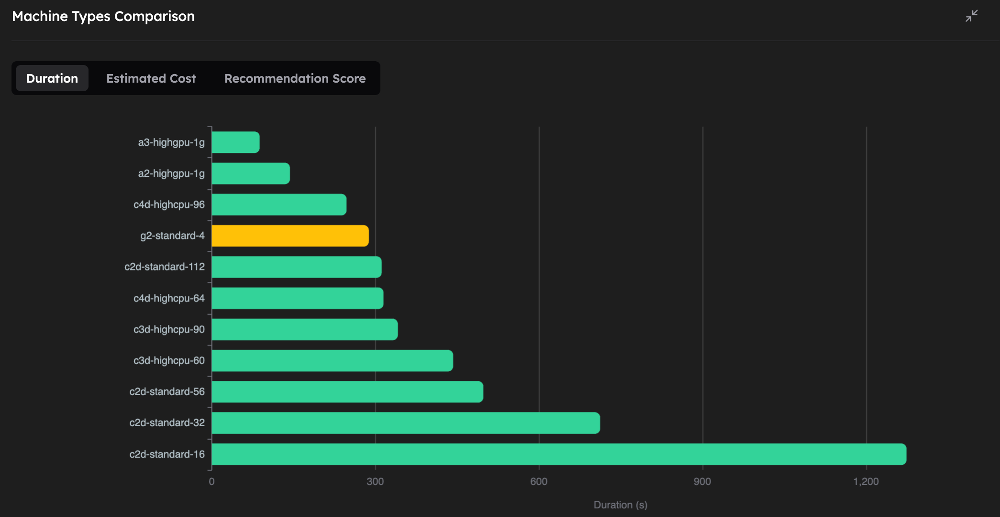
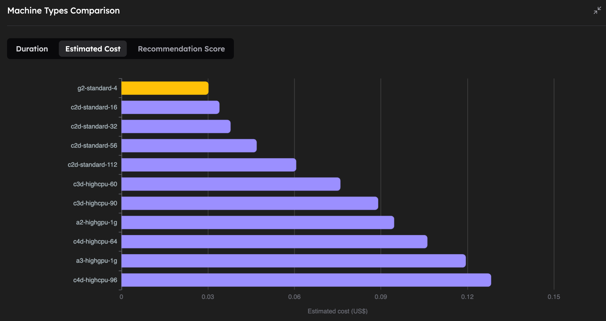
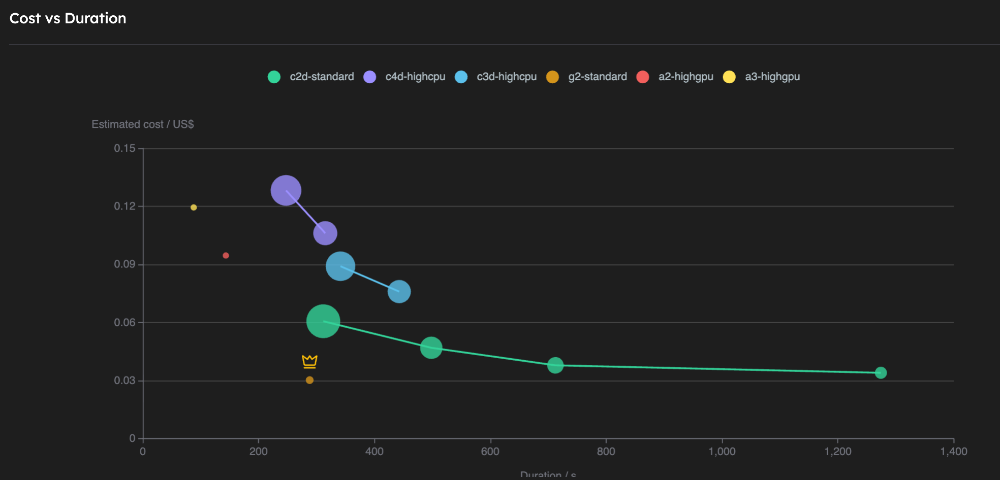

# Run the benchPEP-h Benchmark
In this tutorial, we demonstrate how to run the GROMACS benchmark developed by the [Max Planck Institute for Biophysical Chemistry (MPINAT)](https://www.mpinat.mpg.de/en), specifically the [PEP-h variant](https://www.mpinat.mpg.de/grubmueller/bench). 

The PEP-h variant test case simulates a small protein in a water box, reflecting typical usage scenarios. It covers multiple stages of the simulation workflow, such as force calculations, neighbor searching, and particle movement, providing a thorough assessment of computational efficiency. 

This benchmark is both memory and computation-intensive, making it ideal for stressing CPU and memory resources. On the CPUs we are considering, the test typically takes between 5 and 15 minutes to complete. The simulation consists of 12 million atoms, with peptides in water, a 2 fs time step, and constrained hydrogen bonds. It is also compatible with GPUs, making it suitable for evaluating both CPU and GPU based hardware.

In this guide, we will run the benchPEP-h benchmark on the cloud using the Inductiva platform.

## Prerequisites
Download the required file [here](https://www.mpinat.mpg.de/benchPEP-h) and place it in a folder named `inputs`. 

## Key Considerations
Running this guide on Inductiva is as straightforward as running any other GROMACS simulation.

The only aspect to consider is ensuring that there is enough RAM to perform the computation. This means allocating a machine with sufficient memory.

We verified that the variant **highcpu** with 2GB of RAM per vCPU was not able to handle the benchmark, with the simulations consistently crashing due to lack of RAM. 
Hence, we are left with **standard** machines with 4GB of RAM per vCPU, and **highmem** machines with 8GB of RAM per vCPU. However, **highmem** variants come with a substantial price increase and no performance gain. 

Therefore, for this benchmark, we opted to use the **standard** variant of the machine types.

## Run the Benchmark on a Single Machine
Below is the code required to run benchPEP-h with the Inductiva API. Copy and paste the code into a file named `run.py` and save it:

```python
import inductiva

commands = [
 "gmx mdrun -s benchPEP-h.tpr -pme cpu -bonded cpu -nb cpu -nsteps 1000"
]

# Allocate cloud machine on Google Cloud Platform
machine_group = inductiva.resources.MachineGroup("c2d-standard-16", spot=True)

# Initialize the Simulator
gromacs = inductiva.simulators.GROMACS()

# Run simulation
task = gromacs.run(input_dir="inputs/",
 commands=commands,
 on=machine_group)


# Wait for the simulation to finish and download the results
task.wait()
cloud_machine.terminate()
task.download_outputs()
task.print_summary()
```

You should have the following folder structure:

```
- benchPEP-h-benchmark/  
  ├── run.py
  └── inputs
    └── benchPEP-h
```


You can now run it with:
```
python run.py
```

The simulation will then be sent to a `c2d-standard-16` virtual machine from Google Cloud, equipped with 16 vCPU and 64GB of RAM.

The simulation will take around **x minutes** to run. In the end, you should see something like:

```python
Task status: Success

Timeline:
        Waiting for Input         at 01/07, 10:32:48      15.379 s
        In Queue                  at 01/07, 10:33:03      30.847 s
        Preparing to Compute      at 01/07, 10:33:34      15.377 s
        In Progress               at 01/07, 10:33:50      1259.794 s
                └> 1259.311 s      gmx mdrun -s benchPEP-h.tpr -pme cpu -bonded cpu -nb cpu -nsteps 1000
        Finalizing                at 01/07, 10:54:49      30.191 s
        Success                   at 01/07, 10:55:20      

Data:
        Size of zipped output:    856.19 MB
        Size of unzipped output:  1.46 GB
        Number of output files:   9

Estimated computation cost (US$): 0.040 US$
```

That’s it! You have just run benchPEP-h on Inductiva! 

The magic of Inductiva lies in its flexibility — you can easily scale your simulations to much larger machines with just a few minor changes to your Python script.

Let’s explore what happens when we use more powerful machines to run the same simulation. 


| Machine Type | Execution Time (mm:ss) | Estimated Cost (USD) | GPU            |
|--------------|----------------|---------------------|----------------|
| a3-highgpu-1g | **1:28** | 0.119 | NVIDIA H100 |
| a2-highgpu-1g | 2:23 | 0.095 | NVIDIA A100 |
| c4d-highcpu-96 | 4:07 | 0.128 | - |
| g2-standard-4 | 4:48 | **0.030** | NVIDIA L4 |
| c2d-standard-112 | 5:12 | 0.061 | - |
| c4d-highcpu-64 | 5:15 | 0.106 | - |
| c3d-highcpu-90 | 5:41 | 0.089 | - |
| c3d-highcpu-60 | 7:23 | 0.076 | - |
| c2d-standard-56 | 8:18 | 0.047 | - |
| c2d-standard-32 | 11:52 | 0.038 | - |
| c2d-standard-16 | 21:14 | 0.034 | - |

**Notes**: Execution times and costs were averaged over 3 independent runs per machine type. CPU machines were launched in GCP zone "europe-west1-b" and GPU machines were launched in GCP zone "us-central1-a". All prices are based on *spot instances* (date: 28 Oct 2025).







As we can see, on the CPU-based machines, increasing the number of vCPUs (and RAM) of the machine let's us run the simulation faster, while only slightly increasing the cost. We also note that this particular molecular dynamics simulation with 12M atoms, can be greatly accelerated by using powerful GPUs, the fastest being the NVIDIA H100. Perhaps even more interestingly, the NVIDIA L4 GPU turns out to be the absolute cheapest way to run this simulation, even compared to the CPU machines, while being the 4th fastest overall.


This GROMACS benchmark clearly demonstrates Inductiva’s efficient scaling capabilities, allowing you to balance performance and budget according to your needs. Whether you prioritize speed or cost-effectiveness, Inductiva makes it easy to optimize your simulations seamlessly.

# Running this benchmark with Inductiva

If you are interested in reproducing the results above you can use the following code. Note that the exact costs might vary, depending on the prices of GCP spot instances at the time of execution.

```python
import datetime
import itertools
from inductiva import benchmarks, simulators, resources

NUM_REPEATS = 3
SPOT = True


def get_gpu_runs():
    simulator = simulators.GROMACS(version="2025.1", device="gpu")
    commands_gpu = [
        "gmx mdrun -s benchPEP-h.tpr -gpu_id 0 -pme gpu -bonded gpu -nb gpu -nsteps 1000"
    ]
    gpu_zone = "us-central1-a"
    gpu_machine_types = ["a3-highgpu-1g", "a2-highgpu-1g", "g2-standard-4"]

    for machine_type in gpu_machine_types:
        yield (machine_type, gpu_zone, simulator, commands_gpu)


def get_cpu_runs():

    simulator = simulators.GROMACS(version="2025.1", device="cpu")
    commands_cpu = [
        "gmx mdrun -s benchPEP-h.tpr -pme cpu -bonded cpu -nb cpu -nsteps 1000"
    ]
    cpu_zone = "europe-west1-b"
    cpu_machine_types = [
        "c2d-standard-16",
        "c2d-standard-32",
        "c2d-standard-56",
        "c2d-standard-112",
        "c3d-highcpu-60",
        "c3d-highcpu-90",
        "c4d-highcpu-64",
        "c4d-highcpu-96",
    ]

    for machine_type in cpu_machine_types:
        yield (machine_type, cpu_zone, simulator, commands_cpu)


benchmark = benchmarks.Benchmark(name="gromacs_benchPEP-h-dedicated") \
    .set_default(input_dir="inputs")

max_idle_time = datetime.timedelta(seconds=30)

all_runs = itertools.chain(get_cpu_runs(), get_gpu_runs())
for machine_type, zone, simulator, commands in all_runs:
    benchmark.add_run(
        simulator=simulator,
        commands=commands,
        on=resources.MachineGroup(machine_type=machine_type,
                                  num_machines=NUM_REPEATS,
                                  max_idle_time=max_idle_time,
                                  provider="GCP",
                                  zone=zone,
                                  spot=SPOT),
    )

benchmark.run(num_repeats=NUM_REPEATS, wait_for_quotas=True)

benchmark.wait()
```


```{banner_small}
:origin: gromacs
```
