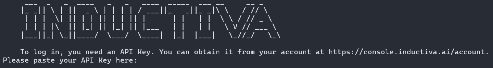

# Install the Inductiva Python Package

Set up in seconds – Install the Inductiva package and start running simulations effortlessly!

### Before You Start

Make sure you have a compatible version of Python (>=3.9) and pip installed, plus some basic Python knowledge.

Check our [System Prep guide](https://docs.inductiva.ai/en/latest/preinstallation/system/system-requirements.html#) to help you check these essentials before getting started.

<!-- Check our <a href="https://docs.inductiva.ai/en/latest/preinstallation/system/system-requirements.html#">System Prep guide</a> to help you check these essentials before getting started.   -->

## Step 1: Install the Package

Open your Terminal (Linux/MacOS) or Command Prompt/PowerShell (Windows) and enter:

```python
pip install inductiva
```

## Step 2: Authenticate Using Inductiva's CLI (Command Line Interface)

Now that the Inductiva package is installed, run the authentication command:

```python
inductiva auth login
```

You should see the INDUCTIVA text art:
<div align="left">
    
</div>
<br>

> ⚠️ **Warning**  
> Windows users might experience an error when trying to authenticate this way, meaning that Inductiva's CLI (Command Line Interface) was not successfuly installed.  
> If this is the case, follow the instructions to Authenticate Using the Python API. Otherwise, move to Step 3.

#### If you got an error and did not get the INDUCTIVA text art
If you weren't able to authenticate using Inductiva's CLI (Command Line Interface), you can do it directly within a Python script.  

On your Command Prompt/PowerShell start your Python interpreter:

```python
python
```
You should get a message with the Python version.  
Then type:

```python
import inductiva
inductiva.auth.login()
```
You should now see the INDUCTIVA text art. Proceed to Step 3.


## Step 3: Complete your authentication with your API Key 

Right below the INDUCTIVA text art, you are prompted to "Please paste your API Key here:".
Retrieve your API Key from [Inductiva's web Console](https://console.inductiva.ai/account/details), and paste it there.

To confirm your authentication, type:

```python
inductiva user info
```
This will display your account information, confirming that the API key has been stored successfully.  


