# Building Blocks

Inductiva provides an API to run large-scale computational simulations on the cloud with ease.

To cater to different workflows and user preferences, we offer three ways to interact with our API: the **Python Client**, the **Command-Line Interface (CLI)**, and the **Web Console**. While each tool can be used independently, they are designed to work together seamlessly, providing a flexible and unified experience for managing your simulations.

This page explains the purpose of each component and how they fit together to form the Inductiva ecosystem.

## How It All Connects

At the heart of Inductiva is the API that manages all your cloud resources, simulation tasks, and storage. The Python Client, CLI, and Web Console are simply different interfaces that communicate with these resources. This means any action you take in one tool will be immediately reflected in the others.

```mermaid
flowchart TD
    %% User Types
    subgraph Users["👥 User Types"]
        Dev["🧑‍💻 Developers<br/>Data Scientists"]
        Ops["⚙️ Operations<br/>Quick Tasks"]
        Bus["📊 Business Users<br/>Non-Technical"]
    end

    %% Inductiva Components
    subgraph Inductiva["🏗️ Inductiva Building Blocks"]
        Python["🐍 Python Client<br/>Library & Scripts"]
        CLI["💻 Command Line Interface<br/>Terminal Operations"]
        Console["🖥️ Web Console<br/>Graphical Interface"]
    end

    %% Core Platform
    subgraph Platform["☁️ Inductiva Platform"]
        API["🔌 Inductiva API"]
        Resources["🖥️ Computational Resources"]
        Storage["💾 Cloud Storage"]
        Tasks["⚡ Task Management"]
        Simulators["🔬 Simulators"]
    end

    %% Connections - User to Tools
    Dev --> Python
    Dev --> CLI
    Ops --> CLI
    Ops --> Console
    Bus --> Console

    %% Connections - Tools to Platform
    Python --> API
    CLI --> API
    Console --> API

    %% Platform Internal
    API --> Resources
    API --> Storage
    API --> Tasks
    API --> Simulators

    %% Use Cases
    subgraph UseCases["📋 Common Use Cases"]
        Scripts["📝 Automation Scripts<br/>Complex Workflows"]
        Quick["⚡ Quick Operations<br/>Status Checks"]
        Mgmt["📊 Data Visualization<br/>Account Management"]
    end

    %% Use Case Connections
    Python -.-> Scripts
    CLI -.-> Quick
    Console -.-> Mgmt

    %% Styling
    classDef userClass fill:#e1f5fe,stroke:#0277bd,stroke-width:2px
    classDef toolClass fill:#f3e5f5,stroke:#7b1fa2,stroke-width:2px
    classDef platformClass fill:#e8f5e8,stroke:#2e7d32,stroke-width:2px
    classDef usecaseClass fill:#fff3e0,stroke:#f57c00,stroke-width:2px

    class Dev,Ops,Bus userClass
    class Python,CLI,Console toolClass
    class API,Resources,Storage,Tasks,Simulators platformClass
    class Scripts,Quick,Mgmt usecaseClass
```

The following diagram illustrates this relationship:

This page explains the purpose of each component and how they fit together to form the Inductiva ecosystem.

Inductiva provides three complementary ways to interact with our API, each designed for different use cases and user preferences. Whether you're a engineer building complex simulation workflows or a scientist stydying complex phenomenon

Welcome to the official Python library for the Inductiva API version 0.10
The Inductiva API allows running a set of open-source physical
simulators on the cloud, easily parallelizing simulations, each running
on hundreds of CPU cores.

Inductiva simplifies the complexities of cloud resource management, and software
configuration, offering a straightforward Python interface for running simulations
on state-of-the-art hardware. This allows scientists and engineers to focus their
time and energy on what matters: running simulations that solve real problems.

This documentation includes:

- An [introduction to our API](../intro/how_it_works.md), highlighting its functionalities and key features.
- A guide on [Inductiva’s Command Line Interface (CLI)](../CLI/index.md), which
allows you to perform many tasks from your terminal, including listing available
computational resources and checking the status of tasks;
- A [User Reference](./computational_resources/index.md) section
that covers a wide variety of topics of interest, including information about
some key classes available in the API Client, a troubleshooting guide, information
about quotas and an [FAQ](../FAQ/index.md).

If you have any questions or suggestions about the API please
[open an issue on the inductiva’s API Client GitHub repo](https://github.com/inductiva/inductiva/issues),
or contact us via [support@inductiva.ai](mailto:support@inductiva.ai).
