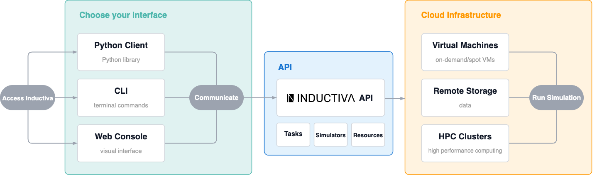

# Interfaces with the API

Inductiva provides an API to easily run large-scale simulations on the cloud.

To accomodate different workflows and user preferences, we offer three ways to interact with our API: the [Python Client](https://inductiva.ai/guides/api-functions/api/index), the [Command-Line Interface (CLI)](https://inductiva.ai/guides/api-functions/cli/overview), and the [Web Console](https://console.inductiva.ai/dashboard). While each interface can be used independently, they are designed to work together, providing a unified experience for managing your simulations.

This page explains the purpose of each component and how they all fit together.

The following diagram illustrates their relationship:



## The Three Interfaces

### Python Client: _a library that transforms API requests into simple code_

The **Python Client** is a library to control the Inductiva API programmatically within a Python script.

**Best For:**
- Run the built-in [simulators](https://inductiva.ai/simulators)
- Automating complex or repetitive workflows 
- Programmatically manage resources and data storage.

````{eval-rst}
.. seealso::
   Check the complete Python Client documentation `here <https://inductiva.ai/guides/api-functions/api/index>`_
````

### Command Line Interface: _for quick terminal operations_

The **Inductiva CLI** provides a fast and efficient way to interact with the API directly from the terminal, without needing to write a full script. It uses the same methods as the Python Client but eliminates the need to open an IDE or write a script for simple operations.

**Best For:**
- Quick operational tasks and one-off commands
- Check the status of a task or list all running machines.
- Download outputs or view logs for a specific task.
- Manually start or terminate a resource.

````{eval-rst}
.. seealso::
   Check the complete CLI documentation `here <https://inductiva.ai/guides/api-functions/cli/overview>`_
````

### Web Console: _an intuitive graphical interface for visualization and management_

The **Web Console** is a graphical interface to visually monitor tasks and resources, analyze costs, see statistics and analytics, and manage your account. It requires **no programming or command-line knowledge**, making it the most suited tool for a high-level overview.

**Best For:**
- Visually monitor resources.
- Analyze costs and manage your credits and account settings.
- Perform urgent actions like killing a task or terminating a machine group with a few clicks.

## How They Fit Together

Inductiva's ecosystem is designed for maximum flexibility. With all three interfaces built on the same API, you can seamlessly move between Python scripts, terminal commands, and the web interface as your workflow evolves.

Consider a typical workflow:

1.  **Launch with Python:** Define and launch simulations using a **Python script**.
2.  **Operate with the CLI:** Use for quick operational tasks like bulk file deletions, loading custom containers so you can [Bring Your Own Software](https://inductiva.ai/guides/expand/bring-your-own-software/index), or checking task status without opening an IDE.
3.  **Monitor in the Console:** Switch to the [Web Console](https://console.inductiva.ai/dashboard) for comprehensive visual monitoring, detailed task analytics, and cost analysis throughout your simulation lifecycle.


| | AUTOMATE & SCRIPT | LAUNCH SIMULATIONS | MONITOR & OPERATE | VISUAL ANALYTICS | MANAGE ACCOUNT |
| :--- | :---: | :---: | :---: | :---: | :---: |
| **Python Client** | ✅ | ✅ | ✅ | ❌ | ❌ |
| **CLI** | ❌ | ✅ | ✅ | ❌ | ❌ |
| **Web Console** | 🚧* | 🚧* | ✅ | ✅ | ✅ |

*You can now run scripts and launch simulations in the Web Console using the [Playground](https://console.inductiva.ai/playground) Beta feature.

```{banner}
:origin: blocks
```