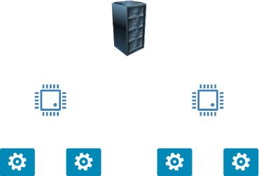

# Understanding Hyper-Threading in Computational Resources

Hyper-threading is a CPU technology that allows each physical core to handle **two threads** (tasks) simultaneously. This increases the total number of tasks your CPU can process at once and improves performance for certain workloads.

---

## What is a vCPU?

A **vCPU** (virtual CPU) is a thread exposed by a physical CPU core.  
With hyper-threading enabled:

- **1 physical core** → **2 threads** → **2 vCPUs**

Example:
- CPU with 2 physical cores → 4 vCPUs  
- CPU with 8 physical cores → 16 vCPUs



---

### How Hyper-Threading Works in Cloud Machines

The cloud machines we make available at Inductiva often expose **all available vCPUs** by default.  
Example machine types:

| Machine Type       | Physical Cores | Threads per Core | vCPUs |
|---------------------|-----------------|--------------------|-------|
| `c2d-highcpu-4`    | 2               | 2                  | 4     |
| `c3d-highcpu-16`   | 8               | 2                  | 16    |

Formula:
```
vCPUs = Physical Cores × Threads per Core
```

---

### Controlling Hyper-Threading

You can disable hyper-threading with Inductiva at the moment you create a
Machine Group. This is done by setting the parameter `threads_per_core=1` in the
constructor:

```python
cloud_machine = inductiva.resources.MachineGroup(
    provider="GCP",
    machine_type="c2d-highcpu-4",
    threads_per_core=1)
```

>**Note**: You can find out more about the Machine Group constructor [here](https://inductiva.ai/guides/api-functions/api/inductiva.resources#inductiva.resources.machine_groups.MachineGroup).

This forces the machine to expose only physical cores:

| Machine Type     | Physical Cores | Threads per Core | vCPUs |
| ---------------- | -------------- | ---------------- | ----- |
| `c2d-highcpu-4`  | 2              | 1                | 2     |
| `c3d-highcpu-16` | 8              | 1                | 8     |


> **Note**:
>
> * In the cloud, you are charged based on the **total number of vCPUs defined by the machine type**, not on how many vCPUs you actually use. This means the cost is the same whether you set `threads_per_core=1` or `threads_per_core=2`.
> * You can not change the number of threads per core at run time. This needs to be done when initializing the machine.

---

### Summary

* Hyper-threading increases parallel processing by exposing multiple threads per core.
* vCPUs = physical cores × threads per core.
* Cloud environments usually expose all vCPUs, but this can be controlled.
* The cost is based on the machine type, not on the actual vCPU usage, meaning, using `threads_per_core=1` does not reduce costs.


