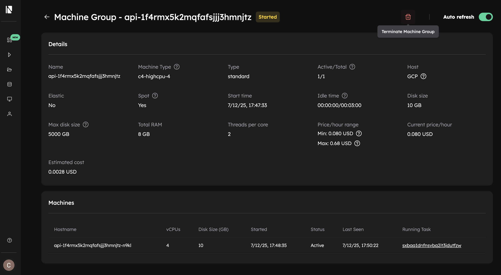

# Manage Resources

Once you have created your resources, the Inductiva API provides various methods and tools for managing them. This guide covers everything from launching resources to monitoring costs and terminating them when you're done.

## Quick Start

```python
import inductiva

# Start a machine group
machine_group = inductiva.resources.MachineGroup(
    machine_type="c2-standard-4",
    num_machines=2
)
machine_group.start()

# List active resources
resources = inductiva.resources.machine_groups.get()

# Terminate when done
machine_group.terminate()
```

## Core Operations
### Start

Start computational resources to run your simulations. You can start resources using Python or the CLI.

**Python**
```python
# Create and start a machine group
machine_group = inductiva.resources.MachineGroup(
    machine_type="c2-standard-4",
    num_machines=4,
    disk_size_gb=50,
    spot=True
)
machine_group.start()
```

**CLI**
```bash
# Start a machine group
inductiva resources start c2-standard-4

# Start with specific options
inductiva resources launch c2-standard-4 \
  --n 4  \
  -d 50 \
  --s
```

````{eval-rst}
.. seealso::
   Run `inductiva resources start --help` to see the full command syntax, arguments and options
```` 

### Listxw
Check the status and details of your active resources.

**Python**
```python
## Obtain a list with instances of all active resources
>>> resources_list = inductiva.resources.machine_groups.get()
>>> print(resources_list)
[MPICluster(name="api-23zssj6oq77xxsot3o0nhax3d"),
 ElasticMachineGroup(name="api-45fetsr58okcs0x6j9m0vsi2z"),
 MachineGroup(name="api-4kken08fnoxuu5zjjak6ak2xe")]
```

**CLI**
```bash
$ inductiva resources list
```

One obtains for example the following output:
```
Active Resources:

 NAME                            MACHINE TYPE     ELASTIC     TYPE       # MACHINES     DATA SIZE IN GB     SPOT     STARTED AT (UTC)     IDLE TIME         MAX COST ($/HOUR)
 api-3ejvh64mxuxnfcv3yxdhoyjuj   c2-standard-4    False       standard   5/5            50                  False    10 Jul, 16:23:00     0:01:15/0:3:00   1.4909
 api-5014txg0rwx3jbbpf6y0ndzmv   c2d-highmem-16   False       mpi        3/3            10                  False    10 Jul, 16:22:04     0:02:12/0:3:00   3.27774
 api-es9sjockjymvkwfmjioibfw8p   c2-standard-8    False       standard   2/2            60                  False    10 Jul, 16:23:25     0:02:50/0:03:00   1.08312
```

**Web Console**
From Inductiva's Web Console, you can also view your active resources navigating to the dedicated [Active Machine Groups page](https://console.inductiva.ai/machine-groups/active).

### Monitor Costs

Keep track of your resource costs to optimize your spending.

**Python**
When you register a resource object using the Python API, you can view the estimated cost in the CLI logs when running your script:

```bash
■ Registering MachineGroup configurations:
        · Name:                       api-2tq6za9oo7i9dym4o5049wu5f
        · Provider:                   GCP
        · Machine Type:               c4-highcpu-4
        · Data disk size:             10 GB
        · Auto resize disk max size:  5000 GB
        · Total memory (RAM):         8 GB
        · Maximum idle time:          3 minutes
        · Auto terminate timestamp:   N/A
        · Number of machines:         1
        · Spot:                       True
        · Estimated cloud cost of machine group:
                · Minimum: 0.080 $/h (1 machine with 10 GB disk)
                · Maximum: 0.690 $/h (1 machine with 5000 GB disk)
        · You are spending 2.4x less by using spot machines.
```

You can later also fecth this cost value again:
```python
# Get cost estimate for an active resource
>>> cost_estimate = machine_group.estimate_cloud_cost()
>>> print(f"Current resource cost: ${cost_estimate:.2f}/hour")
```

**CLI**
```bash
# Check cost for a specific configuration
inductiva resources cost c2-standard-4

# Output: Estimated total cost (per machine): 0.23 US$/h
```

````{eval-rst}
.. seealso::
   Run `inductiva resources cost --help` to see the full command syntax, arguments and options
```` 

**Web Console**
1- Navigate to the [Active resources page](https://console.inductiva.ai/machine-groups/active).
2- Click on the resource and see the value under **Estimated Cost**.

Or you can see the cost of a terminated resource:
1- Navigate to the [Terminated resources page](https://console.inductiva.ai/machine-groups/terminated).
2- Click on the resource and see the value under **Cost**.


## Terminate
Stop your resources when you're finished to avoid unnecessary costs.

**Python**
```python
# Terminate a specific resource
machine_group.terminate()

# Terminate by name
inductiva.resources.machine_groups.get_by_name("api-45fetsr58okcs0x6j9m0vsi2z").terminate()

# Get and terminate all resources
resources = inductiva.resources.machine_groups.get()
for resource in resources:
    resource.terminate()
```

**CLI**
```bash
# Terminate a specific resource (requires confirmation)
inductiva resources terminate api-45fetsr58okcs0x6j9m0vsi2z

# Terminate all resources (requires confirmation)
inductiva resources terminate --all
```

**Web Console**
1- Navigate to the [Active resources page](https://console.inductiva.ai/machine-groups/active).
2- Click on the resource you want to terminate and click the **Terminate Machine Group** button.

<div align="center">
   
   <figcaption align="center"><b>Task Metadata</b></figcaption>
</div>

All these are a blocking call that will only finish when the machines have terminated, in this way no computational resources are left up.

## Advanced Features
### Elastic Machine Groups

See a more advanced tutorial on how to setup and manage Elastic Machine Groups to run parallel simulations [here](manage_resources/set-up-elastic-machine-group.md).

### MPI Cluster
See a more advanced tutorial on how to setup and manage MPI Clusters to run parallel simulations [here](manage_resources/set-up-mpi-cluster.md).

```{toctree}
---
caption: Manage Resources
maxdepth: 2
hidden: true
---
manage_resources/set-up-elastic-machine-group
manage_resources/set-up-mpi-cluster
```
