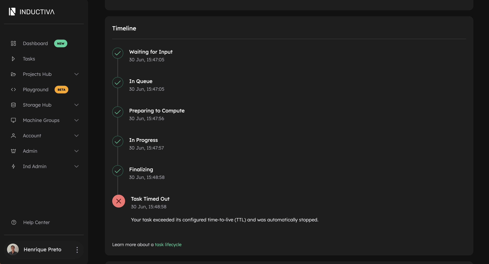

# Setting a TTL (Time-to-Live) on Your Simulations

## The Challenge

When running simulations, it's important to control how long a task can run to avoid
unnecessary resource usage and costs. Without limits, tasks may run longer than intended.

## The Solution

To set a TTL (Time-to-Live) for your simulation, use the `time_to_live` parameter when 
submitting the task. This parameter defines the maximum duration the task is allowed to 
run, specified as a string duration. It supports common time formats such as "10m", 
"2 hours", "2h", "1h30m", or "90s" (see 
[here](https://github.com/onegreyonewhite/pytimeparse2#pytimeparse2-time-expression-parser)
for more details on supported formats). The task will be automatically terminated if it
exceeds this duration after starting. This feature helps you control resource usage and
avoid running tasks longer than necessary (e.g., perfect for quick test runs).

```python
import inductiva

# ...

task = simulator.run(
    input_dir=input_dir,
    on=cloud_machine,
    time_to_live="1m",  # Sets TTL to 1 minute
)
```


You'll see logs like these in your terminal:

```bash
■ Your task exceeded its configured time-to-live (TTL) and was automatically stopped.
Downloading stdout and stderr files to inductiva_output/h04n8swuji8jgrex5sq7smsg2/outputs...
Partial download completed to inductiva_output/h04n8swuji8jgrex5sq7smsg2/outputs.
```

In the [Inductiva Console](https://console.inductiva.ai/dashboard), open the 
[Tasks](https://console.inductiva.ai/tasks) tab and click on your task to view its details. 
You'll see something like this:


