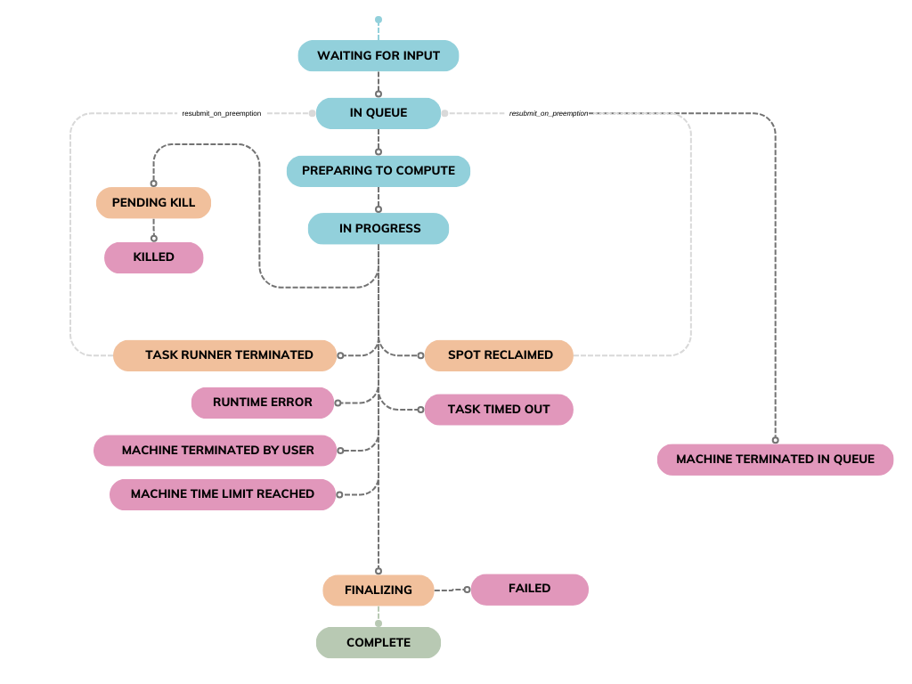

# Task Lifecycle

As a `Task` progresses through its lifecycle, its status changes to reflect
its current state. Understanding these states is essential for tracking
a `Task`’s progress and managing your simulations effectively through the API.

Below, you’ll find a diagram illustrating the possible states a `Task` can
move through and the transitions between them:

   
   <figcaption align = "center"><b>Task Lifecycle</b></figcaption>

## Task Status Overview

Each task progresses through several states from submission to completion. Below is a comprehensive breakdown of all possible states:

Status | What happened? | Why? | Recommendations to overcome
-- | -- | -- | --
Waiting for Input | Your simulation is waiting for all necessary input files. | The task will not be queued until the required input files are uploaded. | Wait for the input files to be uploaded. If there was an error while uploading the files, submit a new task.
In Queue | Your task is queued and waiting for a machine to become available. | The task is submitted but hasn’t yet been picked up by an available machine. If you’ve queued more tasks than the number of machines in the machine group, they will be picked up from the queue as machines become free from processing previous tasks. | Wait for the task to start, or kill it if no longer needed. To reduce waiting times, submit tasks to a machine group with more machines.
Preparing to Compute | Your task has been picked up by a machine. Required input files and container image are being downloaded in preparation to run the simulation. | The task has been picked up by a machine, which is now setting up the appropriate assets to run your task. | Wait for the simulation to proceed, or kill the task if no longer needed.
In Progress | The task's inputs and container image have been downloaded, and the simulation has now started running. | The machine has been set up with the requirements to run your simulation, which is now running. | Wait for the simulation to proceed, or kill the task if no longer needed. You can monitor the simulator logs in real time using the `inductiva logs` command.
Pending Kill | Your request to terminate the task has been received and is awaiting execution. | The system is processing your termination request for the running task. | Wait for the task to be fully terminated.
Killed | The task has been successfully terminated as per your request. | The task was terminated by user request. | No further action is required.
Machine Terminated in Queue | The machine group where the task was enqueued was terminated before the task started. | The task was still in the SUBMITTED status when the machine group was shut down. Since the task hadn’t started, there are no outputs or logs. | Restart the task by submitting it to a new machine group or ensure the machine group remains active for future tasks.
Spot Reclaimed | The spot instances running your task were terminated, and the task has been interrupted. | Spot instances were reclaimed by the cloud provider. If auto-resubmission is enabled, the task is re-queued and goes back to the SUBMITTED status. Otherwise, it stays in this state. | If cost savings are a priority, spot instances are a good choice. For uninterrupted tasks, consider switching to on-demand instances. If the task is stuck, enable auto-resubmission or manually resubmit it.
Failed | The task failed due to an error in the simulator, likely caused by incorrect input configurations or an internal simulator issue. | The simulator command returned a non-zero status code, indicating failure. | Inspect the simulator logs (stderr and stdout) for more information.
Finalizing | The simulation's commands have ended, and output files will be uploaded. | The simulation commands have ran. Results will now be uploaded to the user's storage. | The task's results will be uploaded to the user's storage and the task will go to a terminal status.
Task Runner Terminated | The machine running your task was terminated due to internal reasons from the provider. | The cloud provider terminated the executor unexpectedly. If auto-resubmission is enabled, the task is re-queued and returns to SUBMITTED status. Otherwise, it remains in this state. | Enable auto-resubmission to automatically resubmit the task, or manually resubmit the task.
Machine Terminated by User | The task’s executor was terminated by you while it was running. | The machine group was terminated after the task had started, but no outputs or logs are available because they are only saved once the task completes. | If outputs are needed, avoid terminating the machine group mid-task. Resubmit the task and let it finish to retrieve logs and results.
Machine Time Limit Reached | The task’s machine was terminated because it exceeded its time-to-live (TTL) limit. | The Machine Group’s TTL, defined by your quotas, was reached. This helps manage costs by ensuring resources don’t run longer than expected. | Start a new Machine Group with a larger TTL and resubmit the task. If your quotas don't allow a big enough TTL, talk to us.
Runtime Error | The task failed due to an error external to the simulator, such as low disk space. | An exception in the machine running the task, most commonly due to insufficient disk space, caused the task to fail. | Check the concrete reason for the error and act accordingly. If the the task failed due to insufficient disk space, resubmit the task in a machine group with larger disk space or configure the dynamic disk resize feature.
Task Timed Out | The task exceeded its configured time-to-live (TTL) and was automatically stopped. | The task ran longer than the TTL defined in your quotas, which helps control costs by limiting how long a task can use shared resources. You can also set a TTL manually for better control. | Resubmit the task and consider adjusting the TTL if more computation time is needed.
Credits Exhausted | The task was terminated because you ran out of credits. | Tasks consume credits to run. When your credit balance reaches zero, active tasks are stopped. | Purchase more credits to continue running simulations. You can check your current balance and add credits through your [account](https://console.inductiva.ai/account/top-ups).