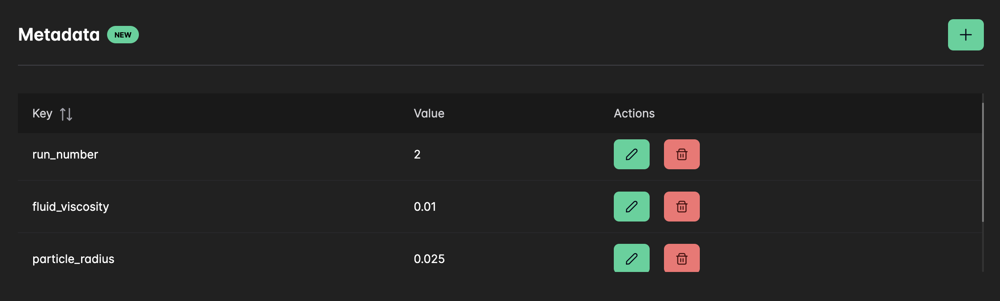

# Tasks

A `Task` represents a single execution of a simulation on the Inductiva platform. Tasks are automatically created when you submit a simulation to the API using the `run` method on any simulator object. Each submission creates a unique task with its own identifier, even when using identical parameters.

## Submitting Your First Task

Here's an example of how to create a `Task` by submitting a [SpliSHSPlasH](https://inductiva.ai/guides/splishsplash) simulation to the API:

```python
# Running the SplishSplash simulator example
import inductiva

# Instantiate machine group
machine_group = inductiva.resources.MachineGroup("c2-standard-4")
machine_group.start()

# Download example input files
input_dir = inductiva.utils.download_from_url(
    "https://storage.googleapis.com/inductiva-api-demo-files/"
    "splishsplash-input-example.zip", unzip=True)

# Instantiate the simulator
splishsplash_simulator = inductiva.simulators.SplishSplash()

# Run the SPlisHSPlasH simulation with the required .json config file
task = splishsplash_simulator.run(input_dir="splishsplash-input-example",
                                  sim_config_filename="config.json",
                                  on=machine_group)
print(task.id)
# Example output: i4ir3kvv62odsfrhko4y8w2an
```

> Subsequent calls to `splishsplash_simulator.run()` with the same input arguments will create a **new task**.

When a task is submitted, the API provides immediate feedback in the terminal about queue position and monitoring options:

```sh
# Number of tasks ahead in the queue: 3.
# · Consider tracking the status of the task via CLI:
#     inductiva tasks list --id <task_id>
# · Or, tracking the logs of the task via CLI:
#     inductiva logs <task_id>
# · Or, track the task files in real time with:
#     inductiva tasks list-files <task_id>
# · You can also get more information about the task via the CLI command:
#     inductiva tasks info <task_id>
```

---

You can also check task status and queue position programmatically:

```python
# Check queue position
position = task.get_position_in_queue()
if position is not None:
    print(f"Tasks ahead in queue: {position}")

# Check current status
print(f"Current status: {task.status}")
```

## Unique Task Identification

Every task receives a unique alphanumeric identifier that allows you to reference it across sessions:

```python
import inductiva

# Create task objects using existing task IDs
task1 = inductiva.tasks.Task("i4ir3kvv62odsfrhko4y8w2an")
task2 = inductiva.tasks.Task("i4ir3kvv62odsfrhko4y8w2an")

# These are different Python objects
print(f"task1 object ID: {id(task1)}")  # Output: 4410160112
print(f"task2 object ID: {id(task2)}")  # Output: 4389863104

# But they reference the same task
print(f"task1 ID: {task1.id}")  # Output: i4ir3kvv62odsfrhko4y8w2an
print(f"task2 ID: {task2.id}")  # Output: i4ir3kvv62odsfrhko4y8w2an
```

> **Note**: Creating multiple `Task` objects with the same ID doesn't duplicate tasks on the platform. All objects reference the same underlying task.

## Task Metadata

Many Inductiva API users generate extensive datasets by running hundreds or thousands of
simulation tasks, each with different input parameters. Previously, tracking these parameters
required maintaining external mechanisms — either local files or databases — to associate task IDs
with their corresponding parameter sets.

Now, it is possible to store these parameters as `task metadata` directly on the Inductiva platform:

```python
# Run a SpliSHSPlasH simulation
task = splishsplash_simulator.run(input_dir="splishsplash-input-example",
                                  sim_config_filename="config.json",
                                  on=machine_group)

# Store simulation parameters as metadata
task.set_metadata({
    "fluid_viscosity": "0.01",
    "particle_radius": "0.025",
    "simulation_time": "5.0",
    "run_number": "2",
})
```

> **Note**: Both metadata keys and values must be **strings**. Any numeric values, booleans, or other data types should be converted to strings before being stored as metadata.

And the metadata can later be retrieved by doing:

```python
metadata = task.get_metadata()
```

You can also manipulate the metadata in the Task's page on the [Web Console](https://console.inductiva.ai/tasks):

<div align="center">
   
   <figcaption align="center"><b>Task Metadata</b></figcaption>
</div>