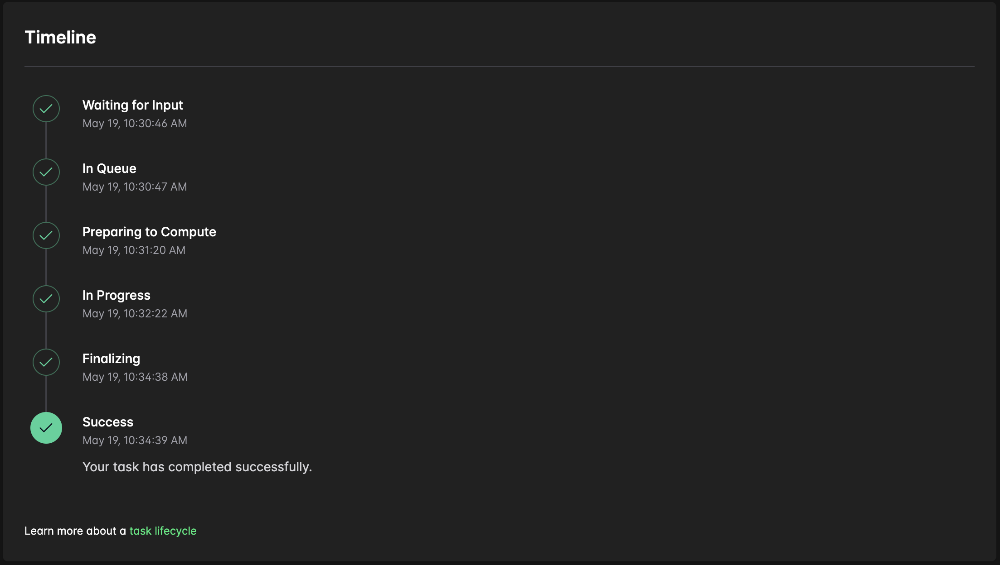
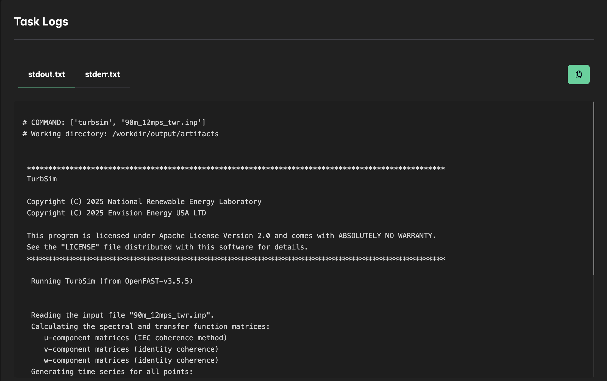

# Run a Single Simulation
First, we will run a single TurbSIM simulation using the [`90m_12mps_twr.inp`](https://github.com/OpenFAST/r-test/tree/v4.0.2/glue-codes/openfast/5MW_Baseline) wind example available in the OpenFAST repository. This should be straightforward as all the necessary input files are already prepared as described in the previous section.

## Code Overview
The Python code required to run a TurbSIM simulation using the Inductiva API follows a consistent structure. We adapt it for this specific use case, as shown below.


```python
import inductiva

# Allocate cloud machine on Google Cloud Platform
cloud_machine = inductiva.resources.MachineGroup( \
    provider="GCP",
    machine_type="c2d-highcpu-2",
    spot=True)

# Initialize OpenFast stack, which includes turbosim
openfast = inductiva.simulators.OpenFAST()

# Run turbosim command on the 90m_12mps_twr.inp input file.
task = openfast.run(input_dir="input_files/",
                    commands=["turbsim 90m_12mps_twr.inp"],
                    on=cloud_machine)

# Wait for the simulation to finish and download the results
task.wait()
cloud_machine.terminate()

task.download_outputs()

task.print_summary()
```

When the simulation is complete, we terminate the machine, download the results and print a summary of the simulation as shown as follows.

```
Task status: Success

Timeline:
        Waiting for Input         at 19/05, 10:30:46      1.078 s
        In Queue                  at 19/05, 10:30:47      33.417 s
        Preparing to Compute      at 19/05, 10:31:20      61.376 s
        In Progress               at 19/05, 10:32:22      136.385 s
                └> 136.186 s       turbsim 90m_12mps_twr.inp
        Finalizing                at 19/05, 10:34:38      0.655 s
        Success                   at 19/05, 10:34:39      

Data:
        Size of zipped output:    8.16 MB
        Size of unzipped output:  8.39 MB
        Number of output files:   6

Estimated computation cost (US$): 0.0010 US$
```

You can also check the [Inductiva Web Console](https://console.inductiva.ai/) for more task information. You can check task details, navigate the task filesystem and even read the logs in real time!




## Performance and Cost Analysis
Given that TurbSIM does not benefit from multiple CPU cores, we chose the `n2-highcpu-2` virtual machine (VM) with 2 virtual CPUs (equivalent to 1 physical core). 
This is one of the cheapest options on Google Cloud, costing just US$0.0081 per hour in spot mode.

In the next part of this tutorial, we'll take things to the next level by running dozens of TurbSIM simulations in parallel on Inductiva, demonstrating 
the true power of cloud-based scalability. Stay tuned!