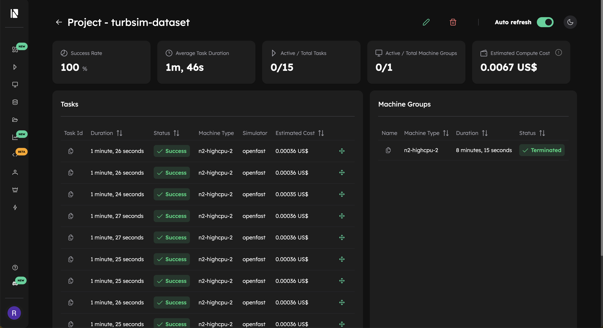

# Generate the Dataset
In the previous part of this tutorial we set up a templating system that allows us to programmatically modify the `URef`, `seed_1` and `seed_2` parameter in the OpenFAST input file. 
This allows us to easily generate multiple simulation configurations.

We will now take the next step and use a for loop to automate the process and generate a dataset in parallel. This approach demonstrates the true power 
of Inductiva: efficiently scaling simulations to save computation time.

## Writing a “for loop” and adding more machines
We will first show you all the necessary code and then analyze it step by step. Each section of code is easy to understand and builds on the examples shown 
in the previous parts of this tutorial.

```python
import random

import inductiva

project = inductiva.projects.Project("turbsim_dataset")

# Allocate cloud machine
cloud_machine = inductiva.resources.ElasticMachineGroup(
   provider="GCP",
   machine_type="n2-highcpu-2",
   spot=True,
   min_machines=1,
   max_machines=5)

# Turbosim takes seeds from -2147483648 to 2147483647
MIN_INT = -2_147_483_648
MAX_INT = 2_147_483_647
UREF_MIN = 7
UREF_MAX = 17
DATASET_SIZE = 25

for i in range(DATASET_SIZE):
    # Sample the parameters
    seed_1 = random.randint(MIN_INT, MAX_INT)
    seed_2 = random.randint(MIN_INT, MAX_INT)
    URef = random.randint(UREF_MIN, UREF_MAX)

    print(f"Preparing files for TurbSim with "\
          f"seed1 = {seed_1}, seed_2 = {seed_2}, "\
          f"URef = {URef}")
    target_dir = f"variations/s1_{seed_1}/s2_{seed_2}/URef_{URef}"
    inductiva.TemplateManager.render_dir(
        source_dir="input_files",
        target_dir=target_dir,
        overwrite=True,
        seed_1=seed_1,
        seed_2=seed_2,
        URef=URef)

    # Initialize the Simulator
    turbsim = inductiva.simulators.OpenFAST()

    # Run simulation
    task = turbsim.run(
        input_dir=target_dir,
        commands=["turbsim 90m_12mps_twr.inp"],
        on=cloud_machine,
        resubmit_on_preemption=True,
    )

    project.add_task(task)

    # Save the parameters in task metadata for later
    task.set_metadata({
        "seed_1": str(seed_1),
        "seed_2": str(seed_2),
        "URef": str(URef),
        "local_template_dir": target_dir
    })

project.wait()
cloud_machine.terminate()

```

Let's break this script into parts.

## Code section 1: Creating the Project

We will use a project to group all the tasks. This allows us to wait for all tasks to complete and provides additional information, such as the project’s total cost.

```python
project = inductiva.projects.Project("turbsim_dataset")
```

## Code Section 2: Allocating the Cloud Machine Group
We will allocate an elastic machine group to run our simulations. This group has a minimum number of active machines and a maximum capacity. 
Machines are dynamically turned on or off as demanded, ensuring efficient resource utilization.

As some simulations may take longer than others, this elastic setup prevents idle waiting. When a machine completes its task and has no more simulations to run, 
it does not have to wait for all the other machines to finish. Instead, the elastic group of machines automatically scales down, optimizing cloud usage and 
reducing costs.

```python
# Allocate cloud machine
cloud_machine = inductiva.resources.ElasticMachineGroup(
   provider="GCP",
   machine_type="n2-highcpu-2",
   spot=True,
   min_machines=1,
   max_machines=50)
```

## Code Section 3: Use Inductiva Templating to Generate Input Variations
We now enter a loop that is responsible for generating new input files and running each simulation.

First, we sample the values for `seed_1`, `seed_2` and `URef`. For each triplet of values, we generate input files using the `render_dir` method as we saw in the previous section:

```python
for i in range(DATASET_SIZE):
    # Sample the parameters
    seed_1 = random.randint(MIN_INT, MAX_INT)
    seed_2 = random.randint(MIN_INT, MAX_INT)
    URef = random.randint(UREF_MIN, UREF_MAX)

    print(f"Preparing files for TurbSim with "\
          f"seed1 = {seed_1}, seed_2 = {seed_2}, "\
          f"URef = {URef}")
    target_dir = f"variations/s1_{seed_1}/s2_{seed_2}/URef_{URef}"
    inductiva.TemplateManager.render_dir(
        source_dir="input_files",
        target_dir=target_dir,
        overwrite=True,
        seed_1=seed_1,
        seed_2=seed_2,
        URef=URef)
```

## Code Section 4: Starting Simulation
Next, we initialize the OpenFAST simulator and run the simulation using the newly created input directory. Each simulation task is added to the project, allowing us to track and wait for all tasks to be completed. We also save some task metadata to keep track of the input parameters.

Note: we use `resubmit_on_preemption=True` when submitting a task to ensure that, if a machine is preempted, the task is automatically resubmited on another machine. ªreemptions can occur when using `spot` machines, which are significantly cheaper (up to 5x less expensive than regural instances), but come with the risk of possibly being interrupted at any time.

```python
    ...
    # Initialize the Simulator
    turbsim = inductiva.simulators.OpenFAST()

    # Run simulation
    task = turbsim.run(
        input_dir=target_dir,
        commands=commands,
        on=cloud_machine,
        resubmit_on_preemption=True,
    )

    # Add task to the project
    project.add_task(task)

    # Save the parameters in task metadata for later
    task.set_metadata({
        "seed_1": str(seed_1),
        "seed_2": str(seed_2),
        "URef": str(URef),
        "local_template_dir": target_dir
    })
```


## Code Section 5: Waiting for the Simulations to finish
In this last part of the code we just wait for all the tasks to finish.

Once all the tasks are done, we turn off our cloud machines.

```python
project.wait()
cloud_machine.terminate()
```

You can list the tasks from this project by running this command on
your command line interface `inductiva tasks list -p turbsim_dataset`

Alternatively, you can also check the tasks projects in the [Inductiva Web Console](https://console.inductiva.ai/) on the "Projects" tab:




## Summary
We demonstrated how Inductiva can be used to efficiently run multiple TurbSim simulations in parallel and generate a dataset. 

While a single TurbSim simulation may run faster on a local machine with high processing power, scaling up to dozens or hundreds of simulations is where Inductiva excels. By automating input file modifications
and distributing simulations across inexpensive cloud machines, you can drastically reduce overall computation time and streamline large-scale studies.

With just a few lines of Python, you can effortlessly scale your OpenFAST projects - saving time, optimising resources and accelerating your research. 🚀
