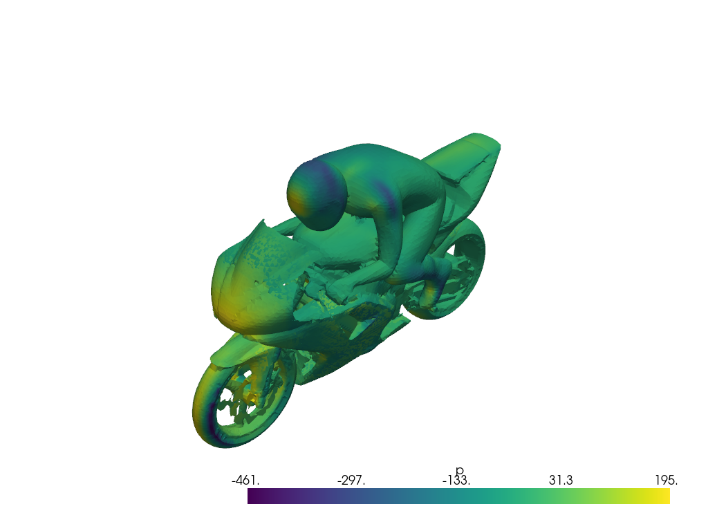

# Generate an OpenFOAM Dataset
In this tutorial, we will demonstrate how to use the Inductiva API to efficiently generate an OpenFOAM dataset 
in parallel by varying the inlet wind speed. This approach allows rapid creation of multiple simulation cases 
with different wind conditions, facilitating the analysis of flow behavior and performance sensitivity over 
a controlled range of wind speeds. By leveraging cloud resources, users can run these simulations in parallel 
and accelerate the generation of CFD data for further study or integration into downstream workflows.

<p align="center"></p>

To demonstrate this process, we will use the incompressible, steady-state simpleFoam solver along with 
the [motorBike example](https://develop.openfoam.com/Development/openfoam/-/tree/master/tutorials/incompressible/simpleFoam/motorBike), which is available in the [OpenFOAM repository](https://develop.openfoam.com/Development/openfoam).

```{toctree}
:hidden:
sections/section1.md
sections/section2.md
sections/section3.md
sections/section4.md
sections/section5.md
```
