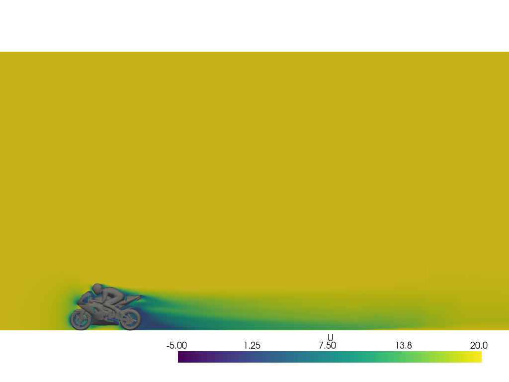

# Prerequisites
Before running a OpenFOAM simulation, ensure all the necessary files are correctly set up. This guide will walk you through the preparation process.

Let’s get started!

<p align="center"></p>


### Download the Simulation File
Download the required [motorBike example](https://develop.openfoam.com/Development/openfoam/-/tree/master/tutorials/incompressible/simpleFoam/motorBike) and place it in your working directory under a folder named `openfoam-input-example/`. We also prepared a zip you can [download here](https://storage.googleapis.com/inductiva-api-demo-files/openfoam-input-example.zip). 

Alternatively, you can also download the example files using inductiva:

```python
import inductiva

input_dir = inductiva.utils.download_from_url(
    "https://storage.googleapis.com/inductiva-api-demo-files/"
    "openfoam-input-example.zip",
    unzip=True)
```

Your directory structure should look like this:

```
- openfoam-input-example/  
  ├── 0
  ├── Allrun
  ├── constant
  └── system
```


The folder structure above represents a typical OpenFOAM case setup:
- `0/` - Contains the initial and boundary conditions for the simulation variables (e.g., velocity, pressure). These files define the starting state of the flow field.
- `constant/` — Stores physical properties of the system such as fluid properties, turbulence model settings, and the mesh definition.
- `system/` — Includes control files that govern the simulation setup, such as solver settings, numerical schemes, and solver algorithms.

This structure is fundamental for OpenFOAM simulations, enabling users to define the problem, specify physical properties, and control numerical execution.

That’s it — you’re ready to send your simulation to the cloud!