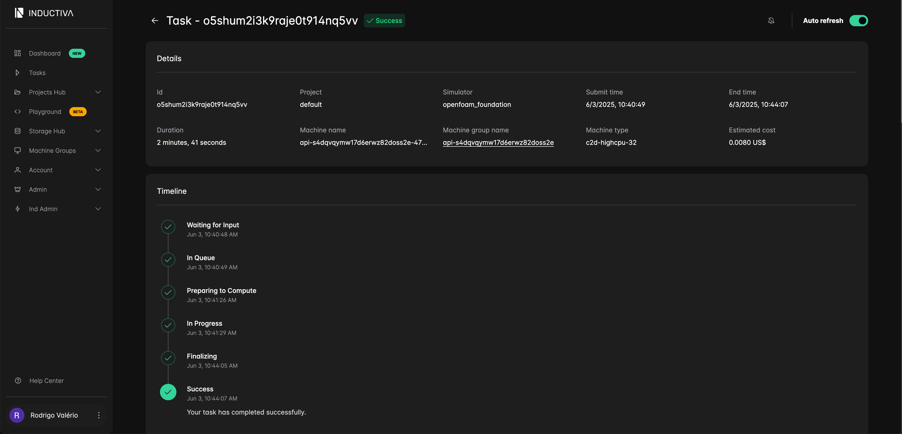
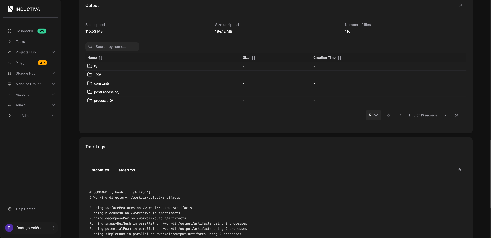

# Run a Single Simulation
First, we will run a single OpenFOAM simulation using the `motorBike` 
case. This should be straightforward as all the necessary input files are 
already prepared, as described in the previous section.

## Code Overview
The Python code required to run a OpenFOAM simulation using the Inductiva API follows a consistent structure. We adapted it for this specific use case, as shown below.

```python
import inductiva

# Allocate cloud machine on Google Cloud Platform
cloud_machine = inductiva.resources.MachineGroup( \
    provider="GCP",
    machine_type="c2d-highcpu-32",
    spot=True)

# Initialize OpenFOAM stack
openfoam = inductiva.simulators.OpenFOAM()

task = openfoam.run( \
    input_dir="openfoam-input-example/",
    shell_script="./Allrun",
    on=cloud_machine)

# Wait for the simulation to finish and download the results
task.wait()
cloud_machine.terminate()

task.download_outputs()

task.print_summary()
```

When the simulation is complete, we terminate the machine, download the results and print a summary of the simulation as shown as follows.

```
Task status: Success

Timeline:
        Waiting for Input         at 03/06, 10:31:51      1.346 s
        In Queue                  at 03/06, 10:31:52      41.149 s
        Preparing to Compute      at 03/06, 10:32:34      4.007 s
        In Progress               at 03/06, 10:32:38      156.559 s
                └> 156.233 s       bash ./Allrun
        Finalizing                at 03/06, 10:35:14      1.23 s
        Success                   at 03/06, 10:35:15      

Data:
        Size of zipped output:    115.53 MB
        Size of unzipped output:  184.12 MB
        Number of output files:   110

Estimated computation cost (US$): 0.0080 US$
```

You can also visit the [Inductiva Web Console](https://console.inductiva.ai/) to view task details, navigate 
the task the filesystem, and monitor logs in real time.





In the next part of this tutorial, we'll take things to the next level by running dozens of OpenFOAM simulations in parallel on Inductiva, demonstrating the true power of cloud-based scalability. Stay tuned!