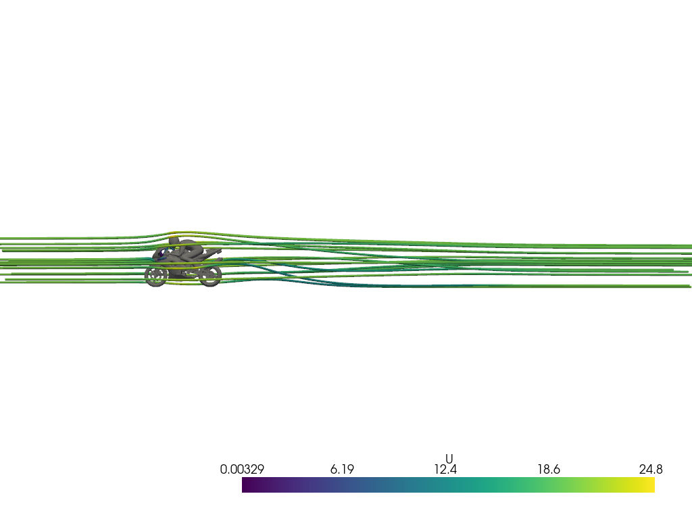

# Results and Key Takeaways
We successfully generated a OpenFOAM dataset in parallel by sampling the wind speed.
This demonstrates the power of using cloud resources to efficiently scale up computational experiments. 
Now it's time to retrieve all the results and analyze the data to extract meaningful insights from our simulations.

<p align="center"></p>


## Project Summary and Output Download
Using the Inductiva package, it is easy to get a project summary and download all the output files. The following code snippet demonstrates how to do this:

```python
import inductiva


openfoam_project = inductiva.projects.Project(
   name="openfoam_dataset")


print(openfoam_project)

openfoam_project.download_outputs()
```

Executing `print(openfoam_project)` gives a summary of the main project details:

```
Project 'openfoam_dataset' created at 2025-06-03 11:02.

Total number of tasks: 25

Tasks by status:
  success: 25

Estimated total computation cost: 0.20 US$
```

Running `openfoam_project.download_outputs()` creates a folder called `inductiva_output/openfoam_project` with one folder for each simulation.

## Retrieve Task Metadata
Retrieving the previously set metadata is easy with the Inductiva API.
Below we show how you can retrieve the metadata of all the tasks in the project:

```python
import inductiva

openfoam_project = inductiva.projects.Project(
   name="openfoam_dataset")

for task in openfoam_project.get_tasks():
    print(f"Task ID: {task.id}")
    print(f"Task metadata: {task.get_metadata()}")
    print()
```

```
Task ID: 3b9n21xqqt97nbec07yzr6wzr
Task metadata: {'wind_speed': '46', 'local_template_dir': 'variations/wind_speed_46'}

Task ID: d5r521g6igus8wh9c3yy8fbry
Task metadata: {'wind_speed': '15', 'local_template_dir': 'variations/wind_speed_15'}

Task ID: iqf11voamuizebwt1edukkfw9
Task metadata: {'wind_speed': '7', 'local_template_dir': 'variations/wind_speed_7'}

..
```

## Key Takeaways
In summary, using cloud computing for generating datasets of large-scale simulations not only increases efficiency, but also significantly reduces computational time and cost. 

Inductiva makes it possible and convenient to run hundreds or thousands of simulations. For example, you could now change the code for:

1. Cover a design space with many more parameters;
2. Add a black-box optimizer, such as [Vizier](https://github.com/google/vizier),
on top of the loop and add an evaluation function to analyse the result of each completed simulation and perform an intelligent exploration of the design space;
3. Build a really large dataset of example simulations to later train a surrogate model.

Inductiva can simplify research by making high-performance computing more accessible and cost-effective.
