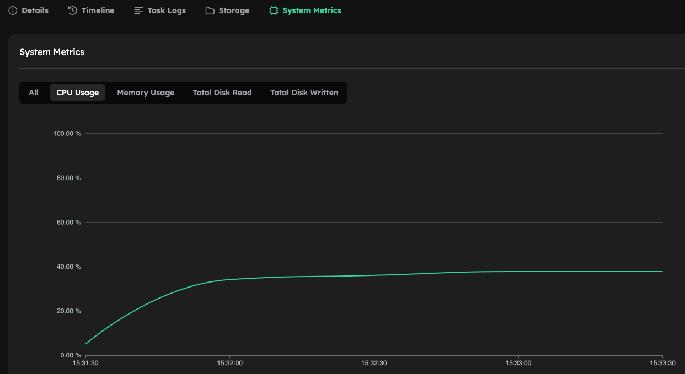
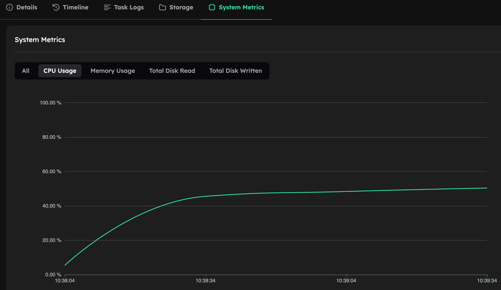

# OpenFOAM-Foundation on Inductiva

To understand the default behavior of OpenFOAM-Foundation when running on Inductiva, let’s start by running the tutorial provided [here](../quick-start.md).

We will run the exact same simulation but with one small change: we will use the default settings for the VM. Your code should look like this:

```python
import inductiva

cloud_machine = inductiva.resources.MachineGroup(
    provider="GCP",
    machine_type="c2d-highcpu-16",
    spot=True)
```

When you run this simulation, keep in mind that it is originally divided into **6 sub-domains**. Because of this, you will notice that CPU utilization peaks at around **37%**:



This happens because the VM is configured with `threads_by_core=2`, which is the default behavior for virtual machines (see more [here](https://inductiva.ai/guides/how-it-works/machines/hyperthreading)). As a result, your simulation uses only **6 vCPUs out of 16**, which explains the ~37% CPU utilization.

To fully utilize the machine you have to use all available vCPUs. This can be done in two regimes:

1) Default mode: hyper-threading turned on, 2 vCPUs per Physical Core

2) Hyper-threading turned OFF, 1 vCPU per Physical Core

---

## 1. Utilize All Available vCPUs

Alternatively, you can run the simulation on all 16 vCPUs. To do this, edit the `Allrun` script and replace every instance of `runParallel` with:

```bash
mpirun -np 16 --use-hwthread-cpus <command> -parallel
```

>**Note**:
>
> * You can learn more about MPI on VMs [here](https://inductiva.ai/guides/how-it-works/machines/mpi-on-vms).
> * Don't forget to add the `-parallel` flag after the OpenFOAM command.

This approach results in ~100% CPU usage while utilizing all 16 vCPUs.

[CPU Usage](../_static/foundation_16_vcpus.png)

---


## 2. Utilize All Physical Cores

This approach is straightforward: divide your domain into the same number of **physical cores** and run the simulation.

* The VM provides 16 vCPUs, but only 8 physical cores.
* Running with 8 processes (one per core) results in ~50% CPU utilization:



You can also configure your VM so that the number of available vCPUs matches the number of physical cores (using `threads_by_core=1`). More information is provided [here](https://inductiva.ai/guides/how-it-works/machines/hyperthreading).
This change will make CPU utilization appear as **100%**, due to the fact that the VM will only have 8 vCPUs:


> **Note**: To clarify. The `c2d-highcpu-16` has 16 vCPUs with the default `threads_per_core=2`. Once we change to `threads_per_core=1` the VM will only have 8 vCPUs, one vCPU per phisical core. Meaning, that using 8 partitions will result in a CPU utilization of 100%.

---

## Analyzing the Results

There are several possible configurations for running this simulation. Here’s a summary of the execution times and costs for each case:

| Machine Type   | Threads per Core | vCPUs Available| MPI Procs |Execution Time | Cost (US$) |
| -------------- | ---------------- | ---------------|---------- |-------------- | ---------- |
| c2d-highcpu-16 | 2                | 16             |  6        | 2 min 19 sec   | 0.0030     |
| c2d-highcpu-16 | 1                | 8              |  8        | 1 min 58 sec   | 0.0026     |
| c2d-highcpu-16 | 2                | 16             |  8        | 1 min 56 sec   | 0.0025     |
| c2d-highcpu-16 | 2                | 16             |  16       | 1 min 53 sec   | 0.0025     |

From these results:

* Switching from `threads_per_core=2` to `threads_per_core=1` has little impact (differences might be within the margin of normal variation).
* Running this simulation with all 16 vCPUs seems to be the fastest way to do it, but the difference is minimal. These results do not necessarily apply to cases where you run OpenFOAM with many more partitions because in those regimes **memory bandwidth limitations** may become more apparent.


> **Note**:
>
> * This is a very small test case, so the results may not be representative.
> * Each simulation behaves differently; what works best here may not work in other scenarios, and vice versa.

---

Next, we’ll explore the same test on a larger, more realistic simulation.


# Large-Scale Example: Steady-State CFD Simulation of Wind Flow in the Perdigão Region

To better understand atmospheric flow over complex terrain, we conducted a
steady-state CFD simulation of the [**Perdigão region in Portugal**](https://journals.ametsoc.org/view/journals/bams/100/5/bams-d-17-0227.1.xml). This site
is notable for its two parallel ridges, which generate intricate wind flow
patterns and make it a reference location for atmospheric research.

The simulation was carried out with OpenFOAM’s `simpleFoam` solver on a
structured, terrain-following graded mesh containing **14 million cells**. The
computational domain spanned **30 × 30 × 3 km**, with idealized atmospheric
boundary layer (ABL) conditions applied at the inlet. Turbulence closure was
modeled using the **k–ε model**, and a stepped
**first-order to second-order convection scheme** was employed to ensure better
convergence.

## Analyzing the Results

| Machine Type   | Threads per Core | vCPUs Available | MPI Procs | Execution Time | Cost (US$) |
| -------------- | ---------------- | --------------- | --------- | -------------- | ---------- |
| c4d-highcpu-96 | 2                | 96              | 48        | 9 hrs 20 min   | 15.48      |
| c4d-highcpu-96 | 2                | 96              | 96        | 10 hrs 58 min  | 18.21      |
| c4d-highcpu-96 | 1                | 48              | 48        | 9 hrs 23 min   | 15.58      |
| c4d-highcpu-48 | 2                | 48              | 48        | 19 hrs 8 min   | 15.93      |

We ran these tests to understand how hyperthreading and machine size affect OpenFOAM performance and cost. Specifically, we wanted to see whether it was better to (1st row) stick to physical cores, (2nd row) try to exploit all vCPUs, or (3rd row) use a smaller instance to reduce cost at the expense of runtime.

The first configuration (48 MPI ranks on 96 vCPUs with hyperthreading enabled) follows the standard OpenFOAM-Foundation practice of mapping one rank per physical core. This gave the fastest adn cheapest runtime at **9 hrs 20 min** and 15.48 US$.

In the second run, we increased the number of MPI ranks to 96 to match all available vCPUs. The idea was to test whether fully loading the hyperthreaded machine would improve throughput. Instead, runtime increased to **10 hrs 58 min**, demonstrating that oversubscribing hyperthreaded cores adds contention and communication overhead, reducing efficiency.

For the third run, we disabled hyperthreading (`threads_per_core=1`), leaving 48 vCPUs that correspond directly to the 48 physical cores. The runtime (**9 hrs 23 min**) was essentially the same as in the first case, confirming that hyperthreading does not provide a performance benefit when already running one MPI rank per physical core.

Finally, we tested a smaller instance (c4d-highcpu-48) with 48 vCPUs. Since these map to only 24 physical cores, running 48 MPI ranks oversubscribed the hardware. Our hypothesis was that even with a slower runtime, the lower hourly cost of the smaller machine might make the simulation cheaper overall. However, the result was a **19 hrs 8 min** runtime and a slightly higher cost compared to the larger instance, making this option both slower and more expensive.

**In summary:** the best strategy seems to be to run one MPI rank per physical core. Hyperthreading offers no measurable benefit for this workload, while attempting to use all logical cores or relying on smaller hyperthreaded instances leads to worse performance and, in some cases, higher cost.
