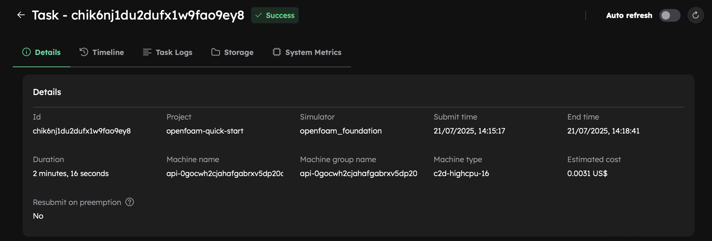
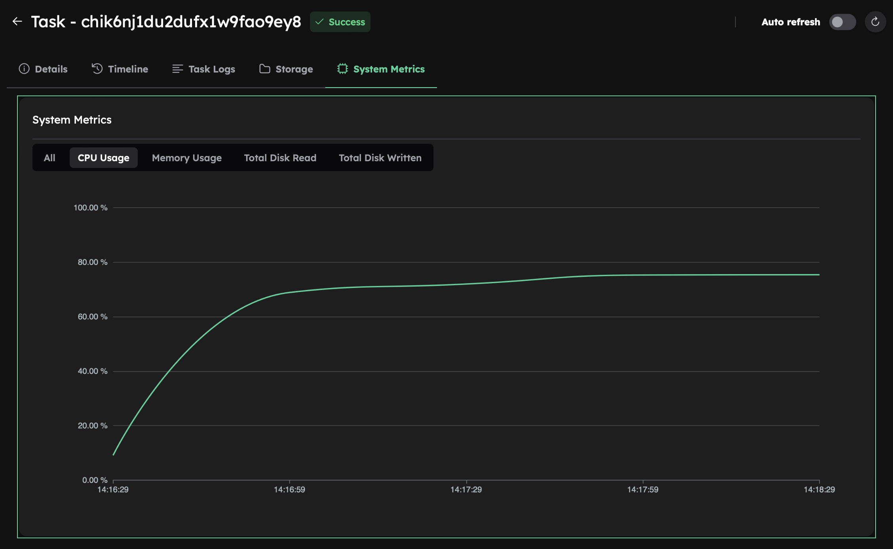
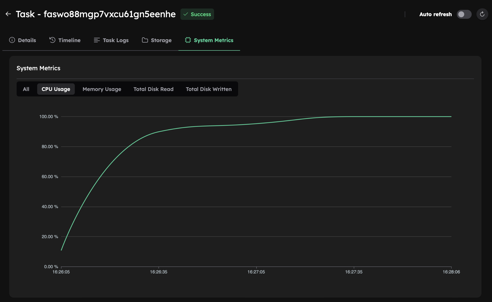

# Run Your First Simulation
This tutorial will show you how to run OpenFOAM simulations using the Inductiva API. 

We will cover the `motorBike` use case from the OpenFOAM Foundation GitHub repository, to help you get started with simulations.

## Prerequisites
Before running the simulation, you’ll need to download the required input files. You can either:

- **Manually download** them from the [OpenFOAM Foundation GitHub repository](https://github.com/OpenFOAM/OpenFOAM-8/tree/version-8/tutorials/incompressible/simpleFoam/motorBike) and place them in a folder named `motorBike`,
**or**
- **Download automatically** using the link provided [here](https://storage.googleapis.com/inductiva-api-demo-files/openfoam-tutorials/motorBike.zip).

Once downloaded, you’ll be ready to submit your simulation to the Cloud.

## Running an OpenFOAM Simulation
This section guides you through launching a simulation using the Inductiva API. You’ll configure a cloud machine, 
run the task and monitor its performance.

### Simulation Script
Here is the code required to run an OpenFOAM simulation using the Inductiva API:

```python
"""OpenFOAM example"""
import inductiva

# Allocate cloud machine on Google Cloud Platform
cloud_machine = inductiva.resources.MachineGroup( \
    provider="GCP",
    machine_type="c2d-highcpu-16",
	# 1 thread per physical core
	threads_per_core=1,
	spot=True)

# Initialize the Simulator
OpenFOAM = inductiva.simulators.OpenFOAM( \
    version="8",
	distribution="foundation")

# Run simulation
task = OpenFOAM.run(input_dir="/Path/to/motorBike",
    shell_script="./Allrun",
	# add simulation to a project
	project="openfoam-quick-start",
    on=cloud_machine)

# Wait for the simulation to finish and download the results
task.wait()
cloud_machine.terminate()

task.download_outputs()

task.print_summary()
```

> **Note**: Setting `spot=True` enables the use of spot machines, which are available at substantial discounts. 
> However, your simulation may be interrupted if the cloud provider reclaims the machine.

We run the simulation using the `run` method, specifying the `shell_script` that handles the execution process (in this case, `./Allrun`).

### Understanding Resource Configuration
In this basic example, we're using a cloud machine (`c2d-highcpu-16`) equipped with 8 physical cores and 16 virtual CPUs. 

For larger or more compute-intensive simulations, consider adjusting the `machine_type` parameter to select 
a machine with more virtual CPUs and increased memory capacity.

> 👉 Explore the full range of available machines [here](https://console.inductiva.ai/machine-groups/instance-types).

### Why Set threads_per_core=1?
In OpenFOAM-Foundation v8, the `runParallel` function uses only **physical** CPU cores and ignores hyperthreaded ones. To match this behavior, we request machines with `threads_per_core=1`, which disables hyperthreading and makes only the physical cores available to the simulation.

> 🔍  For a deeper explanation of this limitation, see [FAQ #6](faq.md#6-why-does-my-simulation-keep-failing-with-there-are-not-enough-slots-available-even-though-my-machine-has-enough-resources)

### Simulation Summary
When the simulation is complete, we terminate the machine, download the results and print a summary of the simulation as shown below.

```
Task status: Success

Timeline:
	Waiting for Input         at 21/07, 14:15:16      0.79 s
	In Queue                  at 21/07, 14:15:17      67.981 s
	Preparing to Compute      at 21/07, 14:16:25      4.064 s
	In Progress               at 21/07, 14:16:29      130.341 s
		└> 130.186 s       bash ./Allrun
	Finalizing                at 21/07, 14:18:39      1.751 s
	Success                   at 21/07, 14:18:41      

Data:
	Size of zipped output:    251.85 MB
	Size of unzipped output:  344.54 MB
	Number of output files:   464

Estimated computation cost (US$): 0.0031 US$

Go to https://console.inductiva.ai/tasks/chik6nj1du2dufx1w9fao9ey8 for more details.
```

As you can see in the "In Progress" line, the part of the timeline that represents the actual execution of the simulation, 
the core computation time of this simulation was approximately 2 minutes and 10 seconds (130.3 seconds).

You can view more details about your simulation task in the Inductiva Console [Inductiva Console](https://console.inductiva.ai/tasks), including the task timeline, logs, output storage, and system metrics.

<p align="center"></p>

### Monitoring System Metrics
Since our machine has 8 physical cores but the simulation uses only 6, it’s expected that the system isn’t fully utilized. 
This is confirmed by checking the **System Metrics** tab in the Console after the simulation completes, where CPU utilization 
is around 70%, indicating suboptimal usage.

<div align="center">
   
</div>

## Improving Efficiency: Use All Physical Cores
To fully utilize available resources, update the simulation to run across all 8 **physical cores**.

To achieve this, update the `system/decomposeParDict` file by modifying the following fields:

```diff
-numberOfSubdomains 6;
+numberOfSubdomains 8;

method          hierarchical;
// method          ptscotch;

simpleCoeffs
{
    n               (4 1 1);
    delta           0.001;
}

hierarchicalCoeffs
{
-    n               (3 2 1);
+    n               (4 2 1);
    delta           0.001;
    order           xyz;
}
```
This change configures the simulation to use **8 subdomains**, matching the number of **physical cores** on the `c2d-highcpu-16` machine. 

Now rerun the simulation using the same script. This time, System Metrics should show near-100% CPU utilization, indicating full use of the machine’s resources:

<div align="center">
   
</div>

## Improving Performance: Scale Up the Simulation
To reduce runtime even further, scale up to a larger machine.

For example, move from a machine with 8 physical cores to one with 16 physical cores (`c2d-highcpu-32`, which has 32 vCPUs).

* **Step 1: Update Machine Configuration**
Change the `machine_type` in the script:

```python
cloud_machine = inductiva.resources.MachineGroup(
    provider="GCP",
    machine_type="c2d-highcpu-32",
    # 1 thread per physical core
	threads_per_core=1,
    spot=True
)
```

* **Step 2: Update Simulation Configuration**
Update the `system/decomposeParDict` file to divide the simulation into 16 subdomains:

```diff
-numberOfSubdomains 8;
+numberOfSubdomains 16;

method          hierarchical;
// method          ptscotch;

simpleCoeffs
{
    n               (4 1 1);
    delta           0.001;
}

hierarchicalCoeffs
{
-    n               (4 2 1);
+    n               (8 2 1);
    delta           0.001;
    order           xyz;
}
```

Now rerun the simulation using the updated script and configuration.

## Results
Here’s a comparison of the different subdomain counts and machine sizes:

| Machine Type       | Subdomains | Execution Time | Estimated Cost (USD) |
|--------------------|-------------|----------------------|------------|
| c2d-highcpu-16     | 6           | 2 min, 9s        | 0.0031 US$  |
| c2d-highcpu-16     | 8           | 1 min, 56s        | 0.0030 US$  |
| c2d-highcpu-32     | 16          | 1 min, 8s        | 0.0037 US$  |

Compared to 6 subdomains on 8 cores, running 16 subdomains on 16 physical cores **nearly halved the simulation runtime** — 
reducing it from 2 minutes 10 seconds to just 1 minute 8 seconds — with only a 19% increase in estimated cost.

```{banner_small}
:origin: openfoam
```

## Adapting This Workflow to Other OpenFOAM Cases
To run other OpenFOAM simulations, follow these steps:
- Change the `input_dir` to point to your OpenFOAM case.
- Adjust the version and distribution in the simulator if needed.
- Ensure your `shell_script` (e.g., `./Allrun`) correctly sets up and runs the case.
