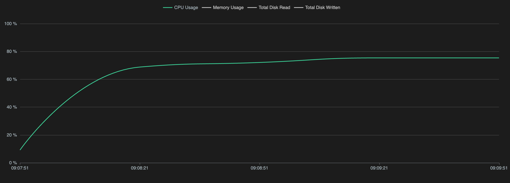
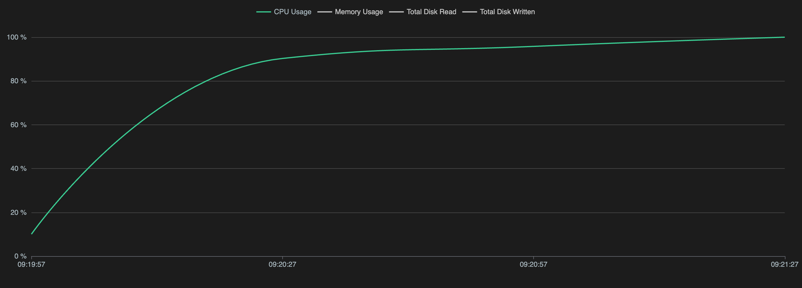

# Run Your First Simulation
This tutorial will show you how to run OpenFOAM simulations using the Inductiva API. 

We will cover the `motorBike` use case from the [OpenFOAM Foundation GitHub repository](https://github.com/OpenFOAM/OpenFOAM-8/tree/version-8/tutorials), to help you get started with simulations.

## Prerequisites
Download the required files [here](https://github.com/OpenFOAM/OpenFOAM-8/tree/version-8/tutorials/incompressible/simpleFoam/motorBike) and place them in a folder called `SimulationFiles`.

This is all you need to get started with your simulation.

## Running an OpenFOAM Simulation
Here is the code required to run an OpenFOAM simulation using the Inductiva API:

```python
"""OpenFOAM example"""
import inductiva

# Allocate cloud machine on Google Cloud Platform
cloud_machine = inductiva.resources.MachineGroup( \
    provider="GCP",
    machine_type="c2d-highcpu-16",
	# 1 thread per physical core
	threads_per_core=1,
	spot=True)

# Initialize the Simulator
OpenFOAM = inductiva.simulators.OpenFOAM( \
    version="8",
	distribution="foundation")

# Run simulation
task = OpenFOAM.run(input_dir="/Path/to/SimulationFiles",
    shell_script="./Allrun",
	# add simulation to a project
	project="openfoam-quick-start",
    on=cloud_machine)

# Wait for the simulation to finish and download the results
task.wait()
cloud_machine.terminate()

task.download_outputs()

task.print_summary()
```

> **Note**: In OpenFOAM-Foundation v8, the `runParallel` function restricts the simulation to use only the **physical** CPU cores. To ensure only the utilization of physical cores, we request machines with `threads_per_core=1`, which disables hyperthreading and exposes only the physical cores to the simulation.
> Learn more in the [FAQ](faq.md#6-why-does-my-simulation-keep-failing-with-there-are-not-enough-slots-available-even-though-my-machine-has-enough-resources).

In this basic example, we're using a cloud machine (`c2d-highcpu-16`) equipped
with 8 physical cores (16 virtual CPUs). For larger or more compute-intensive
simulations, consider adjusting the `machine_type` parameter to select 
a machine with more virtual CPUs and increased memory capacity. You can explore
the full range of available machines [here](https://console.inductiva.ai/machine-groups/instance-types).

> **Note**: Setting `spot=True` enables the use of spot machines, which are available at substantial discounts. 
> However, your simulation may be interrupted if the cloud provider reclaims the machine.

To adapt this script for other OpenFOAM simulations, replace `input_dir` with the
path to your OpenFOAM input files and set the OpenFOAM `distribution` and `version` accordingly.

We run the simulation using the `run` method, specifying the `shell_script` that handles the execution process.

When the simulation is complete, we terminate the machine, download the results and print a summary of the simulation as shown below.

```
Task status: Success

Timeline:
	Waiting for Input         at 15/07, 09:06:54      0.741 s
	In Queue                  at 15/07, 09:06:55      52.061 s
	Preparing to Compute      at 15/07, 09:07:47      4.05 s
	In Progress               at 15/07, 09:07:51      129.378 s
		└> 129.192 s       bash ./Allrun
	Finalizing                at 15/07, 09:10:00      1.754 s
	Success                   at 15/07, 09:10:02      

Data:
	Size of zipped output:    251.85 MB
	Size of unzipped output:  344.54 MB
	Number of output files:   464

Estimated computation cost (US$): 0.0031 US$
```

As you can see in the "In Progress" line, the part of the timeline that represents the actual execution of the simulation, 
the core computation time of this simulation was approximately 2 minutes and 9 seconds.

### Monitoring System Metrics

Since our machine has 8 physical cores but we're only using 6, it's expected that
the system isn't fully utilized. By checking the System Metrics tab in the web
console after the simulation ends, we can confirm this, CPU utilization sits at 70%,
which is below optimal.

<div align="center">
   
</div>


## Matching Partitioning to the Hardware

In this section, we’ll update the simulation configuration to take full advantage
of all available physical cores, improving both efficiency and performance.

To do so, we need to open the file `system/controlDict` and change the following lines:

```diff
-numberOfSubdomains 6;
+numberOfSubdomains 8;

method          hierarchical;
// method          ptscotch;

simpleCoeffs
{
    n               (4 1 1);
    delta           0.001;
}

hierarchicalCoeffs
{
-    n               (3 2 1);
+    n               (4 2 1);
    delta           0.001;
    order           xyz;
}
```

This change updates the simulation to use **8 subdomains**, matching the number
of **physical cores** on the `c2d-highcpu-16` machine. You can now rerun the
simulation using the same script. When checking the system metrics again, you
should see CPU utilization close to 100%, indicating the machine is now fully utilized.

<div align="center">
   
</div>

## Scaling Up the Simulation

After successfully running the simulation on 8 physical cores, let’s scale it up
to 16 physical cores. This corresponds to a machine with 32 virtual CPUs.

### Update the Machine Configuration

Modify your script to use a more powerful machine by setting `machine_type` to
one with 32 vCPUs (i.e., 16 physical cores).

```python
cloud_machine = inductiva.resources.MachineGroup(
    provider="GCP",
    machine_type="c2d-highcpu-32",
    # 1 thread per physical core
	threads_per_core=1,
    spot=True
)
```

### Adjust the Simulation Configuration

Update the `system/controlDict` file to divide the simulation into 16 sub-domains:

```diff
-numberOfSubdomains 8;
+numberOfSubdomains 16;

method          hierarchical;
// method          ptscotch;

simpleCoeffs
{
    n               (4 1 1);
    delta           0.001;
}

hierarchicalCoeffs
{
-    n               (3 2 1);
+    n               (8 2 1);
    delta           0.001;
    order           xyz;
}
```

Below are the results from running the simulation with 6, 8 and 16 sub-domains:

| Machine Type       | Sub-domains | Duration (hh:mm:ss) | Cost (USD) |
|--------------------|-------------|----------------------|------------|
| c2d-highcpu-16     | 6           | 2 min 9 sec        | 0.0031 US$  |
| c2d-highcpu-16     | 8           | 1 min 56 sec        | 0.0030 US$  |
| c2d-highcpu-32     | 16          | 1 min 8 sec         | 0.0037 US$  |

As shown by the results, we managed to run the simulation **1.9 times** faster
with only an increase in cost of **1.19 times**, compared to the base case.


<div class="cta-bar">
  <div class="cta-text">
    <strong>Start running simulations seamlessly!</strong> You have $5 in <strong>free</strong> credits, no credit card required.
  </div>
  <button  onclick="window.open('https://console.inductiva.ai/', '_blank')" target="_blank" class="cta-button">Sign In</button>
</div>

