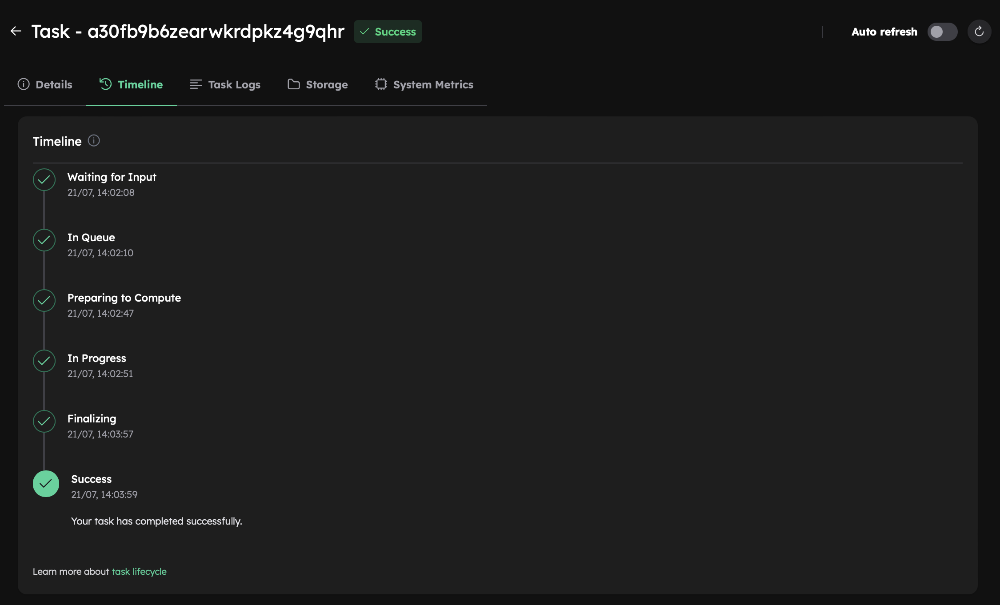

# Test Your Inductiva Setup
Before diving into tutorials and benchmarks, let's ensure that your Inductiva Python package is properly set up. 
To confirm everything is working as expected, simply run a quick OpenFOAM simulation — it only takes a minute!

## Step 1: Copy and Run the Code

1. Copy the code below and save it as `example.py` on your Desktop (or in your preferred directory).

```python
"""OpenFOAM example."""
import inductiva

# Allocate cloud machine on Google Cloud Platform
cloud_machine = inductiva.resources.MachineGroup( \
    provider="GCP",
    machine_type="c2d-highcpu-4",
    spot=True)

# Download the input files into a folder
input_dir = inductiva.utils.download_from_url(
    "https://storage.googleapis.com/inductiva-api-demo-files/"
    "openfoam-esi-input-example.zip",
    unzip=True)

# Initialize the Simulator
openfoam = inductiva.simulators.OpenFOAM( \
    distribution="esi",
    version="2406")

# Run simulation 
task = openfoam.run( \
    input_dir=input_dir,
    shell_script="./Allrun",
    on=cloud_machine)

# Wait for the simulation to finish and download the results
task.wait()
cloud_machine.terminate()

task.download_outputs()

task.print_summary()
```

2. Open your command line, then navigate to the Desktop by running:

```
cd ~/Desktop
```

3. Execute the Python script by running:

```
python example.py
```

> **Note**: On some systems, you might need to use `python3` instead of `python`.

All the necessary simulation artifacts and configuration files will be automatically downloaded to your computer. The OpenFOAM simulation will then be sent to a cloud machine for execution.

## Step 2: Verify the Task Status
After the simulation completes, a task summary will be displayed in your terminal, as shown below. 

```
Task status: Success

Timeline:
	Waiting for Input         at 21/07, 14:02:08      2.004 s
	In Queue                  at 21/07, 14:02:10      37.651 s
	Preparing to Compute      at 21/07, 14:02:47      4.224 s
	In Progress               at 21/07, 14:02:51      65.304 s
		└> 65.134 s        bash ./Allrun
	Finalizing                at 21/07, 14:03:57      1.85 s
	Success                   at 21/07, 14:03:59      

Data:
	Size of zipped output:    99.56 MB
	Size of unzipped output:  155.56 MB
	Number of output files:   223

Estimated Task Compute Cost = 0.00048 US$
Task Orchestration Fee = 0.01 US$
Total Estimated Cost = 0.01048 US$
Learn more about costs at: https://inductiva.ai/guides/how-it-works/basics/how-much-does-it-cost
```

If the **Task status** is marked as **Success**, congratulations! You've successfully ran an OpenFOAM simulation.

You can view more details and track the full simulation progress in the [Inductiva Console](https://console.inductiva.ai/tasks).

<p align="center"></p>

This simple example tested your installation on a small machine with just 4 virtual CPUs. Inductiva offers far more powerful 
options to supercharge your simulations.

```{banner_small}
:origin: openfoam
```

## Need Help?
If you encounter any issues or need further assistance, don't hesitate to [**Contact Us**](mailto:support@inductiva.ai). We're here to help!