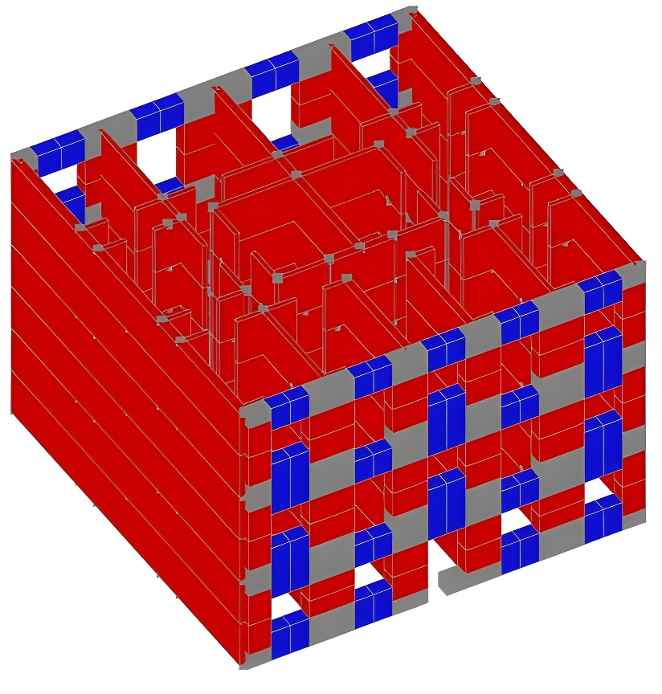

# IDA at Scale: Seismic Assessment of URM Structures

This tutorial was written by [Daniel Caicedo](https://www.researchgate.net/profile/Daniel-Caicedo-5) in collaboration with the **Inductiva Team**, within the framework of the research activities of the [Stand4Heritage (S4H) Team](https://www.linkedin.com/company/stand4heritage/posts/?feedView=all)

---

**Incremental Dynamic Analysis (IDA)** is a computational method widely used in **Performance-Based Earthquake Engineering (PBEE)** to assess the seismic performance of structures. It generates response curves across a range of earthquake intensity levels, enabling a probabilistic evaluation of structural behaviour and associated seismic risk.

However, applying this method to **unreinforced masonry (URM)** buildings has historically been limited due to two main challenges:
1. The **complexity of numerical models** needed to accurately capture URM behavior;
2. The **computational burden** of executing hundreds or thousands of simulations.

The first challenge is addressed by developing efficient structural models in OpenSees, using three-dimensional macroelements 
to capture the in-plane (IP) and out-of-plane (OOP) mechanisms. These models also account for non-linear floor-to-wall connections 
and wall-to-wall interlocking.

The second, and often more limiting, challenge lies not only in running a large number of simulations, but also in having the infrastructure required to support them. 

Running simulations on cloud-based HPC is not required to perform IDA, but it offers clear advantages. It removes the need to 
manage physical infrastructure, provides dedicated compute resources, and enables parallel execution at scale. This reduces overall 
runtime and makes large-scale studies more efficient and accessible.

This is where **Inductiva** steps in, allowing you to focus on developing accurate structural models and analysing results, without 
being constrained by **hardware limitations** or **sequential processing**.

Additionally, Inductiva streamlines simulation management by allowing you to start from a single base case and automatically generate multiple variations through changes to key parameters. This simplifies setting up and running large batches of simulations quickly and effortlessly.

In this tutorial, we walk through a practical example involving a two-storey unreinforced masonry building, representative of the pre-code masonry building stock in the Lisbon metropolitan area. To realistically 
capture seismic demand, we apply 10 intensity levels to 30 different earthquake ground motion records selected 
from real-world events. This results in a total of 300 IDA simulations, dynamically distributed across 50 cloud machines, with each machine processing simulations sequentially as resources free up.

All data used in this example was collected as part of the [STAND4HERITAGE](https://stand4heritage.org) project — New STANDards for seismic assessment of built cultural HERITAGE.

<p align="center"></p> 

The tutorial is divided into the following sections:
- [Kickstart Your Simulation Workflow](sections/section1)
- [Part 1: Case Setup](sections/section2)
- [Part 2: Running the Simulations on the Cloud](sections/section2)
- [Results and Key Takeaways](sections/section3)

```{toctree}
:hidden:
sections/section1.md
sections/section2.md
sections/section3.md
sections/section4.md
```