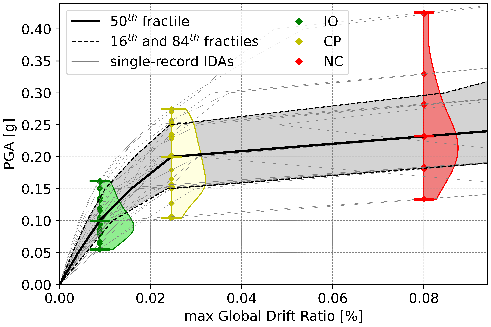
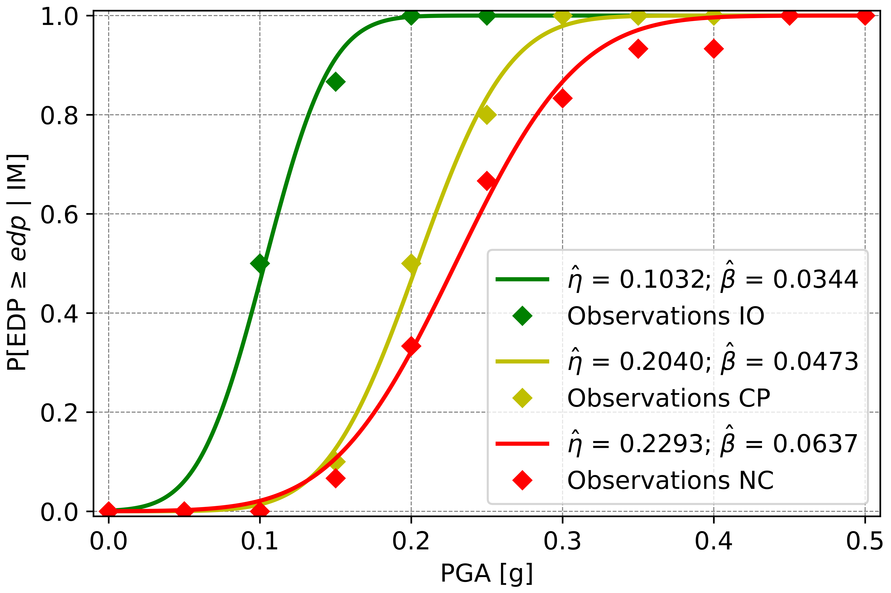
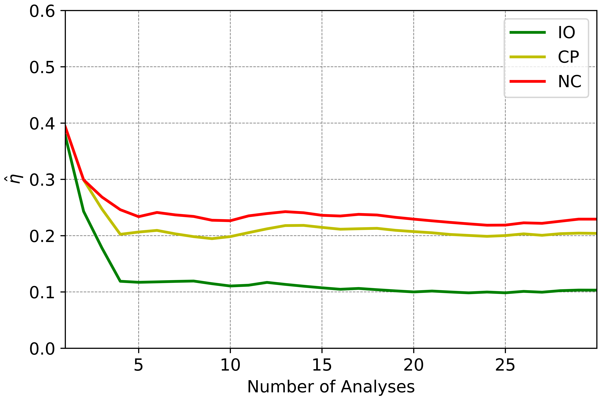
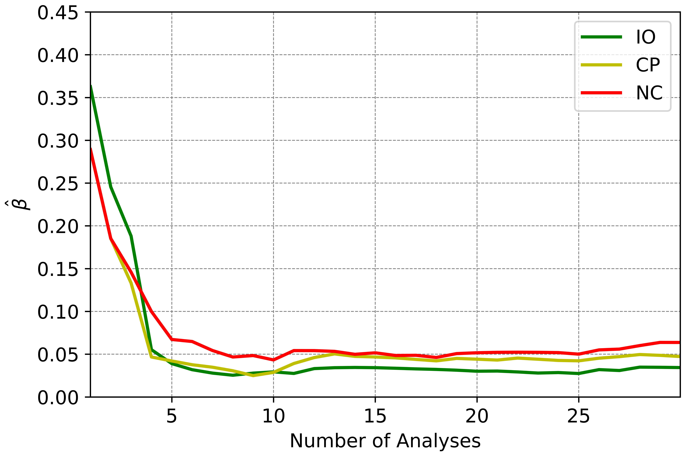

## Results and Key Takeaways
Once the simulation data is available, post-processing can be performed using tools of your choice, such as custom Python scripts.

In this tutorial, results are analyzed in terms of:
1. Capacity and fragility functions
2. Convergence of statistical moments (specifically, the median and dispersion)

Capacity curves are presented based on the 50th, 16th, and 84th percentiles of the IDA response, using the maximum global drift 
ratio as the engineering demand parameter (EDP). The 50th fractile represents the median capacity of the structure.

Next, the damage states of Immediate Occupancy (IO), Collapse Prevention (CP), and Near Collapse (NC) are identified. The IO limit 
is defined approximately at the end of the elastic branch. CP is identified when the slope of the capacity curve decreases to 20% of 
the initial elastic slope. Finally, NC is indicated by the appearance of the flatline.

   
   
<em>Figure 1: Capacity curves with limit state observations</em>

Fragility functions denote the likelihood of exceedance of a specified EDP value corresponding to each limit state, as shown in the 
figure below.

   
   
<em>Figure 2: Fragility functions</em>

The figures below illustrate the convergence of the median and dispersion of the fragility functions, based on the 30 observations 
for each limit state.

   
   
<em>Figure 3: Convergence of fragility median</em>

   
   
<em>Figure 4: Convergence of fragility dispersion</em>

Together, these results give a clear and thorough picture of the structure’s performance and reliability during seismic events.

Performing IDAs at this level of detail typically requires significant computational time and manual effort to set up and manage hundreds of simulations. With Inductiva’s cloud platform, however, the entire process is transformed.

Inductiva automates the creation of hundreds of simulation configurations by starting from a single base case and programmatically varying key parameters. Simultaneously, it leverages parallel cloud computing to run these simulations across multiple machines at once.

By combining automated setup with scalable execution, a process that would normally take **over 150 hours** sequentially can be completed in just **5 hours and 28 minutes** using 200 `c2d-highcpu-2` machines running in parallel.

This demonstrates how Inductiva can dramatically accelerate large-scale structural simulations, enabling faster insights while making more efficient use of computational resources.

