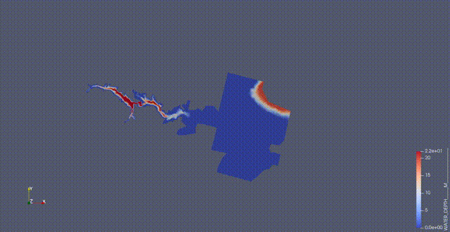

# Run Your First Simulation
This tutorial will show you how to run OpenTelemac simulations using the Inductiva API. 

We will cover the `Malpasset Dam Break` use case from the [OpenTelemac GitLab repository](https://gitlab.pam-retd.fr/otm/telemac-mascaret/-/tree/main/examples/telemac2d/malpasset?ref_type=heads) to help you get started with simulations. This setup models the flood wave resulting from the dam failure, propagating through a valley with realistic topography and open-channel hydraulics using TELEMAC-2D.

## Prerequisites
Download the required files [here](https://storage.googleapis.com/inductiva-api-demo-files/opentelemac-input-example.zip) and place them in a folder called `opentelemac-input-example`.

The folder should include the following:
- `t2d_malpasset-fine.cas`
- Mesh and geometry files, such as`geo_malpasset.slf`, etc. 
- (*Optional*) Boundary condition and results configuration files

Then, you’ll be ready to send your simulation to the Cloud.

## Running an OpenTelemac Simulation
Here is the code required to run an OpenTelemac simulation using the Inductiva API:

```python
"""OpenTelemac example."""
import inductiva

# Allocate cloud machine on Google Cloud Platform
cloud_machine = inductiva.resources.MachineGroup(
    provider="GCP",
    machine_type="c2d-highcpu-32",
    spot=True)

# Initialize the Simulator
telemac2d = inductiva.simulators.OpenTelemac( \
    version="8p4r0")

#  List of commands to run
commands = [
	"telemac2d.py t2d_malpasset-fine.cas --ncsize=32", # Run the simulation using 32 cores
	"converter.py srf2vtk r2d_malpasset-fine.slf t2d_malpasset.vtk", # Convert the results to VTK format
]

# Run simulation
task = telemac2d.run(
    input_dir="/Path/to/opentelemac-input-example",
	commands=commands,
    on=cloud_machine)

# Wait for the simulation to finish and download the results
task.wait()
cloud_machine.terminate()

task.download_outputs()
task.print_summary()
```

> **Note**: `spot` machines are a lot cheaper but may be terminated by the provider if necessary.

### Adapting the Script
To adapt this script for other OpenTelemac simulations, replace `input_dir` with the
path to your OpenTelemac input files and set the the `commands` accordingly.

Since this example is a 2D simulation, we use the `telemac2d.py` command-line script, which is specifically designed for TELEMAC-2D models. It acts as the solver's frontend, reading the `.cas` steering file and managing the simulation execution.

```
telemac2d.py t2d_malpasset-fine.cas --ncsize=32
```

- `t2d_malpasset-fine.cas` is the steering file that contains all the settings for the simulation.
- `--ncsize=32` tells TELEMAC to run the simulation in parallel using 32 cores. Specifies that TELEMAC should run the simulation in parallel using 32 cores. This value should match the number of vCPUs allocated to your machine.

> ⚠️ **Important**: If you don't include `--ncsize`, TELEMAC will default to single-core execution, which can significantly slow down large simulations.

The `converter.py` command converts the result file from Serafin format (`.slf`) to VTK format (`.vtk`) so that it can be opened in tools such as ParaView to visualize depth, velocity, and flood propagation over time. An example of the resulting visualization is shown below.

<p align="center"></p>

### Simulation Completion
When the simulation is complete, we terminate the machine, download the results and print a summary of the simulation as shown below.

```
Task status: Success

Timeline:
        Waiting for Input         at 29/04, 12:10:39      1.221 s
        In Queue                  at 29/04, 12:10:41      60.382 s
        Preparing to Compute      at 29/04, 12:11:41      2.786 s
        In Progress               at 29/04, 12:11:44      187.482 s
                ├> 177.258 s       telemac2d.py t2d_malpasset-fine.cas --ncsize=32
                └> 10.063 s        converter.py srf2vtk r2d_malpasset-fine.slf t2d_malpasset.vtk
        Finalizing                at 29/04, 12:14:51      3.982 s
        Success                   at 29/04, 12:14:55      

Data:
        Size of zipped output:    104.14 MB
        Size of unzipped output:  378.01 MB
        Number of output files:   28

Estimated computation cost (US$): 0.011 US$
```

As you can see in the "In Progress" line, the part of the timeline that represents the actual execution of the simulation, 
the core computation time of this simulation was approximately 187.5 seconds (3 minutes and 8 seconds).

It's that simple!
