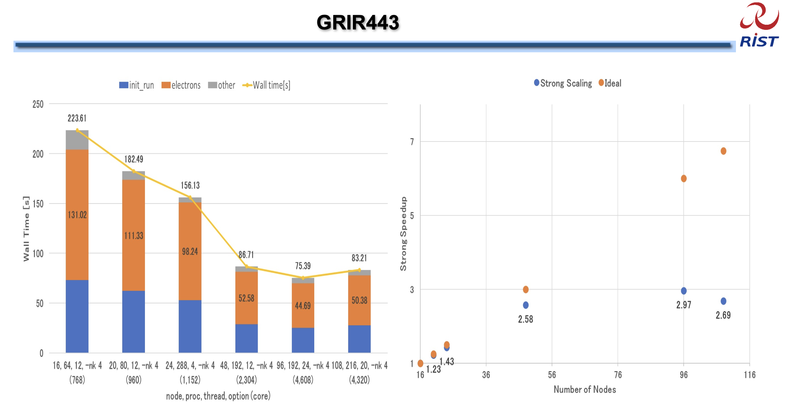

# Can Inductiva Beat Fugaku on Quantum ESPRESSO’s GRIR443 Benchmark?
Fugaku, designed by RIKEN and Fujitsu, is a Japanese supercomputer and one of the fastest and most powerful in the world. 
It delivers a staggering performance exceeding **442 petaflops** and excels across a wide range of applications, from climate simulations and drug discovery to artificial intelligence. 

Powered by ARM processors and a high-speed interconnect, Fugaku sets a new benchmark in high-performance computing (HPC), showcasing the critical role supercomputers play in solving complex, real-world challenges.

So here’s a bold question: **Can Inductiva outperform Fugaku on Quantum ESPRESSO’s GRIR443 benchmark? And if so, how costly would it be?**

At first glance, this might seem far-fetched. After all, Fugaku is among the world’s fastest supercomputers. 

For simulations within a certain scale range, scaling beyond a few hundred to a few thousand cores often yields diminishing returns. For these computational tasks that don’t fully benefit from the extreme parallelization supercomputers offer, Inductiva can effectively gather hundreds of cores (powered by the most recent CPUs) and potentially compete with even the most powerful supercomputers.

We’re not suggesting that Inductiva or any cloud-based infrastructure can generally outperform multimillion-dollar supercomputers across all workloads. However, for small to medium-sized simulations where such extreme parallelization isn’t necessary, Inductiva provides a highly competitive alternative.

And many real-life problems do fall into this category.

---

## An Unexpected Advantage of Cloud HPC
While supercomputers are engineered for speed and scale, cloud-based HPC infrastructures offer some surprising performance benefits. Traditional HPC systems like Fugaku are computationally homogeneous: every node in a given partition has identical hardware specifications to ensure predictable cluster behavior.

This homogeneity makes upgrading the system challenging: you either upgrade all nodes simultaneously or risk unbalancing the cluster. As a result, large supercomputers often retain the same hardware for many years until a full replacement with next-generation technology occurs. Until then (if it happens), they tend to lag behind in hardware innovation.

In contrast, cloud providers constantly refresh their hardware. This means that cloud HPC nodes often use the latest generation CPUs, which tend to be faster on a per-node basis than (not so recent) supercomputer nodes. For workloads that only require a handful of nodes, a cloud-based HPC platform like Inductiva may actually outperform even the most expensive supercomputers.

---

## So, What’s the Catch?
The limitation lies in scaling. Cloud HPC performs best when using up to a few nodes - typically 4 to 8. Beyond this scale, network communication costs in the cloud become a bottleneck. Unlike supercomputers, which use ultra-fast, dedicated interconnects, cloud node communication happens over shared networks that are slower and less predictable.

If you’re fortunate enough to have all your cloud computing nodes located on the same rack and network traffic during the computation is moderate, you might achieve a fast multi-node configuration that outperforms a traditional supercomputer on small to medium-sized tasks. However, a bit of luck is definitely required.

---

## Comparing the Numbers
After reviewing a [performance report from Fugaku](https://www.hpci-office.jp/documents/appli_software/Fugaku_QE_performance.pdf) on the GRIR443 benchmark, we ran the same benchmark on Inductiva to compare results.

The specific Fugaku results we reference are those shown below, covering configurations from **768 to 4,320 cores**.

<em>Performance data from Fugaku’s GRIR443 benchmark runs (Source: page 8 of the Fugaku performance report)</em>

Fugaku’s ARM-based processors run a single thread per core. To ensure a fair comparison, we configured Inductiva’s virtual machines (VMs) to also run **one thread per physical core**, rather than the default two.

We selected **c3d-highcpu-360** VM nodes, each with 180 cores, to reduce the number of nodes needed and minimize internode communication overhead.

The benchmark was executed on a single VM (as a baseline), and then on MPI clusters of 2, 4, and 8 nodes, totaling 180 to 1,440 cores. Prior tests with larger MPI clusters showed that performance tends to degrade beyond this scale.

Below are Inductiva’s results:

| VM Type         | Number of VMs | Total Cores (NP) | Time (seconds) | Cost (USD) |
|-----------------|---------------|------------------|----------------|------------|
| c3d-highcpu-360 | 1             | 180              | 787            | 0.75       |
| c3d-highcpu-360 | 2             | 360              | 399            | 0.77       |
| c3d-highcpu-360 | 4             | 720              | 210            | 0.83       |
| c3d-highcpu-360 | 8             | 1440             | 154            | 1.24       |

While Inductiva’s core counts don’t exactly match Fugaku’s, two regimes provide a fair comparison:

- **Regime 1: Inductiva 720 cores vs. Fugaku 768 cores**  
  Inductiva outperformed Fugaku by 13 seconds (about **5.8% faster**) at just **$0.83**. The overall hourly cost for this 4-node setup is roughly **$13.60**.

- **Regime 2: Inductiva 1,440 cores vs. Fugaku 1,152 cores**  
  Inductiva edged out Fugaku by 2 seconds (a **1% improvement**) using 25% more cores. This indicates that network communication is becoming a limiting factor, where traditional HPC systems like Fugaku excel. Still, Inductiva’s comparable performance costs only **$1.24**, with an estimated hourly expense of about **$27.20**.

---

## Can Inductiva Really Beat Fugaku?
The answer depends on the workload.

For extremely large-scale simulations—those requiring thousands of cores distributed across dozens or hundreds of nodes 
running for many hours, supercomputers like Fugaku remain the better choice. This advantage doesn’t come from the power 
of individual nodes (in fact, cloud-based HPC platforms often use newer, faster hardware), but from the superior 
inter-node communication that supercomputers provide. Thanks to ultra-fast, dedicated interconnects, supercomputers 
maintain performance across massive distributed workloads - something cloud infrastructure can’t always guarantee due 
to generally slower and less predictable internode communication.

However, for many real-world problems that require only a few hundred cores spread across a handful of nodes, typically in 
the range of **3,000 to 15,000 core-hours**, cloud-based HPC platforms can outperform even the fastest supercomputers. At 
this scale, Inductiva not only delivers competitive performance but also offers **exceptional cost-efficiency**, often coming 
in at **under 2 cents per core-hour**.

So, why choose Inductiva? Because with Inductiva, there’s no need to apply for core-hours or wait in scheduling queues. HPC resources are available on demand — **no bureaucracy, no delays**.

Start supercomputing now.

