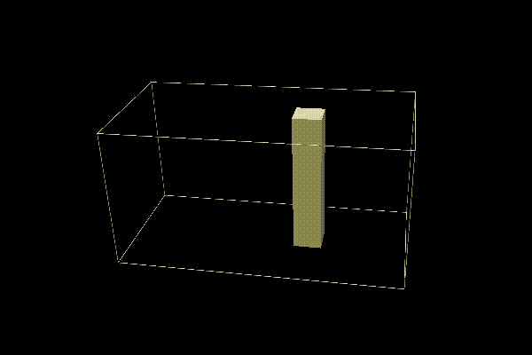

# Run the 3D Dam Break Scenario with Obstacle
In this tutorial we will show you how to use the Inductiva API to run an advanced REEF3D case that requires significant computing power.

<p align="center"></p>

## Objective
The goal of this tutorial is to demonstrate how to run the `11_2 3D Dam Break with Obstacle` use case from the CFD Tutorials, available in the [REEF3D GitHub repository](https://github.com/REEF3D/REEF3D/tree/master).

## Prerequisites
Download the required files [here](https://github.com/REEF3D/REEF3D/tree/25.02/Tutorials/REEF3D_CFD/11_2%203D%20Dam%20Break%20with%20Obstacle) and place them in a folder named `3DDamBreakScenario`.

The directory structure should look like this:
   ```bash
   ls -lasgo .
    total 16
    0 drwxrwxr-x@  4   128 Sep  4 08:46 .
    0 drwxrwxr-x@ 19   608 Nov  5 09:03 ..
    8 -rw-rw-r--@  1   142 Sep  4 08:46 control.txt
    8 -rw-rw-r--@  1   141 Sep  4 08:46 ctrl.txt
   ```
Considering the three key parameters in the Reef3D configuration files (`control.txt` and `ctrl.txt`):
- `N 41`: Maximum simulation time
- `P 30`: Result output frequency
- `M 10`: Number of processors for parallel computation

Set the parameters for each file, as follows:
- `control.txt`

	```
	C 11 21
	C 12 21
	C 13 21
	C 14 21
	C 15 21
	C 16 21

	B 1 0.025
	B 10 0.0 2.0 0.0 1.0 0.0 1.0
	O 10 1.2 1.4 0.4 0.6 0.0 1.0

	M 10 56    ---- defines the nr. of processors for parallel computations (56)
   ```
 
 - `ctrl.txt`
   	
  	```
	D 10 4
	D 20 2
	D 30 1
	F 30 3
	F 40 3
	F 54 0.5
	F 56 0.7
	N 40 3
	N 41 25.0    ---- set the maximum modeled time (25 seconds).
	N 45 50000
	N 47 0.2
	M 10 56    ---- defines the nr. of processors for parallel computations (56)
	P 10 1
	P 30 0.01    ---- defines the rate of paraview results (1 frame per 0.01 s)
	T 10 0
	W 22 -9.81
	```

These settings will limit the simulation to a maximum of 25 seconds, allowing for faster results.

Then, you’ll be ready to send your simulation to the Cloud.
 
## Running Your Simulation
Here is the code required to run a REEF3D simulation using the Inductiva API:

```python
"""REEF3D example."""
import inductiva

# Allocate cloud machine on Google Cloud Platform
cloud_machine = inductiva.resources.MachineGroup(
    provider="GCP",
	machine_type="c2d-highcpu-56",
	spot=True,
	data_disk_gb=20,
	auto_resize_disk_max_gb=100)

# Initialize the Simulator
reef3d = inductiva.simulators.REEF3D( \
    version="25.02")

# Run simulation
task = reef3d.run(input_dir="/Path/to/3DDamBreakScenario",
    n_vcpu=56,
    on=cloud_machine)

# Wait for the simulation to finish and download the results
task.wait()
cloud_machine.terminate()

task.download_outputs()

task.print_summary()
```
This simulation runs on a `c2d-highcpu-112` machine with a 20 GB disk. Automatic disk resizing is enabled, so the disk size will increase as needed,
up to the specified maximum of `auto_resize_disk_max_gb`.

> **Note**: `spot` machines are a lot cheaper but may be terminated by the provider if necessary.

When the simulation is complete, we terminate the machine, download the results and print a summary of the simulation as shown below.

```
Task status: Success

Timeline:
	Waiting for Input         at 28/03, 10:11:56      0.816 s
	In Queue                  at 28/03, 10:11:57      24.275 s
	Preparing to Compute      at 28/03, 10:12:21      7.256 s
	In Progress               at 28/03, 10:12:29      719.496 s
		├> 2.062 s         /DIVEMesh/bin/DiveMESH
		└> 715.778 s       /opt/openmpi/4.1.6/bin/mpirun --use-hwthread-cpus /REEF3D/bin/REEF3D
	Finalizing                at 28/03, 10:24:28      441.386 s
	Success                   at 28/03, 10:31:49      

Data:
	Size of zipped output:    12.79 GB
	Size of unzipped output:  29.95 GB
	Number of output files:   142624

Estimated computation cost (US$): 0.13 US$
```
As you can see in the "In Progress" line, the part of the timeline that represents the actual execution of the simulation, the core computation time 
of this simulation was approximately 719.5 seconds (approximately 12 minutes).

It's that simple! 🚀


