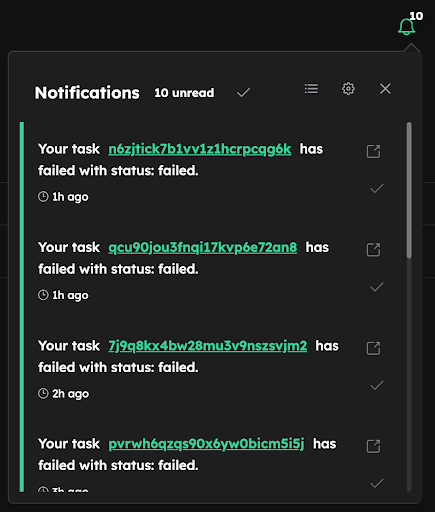
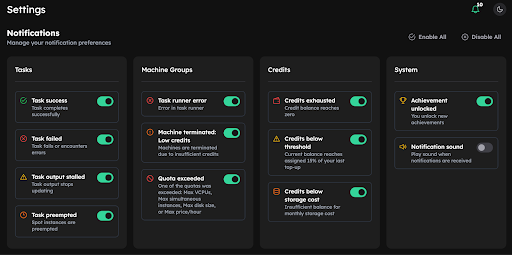

# v0.18.3

**Release Date:** 16 October, 2025 

---

## 🆕 Highlights

Stay on top of your simulations with **Inductiva Alerts** and **Observer Events**. Receive critical alerts instantly via the Console or email, and customize the Console Notifications through the new settings screen.

---

## ✨ New Features

### 🔔 Inductiva Alerts - Web Console Notifications
Inductiva Alerts are predefined by Inductiva to notify users as quickly as possible about events that could disrupt their work. Due to their potential high impact, they are always sent via email, and can now also appear directly in the web Console. 
Conveniently located in the top right corner of the web console, they offer direct links to custom actions. 



Users can manage which alerts they want to receive in the Console through the new settings screen. Additionally, you can choose to enable or disable a sound, ensuring you are alerted even when you’re focusing on other tasks.



**Key benefits:**
- Instant, in-console alerts for key events
- One-click actions directly from notifications
- Ability to mark notifications as “read” for better management
- Optional sound alerts for critical events
- Customizable per event type — you decide what deserves your attention

**Learn more:** Check out the full list of alerts <a href="https://website-staging/inductiva.ai/guides/scale-up/optimize-workflow/alerts-events/sections/alerts" target="_blank">here</a>.

Need another alert to help you keep a close eye on your workflow? Reach out on [Discord - feedback](https://discord.gg/RbW2GfTX)


### 👀Observer Events
Observer Events are user-defined alerts that notify you about specific events occurring in your simulations, by monitoring specific file or log events. These are sent by email only, and only if you choose to enable email notifications for them.

This feature enables proactive monitoring of your simulations, whether to confirm success or respond quickly to errors.

**Key capabilities:**
- Detects when files are created or modified (e.g. error logs)
- Supports regular expressions to identify patterns in file content
- Extracts key information from matched expressions
- Compatible with any simulator that writes logs or intermediate files

**Learn more:** Check out the a href="https://website-staging/inductiva.ai/guides/scale-up/optimize-workflow/alert-events/sections/observer-events" target="_blank">tutorial</a> for more details. 

---

## 🔜 Looking Ahead

- This release marks the first step toward giving users full control over how they receive notifications. While you can now view alerts directly in the Console and adjust which appear there, the next iteration will go further — allowing you to choose the communication channel (email and/or Console) for each alert type.
- Work continues on the mechanism to save the output after a spot instance is preempted feature we previewed [last release](https://inductiva.ai/blog/article/release-v018). We're making solid progress and expect to share more details very soon. 

Want to influence our roadmap? Reach out on [Discord - feedback](https://discord.gg/RbW2GfTX)

---

## 🙏 Feedback & Support

We'd love to hear your thoughts on this release!

- **Report issues or Contact support:** [Discord - Support](https://discord.gg/58W8TjKg)
- **Feature requests:** [Discord - feedback](https://discord.gg/RbW2GfTX)
- **Join the Community:** [Discord - community](https://discord.gg/Q4urPdC9)

---

## 📦 Installation & Upgrade

- No user action is required to start receiving console notifications; they are enabled by default.
- To use the Observer Events, update the Inductiva python package: 
```bash
pip install --upgrade inductiva
```

---


```{banner_small}
:origin: releases_v018_3
```