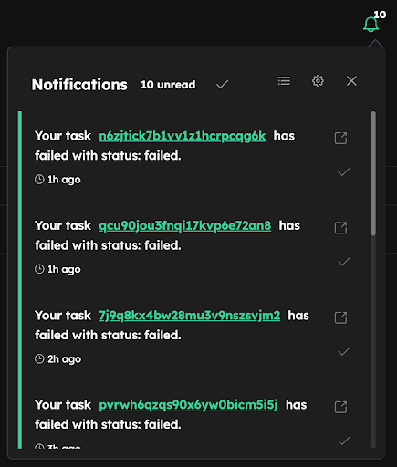
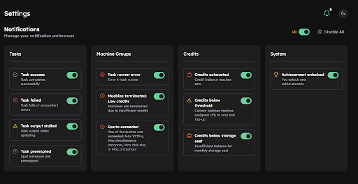
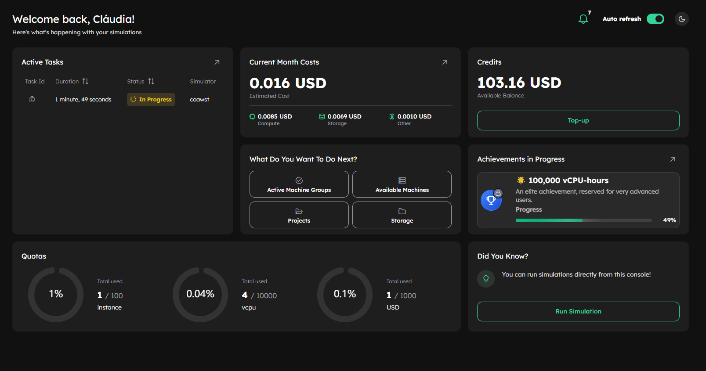
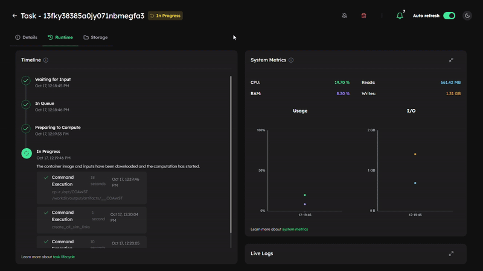

# v0.18.4

**Release Date:** 17 October, 2025 

---

## 🆕 Highlights

- Stay on top of your simulations with **Inductiva Alerts** and **Observer Events**. Receive critical alerts instantly via the Console or email, and customize the Console Notifications through the new settings screen. ([→ Learn more](#-new-features))
- Improvements on the User Experience: Revamped Dashboard Experience; Unified Runtime Tab for Task Details ([→ Learn more](#-improvements))

---

## ✨ New Features

### 🔔 Inductiva Alerts - Web Console Notifications
Inductiva Alerts are predefined by Inductiva to notify users as quickly as possible about events that could disrupt their work. Due to their potential high impact, they are always sent via email, and can now also appear directly in the web Console. 
Conveniently located in the top right corner of the web console, they offer direct links to custom actions. 



Users can manage which alerts they want to receive in the Console through the new settings screen. Additionally, you can choose to enable or disable a sound, ensuring you are alerted even when you’re focusing on other tasks.



**Key benefits:**
- Instant, in-console alerts for key events
- One-click actions directly from notifications
- Ability to mark notifications as “read” for better management
- Optional sound alerts for critical events
- Customizable per event type — you decide what deserves your attention

**Learn more:** Check out the full list of alerts <a href="https://inductiva.ai/guides/scale-up/optimize-workflow/alerts-events/sections/alerts" target="_blank">here</a>.

Need another alert to help you keep a close eye on your workflow? Reach out on [Discord - feedback](https://discord.gg/RbW2GfTX)


### 👀Observer Events
Observer Events are user-defined alerts that notify you about specific events occurring in your simulations, by monitoring specific file or log events. These are sent by email only, and only if you choose to enable email notifications for them.

This feature enables proactive monitoring of your simulations, whether to confirm success or respond quickly to errors.

**Key capabilities:**
- Detects when files are created or modified (e.g. error logs)
- Supports regular expressions to identify patterns in file content
- Extracts key information from matched expressions
- Compatible with any simulator that writes logs or intermediate files

**Learn more:** Check out the a href="https://inductiva.ai/guides/scale-up/optimize-workflow/alert-events/sections/observer-events" target="_blank">tutorial</a> for more details. 

---

## 🚀 Improvements

### 🧭 Revamped Dashboard Experience

The **Console Dashboard** has been redesigned to give you a faster, more informative overview of your activity on Inductiva.

The new layout makes it easier to **monitor activity, track costs, and manage resources in real time**. It’s cleaner, more visual, and optimized for quick decision-making — whether you’re tracking ongoing tasks or planning your next simulations.

* **Cost tracking improvements** – compute, storage, and other costs are now clearly broken down under **Current Month Costs** for easier budget control.
* **Credits overview** – see your available balance instantly, with a quick **Top-up** button for seamless credits refills.
* **Quick actions panel** – new shortcuts help you jump straight into common workflows.
* **Did You Know?** – a new info card that surfaces useful tips, such as how to run simulations directly from the console.




### 🧩 Unified Runtime Tab for Task Details

We’ve streamlined the Task Details experience to make monitoring easier and more intuitive. The previous Timeline, System Metrics, and Logs tabs have been merged into a single “Runtime” tab, allowing you to view all key information — progress updates, live metrics, and logs — in one place.

This improvement greatly enhances usability, letting you track and troubleshoot tasks without switching tabs, and providing a more cohesive view of your simulation’s performance in real time.



---

## 🔜 Looking Ahead

- This release marks the first step toward giving users full control over how they receive notifications. While you can now view alerts directly in the Console and adjust which appear there, the next iteration will go further — allowing you to choose the communication channel (email and/or Console) for each alert type.
- Work continues on the mechanism to save the output after a spot instance is preempted feature we previewed [last release](https://inductiva.ai/blog/article/release-v018). We're making solid progress and expect to share more details very soon. 

Want to influence our roadmap? Reach out on [Discord - feedback](https://discord.gg/RbW2GfTX)

---

## 💬Feedback & Community

Your feedback fuels our next breakthroughs share your ideas for the roadmap, report bugs, or help test a new simulator. We’re all ears!
Reach out through our [contact form](https://inductiva.ai/contact) or our [Discord](https://discord.com/invite/rFkHxVmAbu) to share feedback, connect with peers, and learn from specialists across diverse domains.

---

## 📦 Installation & Upgrade

- No user action is required to start receiving console notifications; they are enabled by default.
- To use the Observer Events, update the Inductiva python package: 
```bash
pip install --upgrade inductiva
```

---


```{banner_small}
:origin: releases_v018_4
```