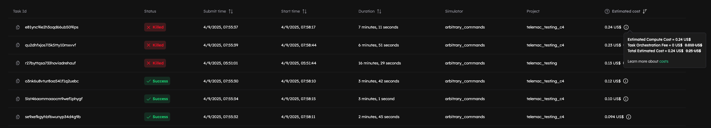
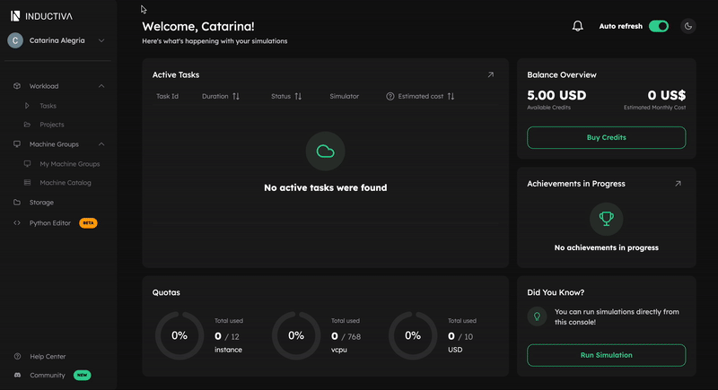

# v0.18.7

**Release Date:** 28 October, 2025 

---

## 🆕 Highlights

- Starting **1 December 2025**, Inductiva will introduce a new **Task Orchestration Fee** applied to each run on our platform. This change ensures fairness across all users by aligning infrastructure costs more closely with actual resource consumption. ([→ Learn more](#-task-orchestration-fee))
- Improvements on the User Experience: more REEF3D versions, Observer Events with Wildcard Patterns, Revamped Sidebar Menu, and more ([→ Learn more](#-improvements))
- Documentation & Resources: New guide to run simple Blender simulation (exclusive to Bring Your Own Software - BYOS)

---

## ✨ New 

### 💲 Task Orchestration Fee
At Inductiva, we’re committed to providing a scalable and efficient simulation platform for everyone: from individual researchers to enterprise teams. As workloads grow, especially those running hundreds of vCPUs, the shared infrastructure costs naturally increase.
The Task Orchestration Fee helps distribute these costs fairly, so each user contributes in proportion to the computational resources they use.

This per-run orchestration fee applies to tasks run from 1 December 2025, in addition to the compute costs.



**Learn more:** Detailed costs break down [here](https://inductiva.ai/guides/how-it-works/basics/how-much-does-it-cost).

---

## 🚀 Improvements

### 🌊 Unlock New and Legacy REEF3D Versions

Inductiva has expanded the available REEF3D versions, ensuring that our portfolio stays current with the latest releases while also adding some older versions to broaden compatibility and testing options. This update allows users to choose from a wider range of versions to suit their development and deployment needs.

Available REEF3D versions:
- 25.07 🆕
- 25.05 🆕
- 25.02
- 24.12
- 24.08 🆕
- 24.05 🆕
- 24.03 🆕
- 24.02

For detailed information, refer to our [REEF3D Versions and Containers Guide](https://inductiva.ai/guides/reef3d/versions-and-containers).


### 👀 Observer Events + Wildcard Patterns

As an addition to the recently introduced [Simulation Observer Events](https://inductiva.ai/guides/release-notes/releases/v0-18/sections/v0-18-4#observer-events) alerts, file observers now support wildcard patterns in the ```file_path``` argument.

This enhancement makes it easier to trigger actions such as email notifications when any matching file meets the observer conditions.

For more details, see the [Simulation Observer Events guide](https://inductiva.ai/guides/scale-up/optimize-workflow/alerts-events/sections/observer-events#wildcard-file-observer-registration)


### 🧭 Revamped Sidebar Menu

We’ve refreshed the Console’s sidebar to make navigation clearer and more intuitive, the first of several upcoming changes aimed at improving overall Console usability.

What’s new:
- Simplified structure: Related items are now grouped under clearer categories such as Workload.
- Reorganized items: You can now access the main Dashboard by clicking the Inductiva logo in the top-left corner, making navigation quicker and more intuitive. 



This marks the first step in a broader effort to make the Console more organized, discoverable, and pleasant to use.

---

### 📊 Dashboard Enhancements

We’re continuing our effort to bring the data that matters most directly to your main Dashboard, helping you stay informed without leaving the first screen.

This ongoing work aims to make the Dashboard your central hub for monitoring and managing simulations efficiently.


---

## 🐛 Bug Fixes

- **Corrected:** The Terminate Task button was missing from the Console on mobile devices. The button was always visible in wider screens, but it was missing on mobile devices.
- **Fixed:** Downloading from Console Storage was not including files contained in subfolders.
---

## 📚 Documentation & Resources

- New BYOS guide: Run Simple Blender Simulation, demonstrating how to render a basic 3D scene using Blender on Inductiva. See how to run custom container workloads and retrieve rendered results ([→ Learn more](https://inductiva.ai/guides/expand/bring-your-own-software/run-blender-simulation))

---

## 🔜 Looking Ahead

Want to influence our roadmap? Reach out on [Discord - feedback](https://discord.com/invite/rFkHxVmAbu)

---

## 💬Feedback & Community

Your feedback fuels our next breakthroughs. Share your ideas for the roadmap, report bugs, or help test a new simulator. We’re all ears!
Reach out through our [contact form](https://inductiva.ai/contact) or our [Discord](https://discord.com/invite/rFkHxVmAbu) to share feedback, connect with peers, and learn from specialists across diverse domains.

---

## 📦 Installation & Upgrade

Keep the Inductiva python package up to date: 
```bash
pip install --upgrade inductiva
```

---


```{banner_small}
:origin: releases_v018_5
```