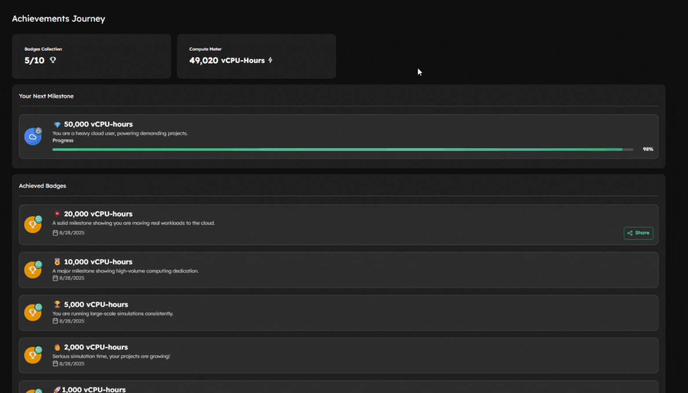
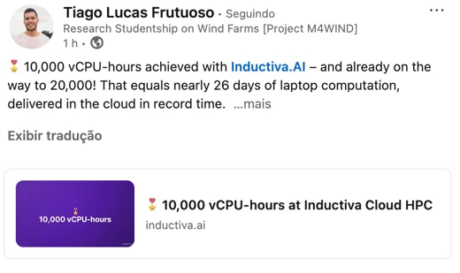
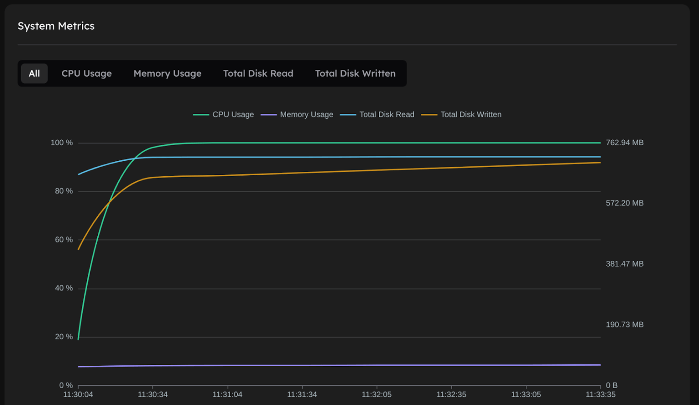
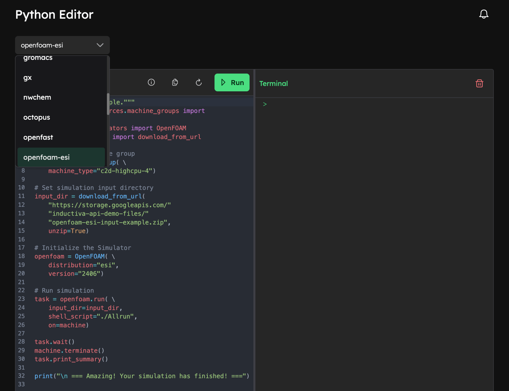
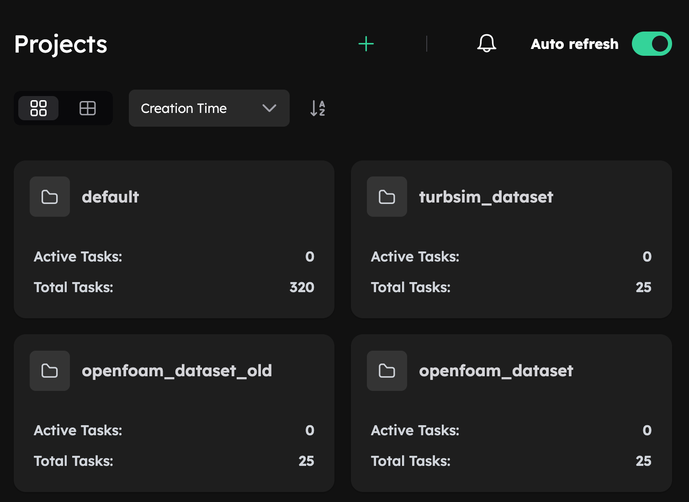
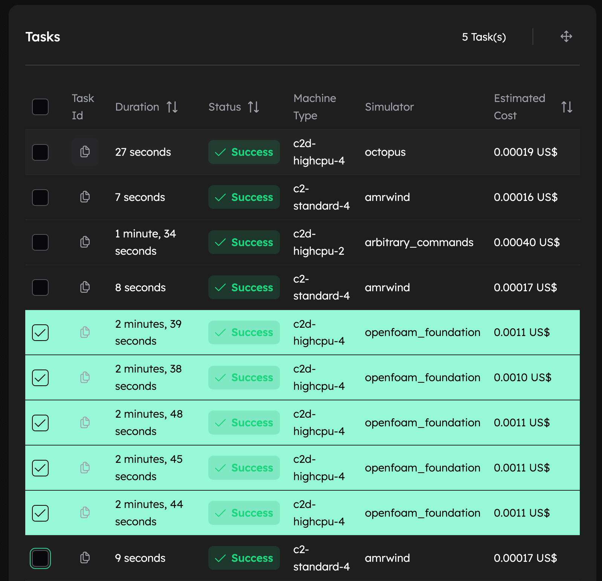
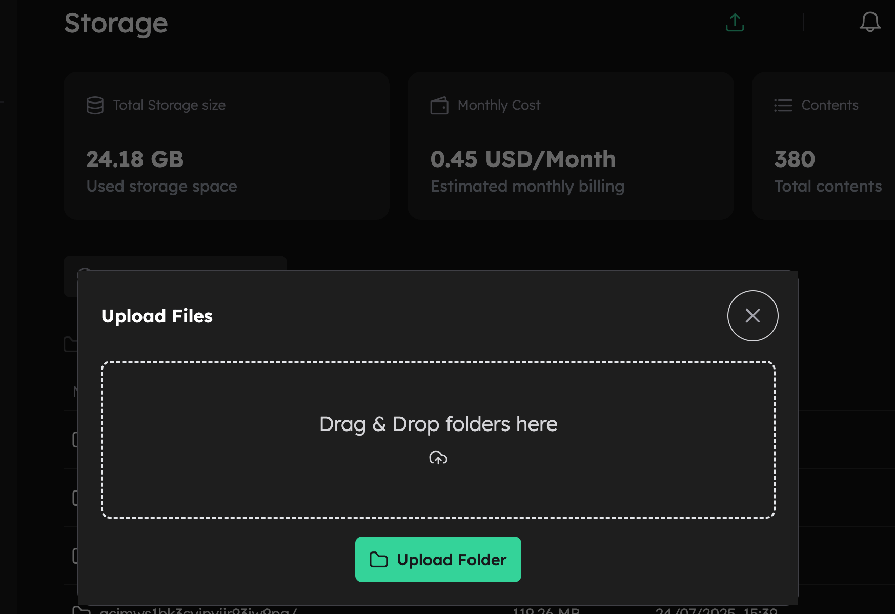
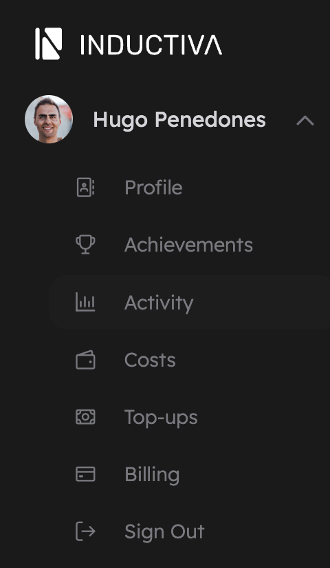

# v0.18

**Release Date:** 25 September, 2025 

---

## 🆕 Highlights

- We’re excited to introduce Achievements: a fun way to celebrate your cloud computing breakthroughs! Unlock milestones as you run simulations and collect Badges that showcase your journey. ([→ Learn more](#achievements))
- We have expanded our cloud HPC offer with a new simulator (CalculiX) and added more recent versions for several others, giving you more power and flexibility. ([→ Learn more](#expand-the-simulators-portfolio))
- There are also several improvements on the User Experience: Real-time System Metrics, Python Editor, Optimized Mobile View, Bulk Actions, and more ([→ Learn more](#-improvements))
- Take a peek into what's coming next in Inductiva's platform ([→ Learn more](#-looking-ahead))
- We’re deeply grateful to our contributors for their continued support and collaboration ([→ Get to know them](#-appreciation))

---

## ✨ New Features

### Achievements
The very first milestone in this journey is the 🖥️ Core-hours Club, your record of how much cloud computing power you’ve used.



Badges are made to be shown off, both to build your reputation in the engineering and HPC communities, and to inspire your network to discover the power of cloud computing with Inductiva.
Check out the LinkedIn post by one of Inductiva's power users. [Post yours today](https://console.inductiva.ai/account/achievements)




### Expand the simulators portfolio

More power, more flexibility: we’ve added CalculiX and upgraded multiple simulators to boost your cloud HPC performance.

| Simulator | What's New | Description | Learn More |
|------------|-------------|--------------|-------------|
| **CalculiX** ⚙️ | 🆕 New simulator | Powerful open-source tool for detailed structural and mechanical analysis. | [Guide →](https://inductiva.ai/guides/calculix) |
| **SWAN (v41.51 incl. UnSWAN)** 🌊 | 🆕 Added version | Next-gen wave model with unstructured grid support — ideal for complex coastal simulations. | [Guide →](https://inductiva.ai/guides/swan/versions-and-containers) |
| **OpenFOAM (ESI v2506 & Foundation v13)** 💨 | 🔄 Updated versions | Latest updates to the world’s leading open-source CFD toolbox for advanced fluid simulations. | [ESI v2506 Guide →](https://inductiva.ai/simulators/openfoam-esi) [Foundation v13 Guide →](https://inductiva.ai/simulators/openfoam-foundation) |
| **OpenTELEMAC (v8p4r1)** 🏞️ | 🔄 Updated version | Enhanced modeling of rivers, estuaries, and free-surface flow environments. | [Guide →](https://inductiva.ai/simulators/opentelemac) |
| **AMR-Wind (v3.5.0 – v3.7.0)** 🌬️ | 🔄 Updated versions | High-fidelity wind turbine and farm simulations with improved performance and accuracy. | [Guide →](https://inductiva.ai/simulators/amr-wind) |
| **CaNS (v3.1.0)** 🌀 | 🔄 Updated version | Fast, parallel solver for fluid flow simulations — perfect for large-scale numerical studies. | [Guide →](https://inductiva.ai/guides/cans) |
| **HEC-RAS** 🏞️ | 🧪 New integration (in preview) | Early access to this industry-standard tool for river hydraulics and flood modeling. | [Guide →](https://inductiva.ai/guides/hec-ras) |

---

## 🚀 Improvements

### 📈 Real-time System Metrics
In our [last release](https://inductiva.ai/blog/article/hpc-simulation-tools-v017), we introduced system metrics tracking (like CPU and RAM usage) to help you make sure you’re using resources efficiently. For instance, you could check that all vCPUs were being used in parallel to make the most of a powerful cloud machine.

However, there was a catch: these metrics were only available after a simulation finished. This made it hard to understand in real-time if a task was running efficiently and kill it early to avoid wasting credits.

Now, that’s no longer the case. [Task System Metrics](https://console.inductiva.ai/tasks) are updated automatically with fresh data at sub-minute intervals, giving you live performance insights so you can monitor efficiency and make smarter decisions as your simulations run.




### 🐍 Python Editor
Formerly known as the Playground, the online [Python Editor](https://console.inductiva.ai/editor) has been upgraded to include ready-to-run code snippets for every simulator supported by Inductiva. Simply choose your preferred simulator from the dropdown menu, and the corresponding example code will appear automatically. From the Console, just click “Run” and your simulation will start instantly.




### 🧩 Tiles View for Projects and Benchmarks

You can now switch to a tile view for your [Projects](https://console.inductiva.ai/projects) and [Benchmarks](https://console.inductiva.ai/benchmarks) to have a cleaner, more visual alternative to the traditional table layout. This update is especially helpful when accessing Inductiva from a mobile device, where the new layout adapts smoothly to smaller screens for a better user experience.

We’re starting with Projects and Benchmarks, but this is just the beginning. The tile view will soon expand to all Console screens, bringing a more consistent and intuitive interface across the platform.




### 🧺 Bulk Task Actions within Projects

Move multiple tasks between Projects at once, making project organization faster and more efficient.




### 📂 Drag-and-Drop Folder Upload

Uploading to your Inductiva cloud storage is now easier than ever. Simply drag and drop entire folders into the new upload interface — the platform will automatically handle all files inside, making data management faster and more intuitive.




### 👤 New Layout for the Account Tab

You may have noticed a small but meaningful change: the Account tab has moved to the upper-left corner of the sidebar for quicker access. It’s a simple adjustment that makes navigation smoother and overall improves the user experience.

You will find there all of the same menu options, plus the new Achievements.




### 🖱️ CTRL-Click to Open in a New Tab

You can now open table rows (in Storage, Task lists, etc.) in a new browser tab by holding CTRL (or Command ⌘ on macOS) while clicking. It’s a small detail, but one that makes navigation faster and more convenient, especially when working across multiple items.

---

## 🔜 Looking Ahead
- Built-in notification system - Receive critical alerts instantly via Inductiva's Web Console.
- “No files left behind!” – a clever automatic mechanism to save all the output files to permanent storage, even when your spot instance is preempted by the underlying cloud provider.

---

## 🙏 Appreciation  

A heartfelt thank you to our all Inductiva contributors and users - your support and expertise make Inductiva possible!

Big thanks to these amazing users for their contribution to Inductiva's brand recognition by posting their Achievements, and especially for challenging Inductiva's platform daily while scaling tens of thousands simulations!
- [João Ribeiro](https://linkedin.com/in/joaopalvesribeiro) 
- [Tiago Frutuoso](https://linkedin.com/in/tiago-lucas) 

---

## 💬Feedback & Community

Your feedback fuels our next breakthroughs share your ideas for the roadmap, report bugs, or help test a new simulator. We’re all ears!
Reach out through our [contact form](https://inductiva.ai/contact) or our [Discord](https://discord.com/invite/rFkHxVmAbu) to share feedback, connect with peers, and learn from specialists across diverse domains.

---

## 📦 Installation & Upgrade
```bash
pip install --upgrade inductiva
```

---


```{banner_small}
:origin: releases_v018
```


```{toctree}
:hidden:
Oct 2025 v0.18.4 <sections/v0-18-4.md>
Oct 2025 v0.18.6 <sections/v0-18-7.md>

```
