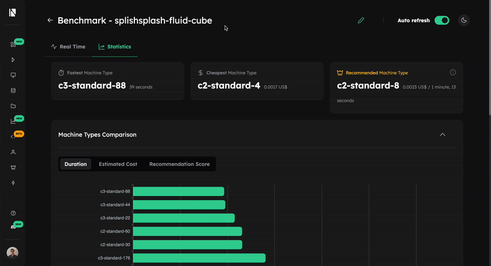

# Check Progress & Results
While your benchmark is running, you can monitor its progress in real-time using the [Inductiva Console](https://console.inductiva.ai/benchmarks). This is crucial for tracking progress and debugging any issues as they happen.

1. Navigate to the [Benchmarks](https://console.inductiva.ai/benchmarks) tab to see a list of all your benchmarks.

2. Find and click on the benchmark you're interested in — in the case of our [step-by-step example](run-benchmarks.md), it is[`splishsplash-fluid-cube`](https://console.inductiva.ai/benchmarks/splishsplash-fluid-cube?tab=results).

This takes you to the **Details** tab, where you can see the overall progress, a detailed list of all tasks (completed or still running), and the status of the machine groups involved.

## Analize the Results

Once the benchmark is complete, navigate to the [Results](https://console.inductiva.ai/benchmarks/splishsplash-fluid-cube?tab=resultsx) tab to analyze the results and make a data-driven decision.

### Key Insights & Recommendation

At the top of the page, you'll find summary cards highlighting the fastest and cheapest machine types. Most importantly, we provide a **Recommended Machine** that offers the best balance between speed and cost, calculated using a recommendation score. This simplifies your choice by pointing to the most efficient option overall.

### Visualize Trade-offs

Scroll down to the plots for a deeper analysis:
- **Execution Duration & Cost Plots**: These bar charts show the raw performance of each measure (cost, time and recommendation score) for each machine type, making it easy to see which excels in each category.
- **Cost vs. Duration Plot**: This scatter plot is your most powerful tool for comparing trade-offs.
    - **Ideal machines** are in the **bottom-left quadrant** (low cost, low duration).
    - **Poor choices** are in the **top-right quadrant** (high cost, high duration).

These visualizations help you quickly identify which machines offer a clear advantage and which should be avoided.

## Making Your Final Decision
Use these tools to select the best machine for your needs:
- For maximum speed, choose the machine with the lowest duration.
- For the tightest budget, pick the one with the lowest cost.
- For the best overall value, start with our recommendation or use the Cost vs. Duration plot to find the machine that best fits your specific balance of priorities.