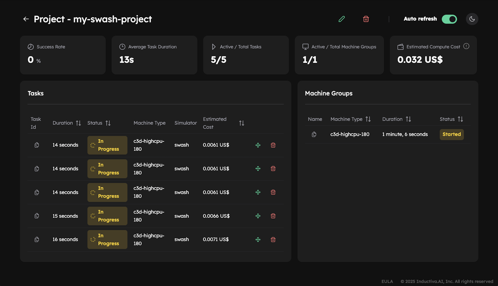
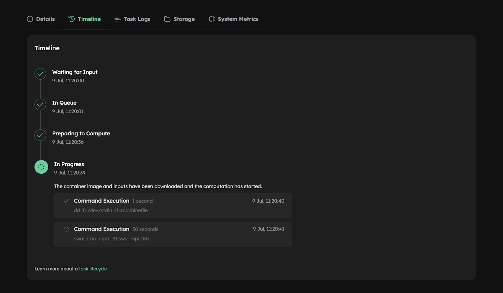

# Scale Up and Organize Simulation Batches with Projects and Metadata

In this tutorial, you'll learn how to run multiple simulations in parallel, each with
its own input directory, and manage them efficiently using the Inductiva API.
You'll see how to submit multiple simulations to the cloud, organize them
with projects and metadata, monitor their progress using the
[Console](https://console.inductiva.ai/dashboard), and finally, download the results in a
clean and automated way.

## What You Will Learn

- Submit multiple simulations to **run in parallel on the cloud**
- Use **multiple powerful machines** simultaneously to speed up your simulations
- Organize all simulations under a single **project**
- Attach **metadata** to track and distinguish each simulation
- **Monitor progress in real time** using the [Console](https://console.inductiva.ai/dashboard)
- Download all simulation outputs in a structured and automated way

## Input Folder Structure

We assume the following folder structure:

```
swash-inputs/
├── swash-input-1/
│   └── S1.sws
|   └── ...
├── swash-input-2/
│   └── S1.sws
|   └── ...
├── ...
```

Each subfolder contains all the input files for a **SWASH** simulation.
All simulations use the same config file, named `S1.sws`.

## Submit Multiple Simulations to Run in Parallel on the Cloud

Here's the full Python script to submit multiple simulations to run in parallel on the cloud:

```python
import inductiva
import pathlib

# Define cloud resources
cloud_machine = inductiva.resources.MachineGroup(
    machine_type="c3d-highcpu-180",  # Machine optimized for compute-intensive tasks
    num_machines=5,                  # Run up to 5 simulations in parallel on the cloud
    spot=True,                       # Use cheaper spot instances (can be interrupted)
)

# Initialize simulator and project settings
swash = inductiva.simulators.SWASH(version="11.01") # Create a SWASH simulator instance
sim_config_filename = "S1.sws"                      # Name of the simulation config file
project_name = "my-swash-project"                   # Project name to group all submitted tasks

# Gather all input directories containing simulation files
root_path = pathlib.Path("swash-inputs")
input_dirs = [
    input_dir for input_dir in root_path.iterdir()
    if input_dir.is_dir()
]

# Submit all simulations to run in parallel on the cloud (no waiting)
for input_dir in input_dirs:
    task = swash.run(
        input_dir=input_dir,
        sim_config_filename=sim_config_filename,
        on=cloud_machine,
        project=project_name,
    )

    # Attach metadata to each task - e.g., to identify its input directory later
    task.set_metadata({
        "input_dir": input_dir.name,
    })
```

### Notes on the Script

- Spot Instances: Setting `spot=True` uses cheaper machines that may be interrupted at any time.
More info [here](https://cloud.google.com/compute/docs/instances/spot).

- No `task.wait()` Calls: The script doesn't call `task.wait()` inside the for loop. This is intentional.
It allows all simulations to be submitted immediately without waiting for each other to complete.
This approach submits all tasks as quickly as possible, maximizing parallelism and taking full advantage
of the Inductiva API.

- Automatic Shutdown: By default, the machine group will automatically terminate after **3 minutes** of inactivity.
You can customize this using `max_idle_time` parameter in the [`MachineGroup` constructor](https://inductiva.ai/guides/documentation/api/inductiva.resources#inductiva.resources.machine_groups.MachineGroup).

## Monitor Your Simulations in Real Time

As soon as the script runs, your simulations start running in parallel on the cloud.
You can monitor their progress in real time using the [Inductiva Console](https://console.inductiva.ai/dashboard).

### View Tasks in the Console

1. Navigate to the [Projects](https://console.inductiva.ai/projects/projects) tab.
2. Click on your project name. In this case: `my-swash-project`.
3. You'll see a list of all tasks submitted under that project, along with their current statuses (e.g., `In progress`). 
The 5 tasks are marked as `In progress` at the same time because they are running simultaneously on 5 separate cloud machines
(as specified by the `num_machines=5` setting in the cloud resource configuration).



4. Click on any task to open a detailed view.



## Downloading Outputs

Once your simulations complete (e.g., with status `Success`), you can download all outputs using the following script:

```python
import inductiva
import os

project = inductiva.projects.Project("my-swash-project")

for task in project.get_tasks():
    metadata = task.get_metadata()
    input_dir = metadata["input_dir"]
    output_dir = os.path.join("swash-outputs", input_dir)
    task.download_outputs(output_dir=output_dir)
```

You'll get logs like this:

```bash
Downloading simulation files to swash-outputs/swash-input-1/output.zip...
100%|███████████████████████████████████████████████████████████████████████████| 57.3M/57.3M [00:00<00:00, 73.6MB/s]
Uncompressing the files to swash-outputs/swash-input-1...
...
```

Now, your outputs are organized cleanly by input directory:

```bash
swash-outputs/
├── swash-input-1/
├── swash-input-2/
├── ...
```

---

# Why This Matters?

If you need to run multiple simulations simultaneously, submitting several tasks across multiple cloud machines lets you speed up
your execution time by the number of machines. Here, that means running 5 times faster. Setting this up requires just one line of code 
(e.g., `num_machines=<number of simulations>`). Additionally, organizing simulations with projects, storing metadata, and monitoring
via the console help you effortlessly keep track of everything, so you never lose sight of what's happening in your batch, creating 
a powerful and efficient simulation workflow.

---

# Wrapping Up: Building a Scalable Simulation Workflow

In this tutorial, you learned how to efficiently run multiple SWASH simulations in parallel using the Inductiva API.

By leveraging cloud resources, projects, and task metadata, you've created a scalable and maintainable workflow to manage large batches of simulations with ease.

### Key Takeaways

- **Parallel execution** drastically reduces total runtime.
- **Projects** provide an effective way to group and organize related simulation tasks.
- **Metadata** allows you to track, filter, and manage individual runs for better traceability.
- **The Console** offers a user-friendly interface for real-time monitoring, management, and troubleshooting.
- **Programmatic downloads** keep your results organized and reproducible.

Whether you increase compute power or run many simulations at once, the Inductiva API makes running simulations on the cloud simple and efficient at any scale.

You're now equipped to integrate this workflow into larger pipelines, automate batch experiments, or develop research tools powered by Inductiva API.

**Happy simulating!**
