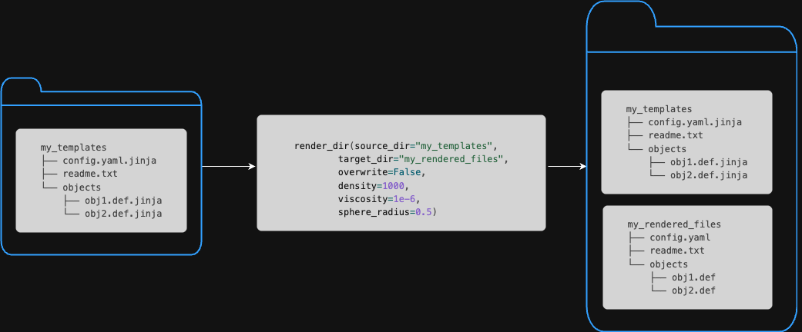

# Templating Manager

The Inductiva API is all about enabling you to simulate at scale. As we have shown,
with a few lines of Python code, you can send your simulations to MPI Clusters
assembled from last-generation cloud hardware, letting you run much larger simulations
than you would be able to use your local resources. Or you can spin up a large Machine
Group, with dozens or hundreds of machines, and send a large number of simulations
to be run on those machines in parallel. Such massive parallelism is precisely
what you need when you want to find the optimal solution for a problem, and the
only way to test each candidate's solution is by simulating it. To do so, one needs
to configure multiple simulations, each with a slightly different set of parameters.
Generally speaking, the goal is to explore the largest possible extent of the
design space.

In this context, the Inductiva API provides a powerful tool for exploring the design
space of a problem: the *templating manager*. The templating manager allows you to
quickly generate a large number of simulation configurations by starting from a
base case and replacing some of its fixed values with variables that you can programmatically
change.

## The `TemplateManager` class

The `TemplateManager` is an utility class that allows you to manage templating
files and specify how to render each template into a concrete configuration file.
It abstracts the rendering process, allowing the user to focus solely on defining
the source of the template files, the destination directory of the rendered files,
and the values of the variables to be used in the rendering process.

In the following sections, we'll provide a basic introduction to rendering concepts
and explain how to use the `TemplateManager` class to render different variations
of template files to a destination folder. In the end, we will discuss some safety
features that the `TemplateManager` class provides to prevent accidental overwriting
of files and ensure the uniqueness of the destination directory.

### Rendering Basics

Template files are plain text files that contain placeholders—also known as
variables, that will be replaced with actual values during the rendering process.
These files must have the `.jinja` extension and use double curly braces (`{{ }}`)
to denote variables. Optionally, you can provide default values for variables to
be used when no explicit value is supplied.

> **Important:** To enable the Templating Manager to render a file, you must append `.jinja` to its filename.
> For example, to render a file originally named `file1.txt`, you should rename it to `file1.txt.jinja`.
> The Templating Manager will then process this template and generate `file1.txt` with all placeholders correctly replaced by their corresponding values.


In the following example, the content of a template file defines a configuration
parameter named `config_parameter`:

```jinja
config_parameter = {{ parameter_value }}
```

When this file is rendered with `10` for the variable `parameter_value`,
the resulting file will read:

```text
config_parameter = 10
```

If the template file were to be defined with a default value for `parameter_value`:

```jinja
config_parameter = {{ parameter_value | default(20) }}
```

and **rendered without providing a value for it**, the resulting file would read:

```text
config_parameter = 20
```

### Rendering a directory with the `TemplateManager` class

For the sake of illustration, let's consider a directory, containing three template
files and a regular (non-template) file, with the following structure:

```console
$ tree my_templates
my_templates
├── config.yaml.jinja
├── readme.txt
└── objects
    ├── obj1.def.jinja
    └── obj2.def.jinja
```

The contents of each file are as follows:

```console
$ cat my_templates/config.yaml.jinja
density: {{ density }}
viscosity: {{ viscosity }}
position: {{ position | default([0, 0, 0]) }}

$ cat my_templates/readme.txt
I am a non-template file. I will be copied as is.

$ cat my_templates/objects/obj1.def.jinja
type: sphere
radius: {{ sphere_radius }}

$ cat my_templates/objects/obj2.def.jinja
type: cube
side: {{ cube_side | default(1) }}
```

To render all files in the `my_templates` directory, into a target directory:

```python
import inductiva


# render all files in the template directory specifying the values of
# the variables in the template files. Note that we are deliberately not
# providing values for the `position` or `cube_side` variables in the
# config.yaml.jinja and obj2.def.jinja files, respectively. This
# will enforce the default values to be used.

inductiva.TemplateManager.render_dir(source_dir="my_templates",
                                     target_dir="my_rendered_files",
                                     overwrite=False,
                                     density=1000,
                                     viscosity=1e-6,
                                     sphere_radius=0.5)
```

After running the code above, the `my_rendered_files` directory will contain the
following files:

```console
$ tree my_rendered_files
my_rendered_files
├── config.yaml
├── readme.txt
└── objects
    ├── obj1.def
    └── obj2.def

$ cat my_rendered_files/config.yaml
density: 1000
viscosity: 1e-6
position: [0, 0, 0]

$ cat my_templates/readme.txt
I am a non-template file. I will be copied as is.

$ cat my_rendered_files/objects/obj1.def
type: sphere
radius: 0.5

$ cat my_rendered_files/objects/obj2.def
type: cube
side: 1
```

<div style="text-align: center;">
  
</div>


### Overwrite safety

By default, the `TemplateManager` *will not overwrite* any existing files in the
destination directory. Calls to the `render_dir` method will fail if
any file already exist in the `target_dir`. This behavior is intended to prevent
accidental overwriting of files that may have been generated in a previous run.

To enforce deleting existing files, you can set the `overwrite` argument
to `True` when calling the `renderdir` method.
