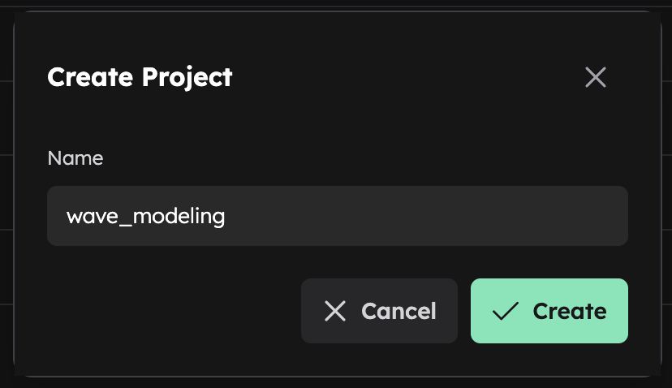

# Visualize Projects

The Inductiva [Web Console](https://console.inductiva.ai/dashboard) provides a visual interface for managing projects, complementing the Python API and CLI commands.

## Project Creation

To create a new prokect in the console:
1. Click the _"Create Project"_ button in the [projects section](https://console.inductiva.ai/projects)

2. Enter a project name
3. Click _"Create"_ to finalize

## Project Visualization
### Project Dashboard Overview
Each Project has its own dedicated dashboard that displays:
- Success Rate
- Average Task Duration
- Number of Active and Total Machine Groups in the Project
- Estimated Compute Cost
- Two tables: one with the machines groups and other with the tasks

## Project Management
### Renaming Project

### Moving Tasks

### Deleting Project