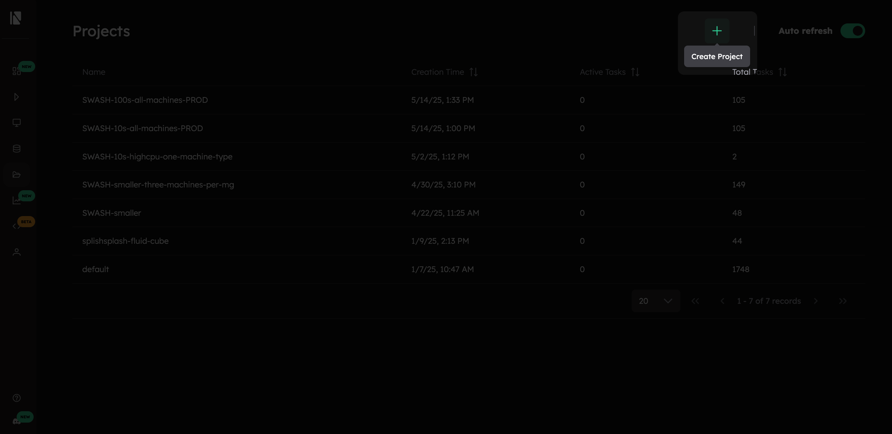

# Visualize Projects

The Inductiva [Web Console](https://console.inductiva.ai/dashboard) provides a visual interface for managing projects, complementing the Python API and CLI commands.

## Project Creation & Setup
### Creating a New Project

To create a new prokect in the console:
1. Click the _"Create Project"_ button in the [projects section](https://console.inductiva.ai/projects)

