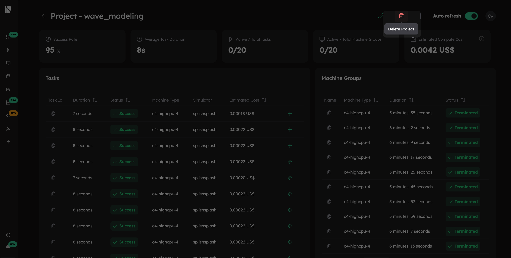

# Visualize Projects

The Inductiva [Web Console](https://console.inductiva.ai/dashboard) provides a visual interface for managing projects, complementing the Python API and CLI commands.

## Create a Project

1. Click the _"Create Project"_ button in the [projects section](https://console.inductiva.ai/projects).

2. In the dialog box that appears, enter a name for your project.
3. Click _"Create"_ to finalize. Your new project is now ready.

## Project Visualization
Selecting a project takes you to its **dedicated dashboard** that gives real-time, at-a-glance overview of the simulations progress and resource usage.

### Project Dashboard Overview
The dashboard is split into two main areas: summary cards at the top for quick insights and detailed tables below.

#### Summary Cards

These cards highlight the most important metrics of your project:

- **Success Rate**: The percentage of tasks that completed successfully.
- **Average Task Duration**: The average runtime for a single task.
- **Active / Total Tasks**: The number of currently running tasks versus the total number of tasks submitted.
- **Active / Total Machine Groups**: The number of machine groups currently active versus the total number launched for the project.
- **Estimated Compute Cost**: Estimated computational cost in US dollars ($) for all tasks in the project.

#### Tables

For more granular information, the dashboard includes two tables:
- **Tasks Table**: Detailed breakdown of every task. You can check each task's `ID`, status (e.g., `Success`, `Failed`), duration, the simulator used, and its individual estimated cost.
- **Machine Groups Table**: Lists all machine groups launched for the project. It shows the machine type used (e.g., `c4-highcpu-4`), the total duration it was active, and its status (e.g., `Terminated`, `Running`).

### Accessing Task Details

To dive deeper into a specific simulation, click on its row in the **Tasks table**. This will take you to the Task Detail page:

> **Note**: You can access a Machine Group details using the same workflow!

## Project Management
The console also provides simple tools for keeping your projects organized.

### Rename a Project
1. Click the _"Rename Project"_ button next to the project title

2. Enter the new name in the dialog.
3. Click _"Save"_ to apply the changes

### Move a Task
To better organize your work, you can move tasks from one project to another.

1. In the Tasks table, check the box next to one or more tasks you wish to move.

2. An action bar will appear at the top of the table. Click _"Move"_.

3. Select the destination project from the dropdown menu and confirm the action.

### Terminate a Task
You can stop a task before it finishes. You can only terminate tasks that are in a `in queue` or `in progress` state.

1. In the Tasks table, select the checkbox next to the active task you want to terminate.
2. An action bar will appear. Click the _"Terminate"_ button.

3. A confirmation dialog will appear. Click "_Terminate"_ again to stop the task. The task's status will then change to `killed`.

### Delete a Project
1. Click the _"Delete Project"_ button next to the project title.

2. A confirmation window will appear, warning you that this action will permanently delete the project and **move all of its associated tasks to the default project**.
3. Click the final _"Delete"_ button to confirm.

