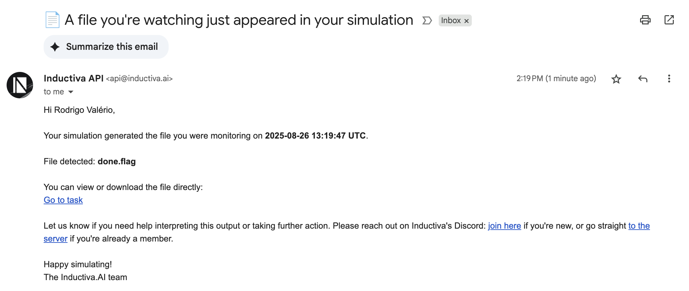
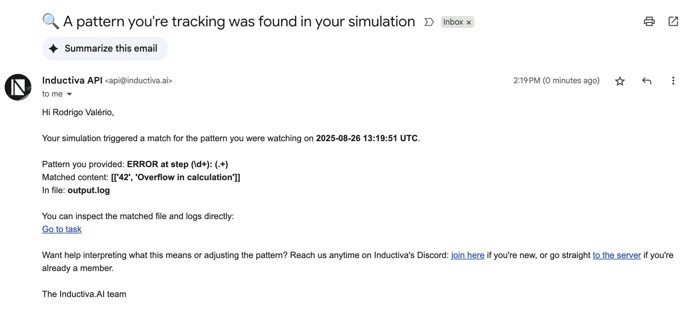

# 📨 Simulation Notifications via Observer Events

> **Note:** This tutorial demonstrates **passive tracking**, where observer triggers run **on the background**
> and automatically send notifications when events occur.
> For **active tracking**, refer to the [Real-Time Monitoring & Auto Termination tutorial](<real-time-simulation-monitoring>), where monitoring runs
> on your local machine.

## Challenge

Simulations often produce subtle signals instead of outright failures:

- Files may appear (e.g., `error.log` or `done.flag`) indicating success, warning, or failure.
- Log files may contain important information buried inside thousands of lines
  (e.g., `ERROR`, `WARNING`, convergence stats).

Manually monitoring these events is tedious and error-prone,
especially for long-running or multiple parallel tasks.


## The Solution

Inductiva **observer events** let you watch for file or log events and automatically take action, 
such as sending an email.

Key features:

- Detect when a file **has been created**, such as an error file, or when its contents **match a regular expression**.
- Supports **capturing groups** in matched regular expressions to extract relevant information.
- Works with **any simulator** that writes logs or intermediate files to disk.

## Example Use Cases

- **Error detection:** Catch critical messages in logs.
- **Progress tracking:** Watch for intermediate results or checkpoint files.
- **Completion alerts:** Notify when a `done` flag appears.
- **Value monitoring:** Extract numbers from logs (e.g., residuals, energy, temperature) using regex.

## Using Regex in Observers

- **Regex** allows you to detect specific strings or patterns in logs.
- **Match groups** `( … )` allow you to capture important parts of a line, such as:
  - Step number or iteration
  - Error or warning message
  - Numeric values like residuals, energy, or temperature
- Captured groups can be included in email notifications to provide context.

> 💡 If you are new to regex, see the official Python regex guide:  
> [https://docs.python.org/3/library/re.html](https://docs.python.org/3/library/re.html)


## Observer Classes

Inductiva provides two main observer trigger classes for monitoring file events:

### 1. ObserverFileExists

Detects when a specific file appears in your task's working directory.

**Parameters:**
- `task_id` (str): The ID of the task to monitor
- `file_path` (str): The path of the file to watch for (relative to task directory)

**Use cases:** Completion flags, error files, or other milestone files.

### 2. ObserverFileRegex

Detects patterns inside log files using regular expressions.

**Parameters:**
- `task_id` (str): The ID of the task to monitor  
- `file_path` (str): The path of the log file to monitor
- `regex` (str): Regular expression pattern to match against file contents

**Use cases:** Error detection, progress tracking, value monitoring with captured groups.

> 💡 If you are new to regex, see the official Python regex guide:
> [https://docs.python.org/3/library/re.html](https://docs.python.org/3/library/re.html)

## Email Notifications

The `EmailNotification` action sends email alerts when observer triggers are activated.

**Parameters:**
- `email_address` (str): The email address to send notifications to

## Registering Observers

Once you understand the observer classes, you can register them using `events.register()`:

### File-Based Observer Registration

```python
from inductiva import events

# Register an observer that triggers when "done.flag" appears
events.register(
    trigger=events.triggers.ObserverFileExists(
        task_id=task.id,
        file_path="done.flag"),
    action=events.actions.EmailNotification(
        email_address="your@email.com")
)
```

**Result:** You'll receive an email when the `done.flag` file is created.

Email received:


### Log-Based Observer Registration

```python
from inductiva import events

# Register an observer that triggers on error patterns in logs
# Regex captures groups: (\d+) = step number, (.+) = error message
events.register(
    trigger=events.triggers.ObserverFileRegex(
        task_id=task.id,
        file_path="output.log",
        regex=r"ERROR at step (\d+): (.+)"),  # Capture step and message
    action=events.actions.EmailNotification(
        email_address="your@email.com")
)
```

**Result:** You'll receive an email whenever a line in `output.log` matches the error pattern.

**Regex Explanation:**
- `ERROR at step (\d+): (.+)` matches error messages with step numbers
- `(\d+)`: captures the step number  
- `(.+)`: captures the error message  

**Example:** If a log line reads `ERROR at step 42: Overflow in calculation`, then:
- `(\d+)` captures `42`
- `(.+)` captures `Overflow in calculation`

Email received:


Observers are an easy-to-use and flexible mechanism for monitoring simulation progress and automatically responding to important events.
