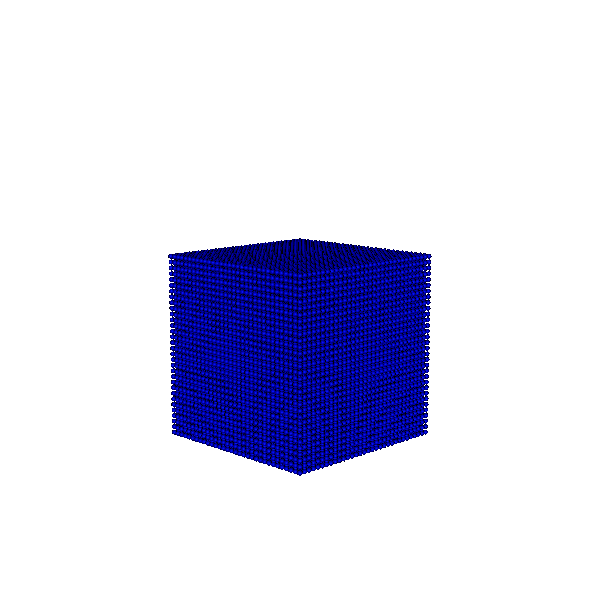

# Visualizing Your Simulation Results

After running the 400 simulations from [Generate the Dataset](../synthetic-data-for-piml/sections/section4.md), it’s time to download and visualize the results.
To make this process easier, we’ve prepared a few helper scripts.

<p align="center"></p>

## Step 1: Download the Simulation Results

Start by downloading the results from the cloud using the following command:

```bash
inductiva project download splishsplash_400
```

This will create a folder named `inductiva_output` in your current directory, containing the output files from all 400 simulations.

## Step 2: Generate Visualizations

To visualize the particle movements from each simulation, we’ve created a Python script that processes the results and generates individual GIFs.

Download the visualization script from the following link:

👉 [Download `splishsplash_gen_viz.py`](https://storage.googleapis.com/inductiva-api-demo-files/splishsplash_gen_viz.py)

### How to Use the Script

1. Place the downloaded `splishsplash_gen_viz.py` file in the same directory where the `inductiva_output` folder is located.
2. Create a new folder called `gifs` in the same directory to store the generated visualizations.
3. Run the script:

```bash
python splishsplash_gen_viz.py
```

> **Note**: If required packages are missing, install them with:
>
> ```bash
> pip install vtk numpy imageio
> ```

Once the script finishes, you’ll find a collection of GIFs in the `gifs` folder—one for each simulation. Each animation shows how particles move over time, giving you a visual insight into the dynamics of each simulation.

---

Next, we’ll show you how to combine these individual GIFs into a single animation—making it easier to compare different simulation results side by side.
