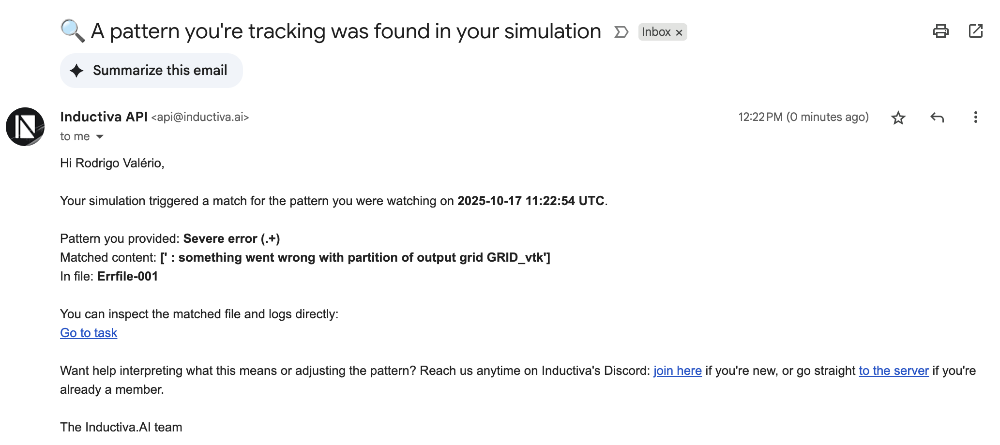

# How do I track Errfile to see if something wrong happened?

> **Note:** This tutorial shows how to use **observer events** to automatically monitor SWASH simulation error files and get notified when problems occur.
> 
> For a comprehensive guide on observer events with more advanced features and examples, see the [full Observer Events tutorial](https://inductiva.ai/guides/scale-up/recipes/observer-events).

## The Problem

When running SWASH simulations, errors can occur that might not immediately stop the simulation but indicate problems that need attention. SWASH often writes error information to files like `Errfile-001`, but manually checking these files is tedious, especially for long-running simulations.

## The Solution

Use Inductiva's **observer events** to automatically monitor your SWASH simulation's error files and get email notifications when severe errors are detected.

## Quick Setup

Here's how to set up automatic error monitoring for your SWASH simulation:

```python
from inductiva import events

# Register an observer to monitor Errfile-001 for severe errors
events.register(
    trigger=events.triggers.ObserverFileRegex(
        task_id=task.id,
        file_path="Errfile-001",
        regex=r"Severe error (.+)"),  # Captures text after "Severe error "
    action=events.actions.EmailNotification(
        email_address="your@email.com")
)
```

## How It Works

1. **ObserverFileRegex** monitors the `Errfile-001` file in your task's working directory
2. **Regular expression** `r"Severe error (.+)"` detects lines containing "Severe error " and captures the error message that follows
3. **Email notification** is sent immediately when a match is found, including the captured error message
4. The observer runs in the background, so you don't need to actively monitor the simulation

## Customizing the Error Detection

You can modify the regex pattern to detect different types of errors:

```python
# Detect any error (case insensitive)
regex=r"(?i)error"

# Detect specific error types
regex=r"(?i)(fatal|critical|severe) error"

# Detect errors with specific patterns
regex=r"Error \d+: .*"
```

## What You'll Receive

When a severe error is detected, you'll receive an email:



## Complete Example

Here's a complete example of running a SWASH simulation with error monitoring:

```python
import inductiva

swash = inductiva.simulators.SWASH()

task = swash.run(...)

# Set up error monitoring after creating the task
events.register(
    trigger=events.triggers.ObserverFileRegex(
        task_id=task.id,
        file_path="Errfile-001",
        regex=r"Severe error (.+)"),
    action=events.actions.EmailNotification(
        email_address="your@email.com")
)

# The observer will automatically monitor for errors during execution
```

## Benefits

- **Automatic monitoring**: No need to manually check error files
- **Immediate alerts**: Get notified as soon as problems occur
- **Background operation**: Monitoring happens without affecting simulation performance
- **Flexible detection**: Customize regex patterns for different error types

This approach ensures you're immediately aware of any issues with your SWASH simulation, allowing you to take corrective action without delay.
